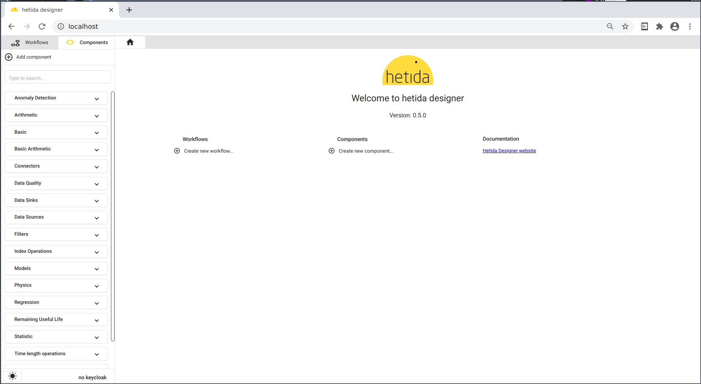

# hetida designer

## What is hetida designer?

hetida designer is an open source, scalable analytics engine for people wanting to do production data science and machine learning in Python without the hassles.


### From a user point of view
On the one hand, hetida designer is aimed at **data scientists** and **subject matter experts** who can write Python data science code and want to deploy it productively. Once hetida designer is set up, these users can develop, test, manage, document and employ their Data Science artifacts in its UI on their own without having to acquire professional software engineering knowledge (git, yaml files, Dockerfiles / containerization, deployment and ci / cd, devops, writing Rest APIs ...). 

On the other hand, it enables **professional software or data engineers** to invoke, use, automate and integrate these artifacts and provide and receive data to/from them: Executing is just a REST call away, immediately. Adapters can be written to provide controlled and discoverable access to development as well as production data sources and sinks.

### From a technical point of view
hetida designer manages (versioning, lifecycle), exposes (Rest, Kafka) and scalably runs Python code and workflows while decoupling data access and result extraction via its adapter system. It furthermore integrates metadata in an opinionated way and treats visualization as a first class output, even for automated production runs.

hetida designer typically runs on Kubernetes to enable appropriate scaling, in particular for its runtime. Often it is part of a larger data (iot, timeseries) platform setup, like https://hetida.io/en/. A docker-compose setup is provided for small installations and trying out hetida designer.

hetida designer comes with a web UI, a backend / API, a runtime, a CLI Tool (hdctl) for maintenance and import/export tasks, built-in adapters for its adapter system and a set of base / example components and workflows. Additionally, experimental dashboard functionality is available, as well as simple scheduling.

### Main features
* managing Python data science code artifacts and workflows in a UI including versioning, lifecycle and documentation
* decoupling data provisioning from analytics
* no extra deployment steps required: Components (code) and workflows managed in the hetida designer UI are immediately usable / invokable via REST API or Kafka.
* visualization outputs (Plotly) are first-class citizens. One (surprisingly prevalent) use case for hetida designer is to provide custom Plotly visualizations for other applications' dashboarding.
* Data Scientists and Subject Matter Experts not required to learn git, yaml, ci/cd, devops, ... they can do everything in the UI. This enables collaboration with and between team members having varied skill level and exposure to software engineering. 
* modularity and reusability through nestable workflows and components being able to import other components.
* pytest unittesting and standard Python logging
* maintainable data science through versioning and lifecycle management
* clear and precise visualization of data flow in workflows: See at a glance which output connects to which input
* simple cron scheduling
* experimental dashboarding: Every component/workflow defines a dashboard.

### What is it not?
* an orchestration and automation framwork or platform (despite having simple built-in cron scheduling.)
* a low-code / no-code graphical programming environment:
    * User's are expected to write their own components using Python at an early point.
    * hetida designer is far from providing a comprehensive and complete set of core components and workflows for data science.
    * workflows in hetida designer are just [DAGs](https://en.wikipedia.org/wiki/Directed_acyclic_graph): Looping and conditional logic need to be done in component code.
* a database
* a dashboarding solution
* a data platform. See https://hetida.io/en/ for a platform that integrates hetida designer as its analytics engine.
* an alternative to tableau, knime, rapidminer, alteryx, n8n, nodered, mlflow, kubeflow, kedro, bento, prefect, windmill.dev, dataiku, dagster, apache airflow, flyte, ... (add yours to the list when tempted to ask "So hetida designer is like X?"). hetida designer has its own distinct set of features and philosophy: hetida designer focusses on data science code and workflows (instead of models or experiments and general automation) and running them in production with modifiable data sources and sinks. Its philosophy is to make this possible without requiring data scientists and subject matter experts to grapple with git, yaml files, deployments, DevOps, and the like.

### More Screenshots 📸

<details>
<summary>Show more UI Examples</summary>

Home Tab


Component Editor


Workflow


Test Execution Dialog


Select Data From Adapter


Test execution result


Markdown Documentation Editor


Details Dialog


Input/Output configuration dialog


Dashboard (experimental)


Scheduling


Another Workflow Example


Screenshot collection

</details>


## Getting Started with hetida designer

### Docker-compose setup

hetida designer consists of multiple containerized services and is meant to run on a [Kubernetes](https://kubernetes.io/) cluster in production. To try and run hetida designer locally on a single machine it includes a [docker-compose](https://docs.docker.com/compose/) setup.

Run

```sh
git clone https://github.com/hetida/hetida-designer.git

cd hetida-designer && git checkout release

docker-compose up -d
```

Then open `http://localhost/` to access the hetida designer's web user interface:



From here we recommend working through the tutorials.


### Tutorials

* [Basic Concepts](./docs/user_guide/tutorials/basic_concepts.md)
* [Component and Workflow Development](./docs/user_guide/tutorials/component_workflow_tutorial.md)
* [Test execution, Wiring and Adapters](./docs/user_guide/tutorials/exec_wirings_adapters.md)
* [Execution in production](./docs/user_guide/tutorials/running_in_production.md)


### Some more advanced topics

* [Adapter system](./docs/adapter_system/intro.md)
* [Rest API](./docs/integration_guide/api.md)
* [Kafka integration](./docs/kafka_integration.md)
* [Kubernetes setup](./docs/user_guide/advanced_topics/kubernetes.md)
* [Security hints](#security-hints)

### General Documentation

See the [Documentation Overview](./docs/documentation.md) page.

There also is a [glossary](./docs/glossary.md).

## Development / Contributing

Contributions are welcome. If you'd like to ask a question,
file a bug, or contribute bugfixes, improvements, or documentation, you'll find all
necessary information in our [contribution guidelines](./CONTRIBUTING.md).

For development we refer to
* [Development setup](./docs/development-setup.md)
* [Standalone docker setup](./docs/standalone-docker-setup.md)
* [Readme for runtime and backend development](./runtime/README.md)

## <a name="security-hints"></a>Security Hints

Hetida designer allows to execute arbitrary Python code. The included plain execution engine executes workflows in the same processes that serve the runtime component (which typically run as a (non-root) process in a Docker container if you use the runtime docker image). There is no isolation / sandboxing both in-between operators of a workflow and different executions (of the same or different components/workflows).

This is intentional, since hetida designer has a focus on data science and therefore needs to avoid expensive serialisation/deserialisation of mass data as well as the overhead of loading resource-heavy data science libraries like pandas, scipy, etc. each time an execution is triggered. Note that here hetida designer significantly differs from more "business automation" - oriented workflow engines.

Knowing this, the following security measurements should at minimum be employed when working with the hetida designer:

* Never expose the frontend, the backend webservice, the database webservice to the public unauthenticated!
* Avoid exposing the runtime webservice directly to users at all. It should only be reachable by the backend.
* It is always strongly recommended to employ / activate authentification for frontend, backend, and runtime.
* **MOST IMPORTANT: You should trust your users of the designer to the same degree that you trust a professional software engineer of your organization who is authorized to develop, run, and deploy arbitrary code (in production if hetida designer has access to your production systems e.g. via adapters)**
* You should restrict resource access (memory, cpu, networking bandwidth etc) of the docker service / docker container of the runtime in order to limit DoS attacks.
* You should restrict the runtime container to only have configured the absolutely necessary secrets and permissions
* You should never solely rely on the isolation that is provided by running something in a Docker container. The container should be isolated from other systems as much as possible. It should be monitored continuously for suspicious activities.
* Depending on your security requirements, you should consider further isolation methods like deferring every workflow execution to a one-time container or doing the same on process level. Do not hesitate to ask questions or create a feature request on the issue tracker.
* **If you do not feel comfortable employing security measures yourself, do not hesitate to ask for help from professional security consultants.**
