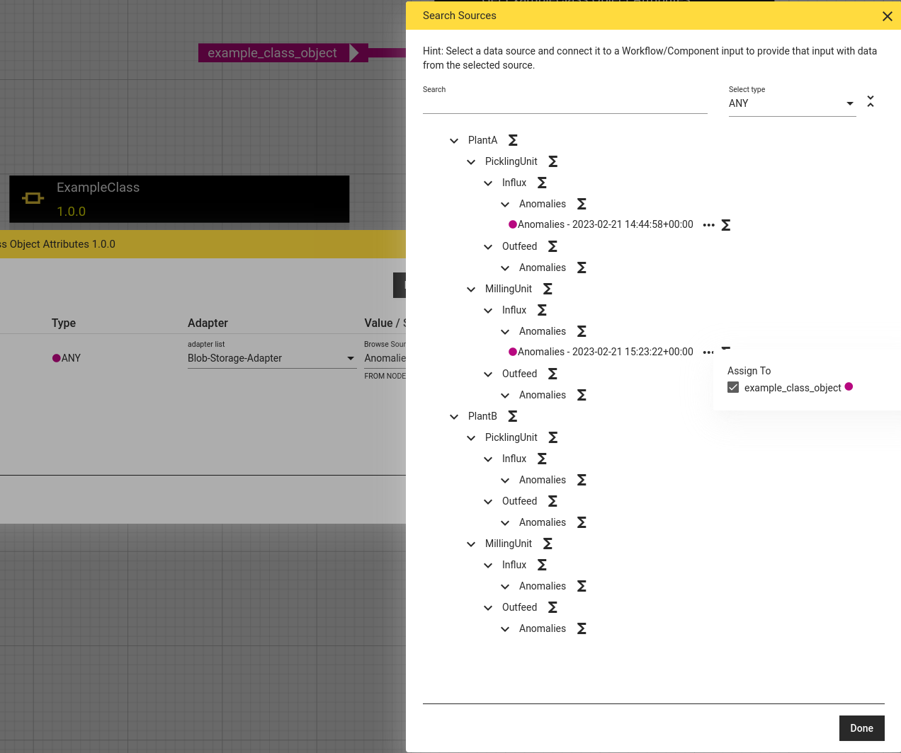
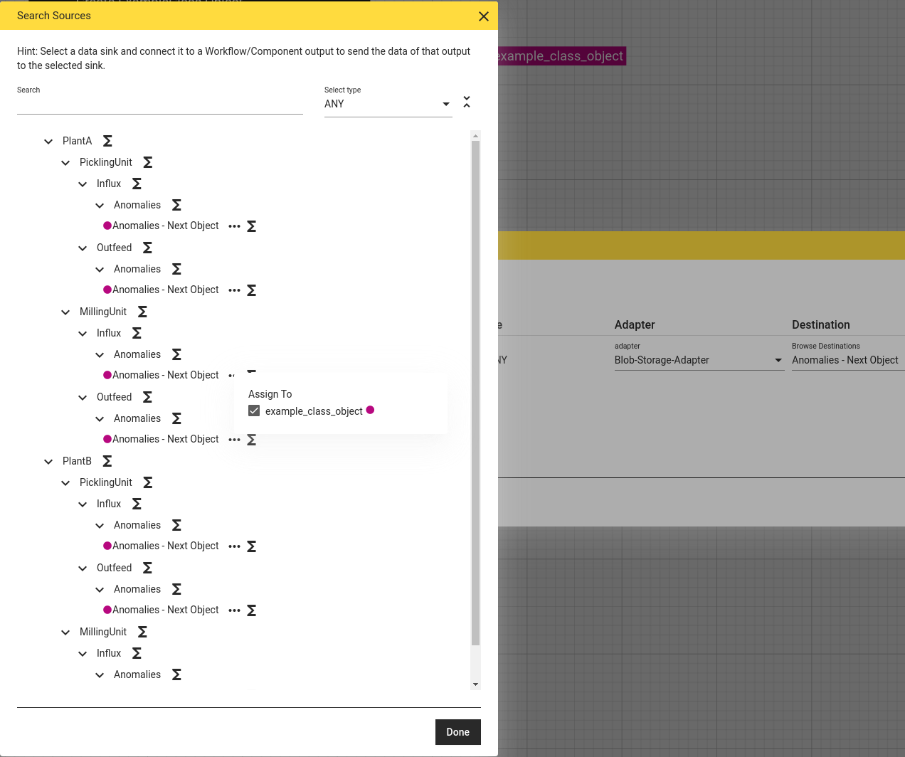

# Blob Storage Adapter

The built-in blob storage adapter allows to read and write objects in buckets of an S3 compatible blob storage.

It allows to store and reload e.g. trained machine learning models.

## Configuration

This section explains how to make blob storage available via the blob storage adapter for the default docker-compose setup.

### Mounting the adapter hierarchy configuration

The S3 data model is flat, consisting only of buckets in which objects can be stored.
There is no hierarchy of sub-buckets of sub-folders.
The blob storage adapter can infer a more complex hierarchical structure by using delimiters.
Hyphens `-` are used as delimiters in bucket names, and slashes `/` are used as delimiters within object keys to mimic paths to files in nested folders.
Some tools for S3 blob storages can infer hierarchy in the user interface from object keys with such delimiters.

The blob storage adapter offers resources from the blob storage in a hierarchical structure.
This hierarchy is defined in a file named `blob_storage_adapter_hierarchy.json` which must be available to the runtime service and is loaded at startup.
For example, a demo hierarchy can be mounted in the docker-compose setup as follows:

```yaml
  hetida-designer-runtime:
    ...
    volumes:
      ...
      - ./runtime/demodata/blob_storage_adapter_hierarchy.json:/mnt/blob_storage_adapter_hierarchy.json
```

You just need to replace the path `./runtime/demodata/blob_storage_adapter_hierarchy.json` with a path to the file on your machine.

This [file](../../runtime/demodata/blob_storage_adapter_hierarchy.json) contains an example of such a json starting with:

```json
{
    "structure": [
        {
            "name": "PlantA",
            "description": "Plant A",
            "substructure": [
                {
                    "name": "PicklingUnit",
                    "description": "Plant A Pickling Unit",
                    "below_structure_defines_object_key": true,
                    "substructure": [
                        {
                            "name": "Influx",
                            "description": "Plant A Pickling Unit Influx",
                            "substructure": [
                                {
                                    "name": "Anomalies",
                                    "description": "Plant A Pickling Unit Influx Anomalies"
                                }, //...
                            ]
                        }
                    ]
                },
                {
                    "name": "MillingUnit",
                    "description": "Plant A Milling Unit",
                    "below_structure_defines_object_key": true,
                    "substructure": [//...
                    ]
                }
            ]
        },
        {
            "name": "PlantB",
            "description": "Plant B",
            "below_structure_defines_object_key": true,
            "substructure": [//...
            ]
        }
    ]
}
```

The names for the hierarchy nodes should consist only of alphanumeric upper and lower case letters without spaces, because they are interpreted as parts of the bucket names and object keys. Since bucket names cannot contain uppercase letters, the hierarchy node names are converted to lowercase when the corresponding bucket names are generated. When naming hierarchy nodes, note that bucket names must consist of a minimum of 3 and a maximum of 63 characters.

The `below_structure_defines_object_key` attribute is `false` by default.
If it is not set, only the names of the hierarchy end nodes are used as prefix of the object key, which is supplemented by the respective creation time stamp, and the bucket name is composed of the names of all higher hierarchy nodes.
If this attribute is set to "true" for a hierarchy node, the names of all lower hierarchy nodes are used as prefix of the object key.

The buckets defined by the adapter structure must already be present in the blob storage. For the example adapter hierarchy these would be buckets with the following names:
* `planta-picklingunit`
* `planta-millingunit`
* `plantb`

A generic sink is generated for each end node of the hierarchy. Using it will always create a new object, the creation timestamp, the job id of the execution and a file extension indication the serialization method are appended to the object key. Vice-versa object keys are expected to have such a suffix to be available as sources via the adapter.

For the example adapter hierarchy e.g. the following objects would be available as source:
* in bucket `planta-picklingunit` an object with key `Influx/Anomalies_2023-02-14T12:19:38+00:00_94726ca0-9b4d-4b72-97be-d3ef085e16fa.pkl`
* in bucket `plantb` an object with key `PicklingUnit/Influx/Anomalies_2023-02-14T12:19:38+00:00_94726ca0-9b4d-4b72-97be-d3ef085e16fa.h5`


### Configuring the runtime

The blob storage adapter is configured by the following environment variables:

* BLOB_STORAGE_ADAPTER_HIERARCHY_LOCATION
* BLOB_STORAGE_ADAPTER_ALLOW_BUCKET_CREATION
* BLOB_STORAGE_ENDPOINT_URL
* BLOB_STORAGE_STS_PARAMS
* BLOB_STORAGE_ADAPTER_ANONYMOUS
* BLOB_STORAGE_REGION_NAME
* BLOB_STORAGE_CHECKSUM_ALGORITHM

The location of the hierarchy JSON file within the runtime instance is specified with the environment variable `BLOB_STORAGE_ADAPTER_HIERARCHY_LOCATION`.
Whether to automatically create buckets that are expected according to the hierarchy JSON file or to throw an error if they do not exist can be configured with the `BLOB_STORAGE_ADAPTER_ALLOW_BUCKET_CREATION` environment variable.
The environment variable `BLOB_STORAGE_STS_PRAMS` is supposed to be a JSON string that contains all parameters needed for the authentication via the STS REST API under the `BLOB_STORAGE_ENDPOINT_URL` besides `Action=AssumeRoleWithWebIdentity` and the `WebIdentityToken`.
To send unsigned S3 requests set the `BLOB_STORAGE_ADAPTER_ANONYMOUS` environment variable to true. In that case automatic bucket creation will not be possible and the `BLOB_STORAGE_ADAPTER_ALLOW_BUCKET_CREATION` environment variable will be ignored.
The environment variable `BLOB_STORAGE_REGION_NAME` should be set to the region name matching your blob storage setup.
The default value is "eu-central-1".
Per default checksums created with the SHA1 algorithm are used to check the integrity of send and loaded objects. The `BLOB_STORAGE_CHECKSUM_ALGORITHM` environment variable can instead be set to one of the strings 'SHA256', 'CRC32' or 'CRC32C' to change the used algorithm or to an empty string to deactivate the usage of checksums. 

An example using a minio instance as blob storage provider:

```yaml
  hetida-designer-runtime:
    ...
    environment:
      BLOB_STORAGE_ADAPTER_HIERARCHY_LOCATION: /mnt/blob_storage_adapter_hierarchy.json
      BLOB_STORAGE_ENDPOINT_URL: http://minio:9000
      BLOB_STORAGE_STS_PRAMS: '{"Version": "2011-06-15", "AccessDuration": 3600}'
      ...
```

### Configuring the backend

The blob storage adapter needs to be [registered](./adapter_registration.md) in the designer backend. The blob storage adapter's part of the environment variable `HETIDA_DESIGNER_ADAPTERS` could for example look like this:
```
blob-storage-adapter|Blob-Storage-Adapter|http://localhost:8090/adapters/blob|http://hetida-designer-runtime:8090/adapters/blob
```

### Configuring for an Azure Blob Storage

Azure Blob Storage has its own API and currently does not directly support the S3 API. There are several proxy or gateway options to translate the S3 API requests into Azure Blob Storage API requests, e.g. S3Proxy. Depending on the proxy or gateway chosen, request authorization must be configured within that instance and authentication of the Blob storage adapter via an STS access token must be disabled by setting `BLOB_STORAGE_ADAPTER_ANONYMOUS` to true. In this case, make sure to provide security for your software through other means such as encapsulating the system.

The transaction checksum algorithms supported by S3 and the algorithms supported by Azure Blob Storage have no common subset. Therefore, it is necessary to disable the use of transaction checksums by setting `BLOB_STORAGE_CHECKSUM_ALGORITHM` to an empty string.

## Usage
All sources and sinks of the blob storage adapter are of type `Any`, thus only inputs and outputs of type `Any` can be wired to the blob storage adapter.

By default, the `dump` and `load` methods of the Python package `pickle` are used to serialize and deserialize these inputs and outputs. Hence, the file extension ".pkl" is added to their object key.
Since it is [not recommended to save Tensorflow Keras models via pickle](https://keras.io/getting_started/faq/#what-are-my-options-for-saving-models), such models are automatically identified by the adapter and serialized into the HDF5 format by the keras `save_model` method instead. In this case the file extension ".h5" is appended to the object key.

**Note:** The python module tensorflow (or keras) is not included in the standard hetida designer dependencies. To use tensorflow in the hetida designer components or workflows, you need to [add this dependency](../custom_python_dependencies.md). The blob storage adapter is compatible with tensorflow version 2.12.0 or later.

### Basic Usage

The workflows "Get ExampleClass Object Attributes" and "Create ExampleClass Object" provide a minimal example of [how objects with a self defined class can be stored and loaded](../faq.md#storing-and-loading-objects-with-self-defined-classes).

Similarly, the workflows "Persist Wrapped Keras Model with Custom Layer" and "Load Keras Model with Custom Layer" demonstrate how to save and load a model which includes a self-defined class for a custom layer.
The base component "Wrap Keras Model with Custom Classes" is used to combine the model with a dictionary including all self-defined classes (in this simple case just one) in a single object.
This object is used by the adapter to store the model itself and the corresponding classes in a way, that they can be recombined automatically at the time the model is loaded.

Selecting "Blob Storage Adapter" for an input in the Execution dialog sources should be available for all objects for which bucket name and object key match the adapter hierarchy:



Similarly a sink should be available for each end node in the hierarchy via selecting "Blob Storage Adapter" for an output in the Execution dialog:



### Usage in production

The wirings to a source or sink of the blob storage adapter must contain the path to the respective hierarchy end node as `ref_id` and the name of the sink or source as `ref_key`.
E.g. for the examplary sources presented at the end of the section [Mounting the adapter hierarchy configuration](#mounting-the-adapter-hierarchy-configuration) these would be:
* `ref_id="planta-picklingunit/Influx/Anomalies"` and `ref_key="Anomalies - 2023-02-14 12:19:38+00:00 - 94726ca0-9b4d-4b72-97be-d3ef085e16fa (pkl)"`
* `ref_id="plantb/PicklingUnit/Influx/Anomalies"` and `ref_key="Anomalies - 2023-02-14 12:19:38+00:00 - 94726ca0-9b4d-4b72-97be-d3ef085e16fa (h5)"`

For sinks the `ref_key` contains the suffix `Next Object` instead of time and job id, e.g. `ref_key="Anomalies - Next Object"`. Time and job id for the stored object will then be determined automatically.
Alternatively, it is possible to provide a `ref_key` with time and job id, which will then be used to set the object key. Note, that the time must have the timezone UTC>
If an object with this object key already exists or either `ref_id` or `ref_key` are not allowed, this object will not be overwritten but an exception will be raised so that the response to the execution request will still have the HTTP status code 200 but the attriube `result` of response JSON will have the value `failure` and the attribute `error` will contain the  according error message.