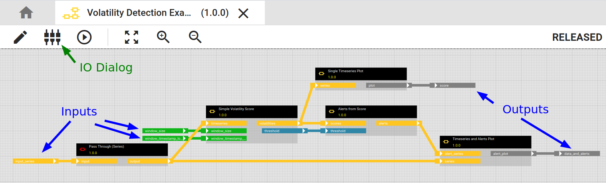
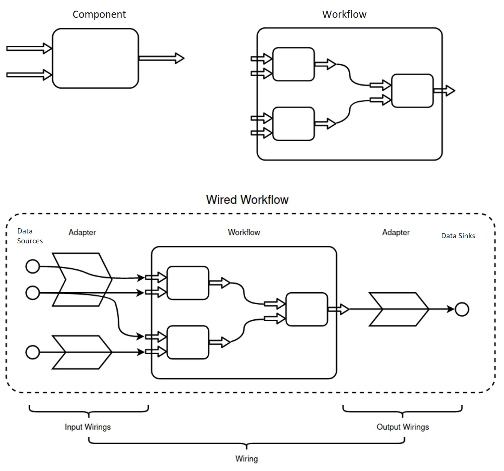

# Introduction to hetida designer adapter system

## Why not in/egestion operators?

Some graphical analytical workflow tools have "Load table from Postgres" or "Write to csv file" data **in/egestion operators** that you pull into your analytical workflows. This couples analytics with data engineering in a way that makes it cumbersome and difficult to employ the same workflow in different contexts.

At its worst it requires the user to manage several variants of her workflow, e.g. one with CSV-loading operators for development and one with database operators for production. If a workflow is reused over several facilities with different backing database systems one may furthermore need to handle even more variants.

Another disadvantage is that with such operators your workflow has side effects (in a functional programming sense) while the analytics itself typically is side-effect free. This can impose technical restrictions on some scaling / parallelizing / deployment scenarios. Generally it is a good idea to decouple analytics from data engineering whenever possible and think of it as a three-step process:
    **data goes in** :arrow_right: **analytics** :arrow_right: **results go out**.
    
**Note:** It certainly is possible to write and use such in/egestion operators in hetida designer since any Python code can be used when writing components. But it is not the recommended way of getting data into and out of your workflows.

Instead hetida designer provides a flexible **adapter system** that not only allows to decouple in/egestion from the analytics but also allows to browse data sources and sinks in the hetida desgner user interface (and even your custom web applications through using the dialog component or the adapter webservice endpoints in external software).

This means in particular that workflows in hetida designer are meant to contain only analytics and not data in/egestion.

## The hetida designer adapter system

The hetida designer adapter system has the following **main goals**:

* :dart: Decouple data engineering and in particular data in/egestion from analytics

* :dart: Allow flexible integration of arbitrary data sources and sinks

* :dart: Make it easy to browse, filter and find data sources and sinks in user interfaces

### Overview: Workflows, wirings and adapters

A **workflow** exposes an interface consisting of its dynamic inputs and outputs. This is what you configure in the IO dialog. Inputs and outputs have types like "DATAFRAME" or "SERIES" or "FLOAT" that correspond to the Pandas/Python types used internally.

When a workflow is executed a **wiring** is necessary to provide the needed information from where data sources should be ingested into what inputs and similary which output should go to what data sink. A wiring is a json object. The [running transformation revisions](../execution/running_transformation_revisions.md) documentation has some example wirings.

A wiring contains references to **adapters** which actually do the job of ingesting the data and sending it to sinks. Adapters also provide web service endpoints for browsing and filtering the available data in user interfaces in order to construct wirings. An adapter consists of software.

What the test execution dialog in hetida designer actually does is creating a wiring from user input and using this to execute a workflow.

### Built-In adapters

At the moment hetida designer is equipped with the following built-in adapters.

#### Direct provisioning (Manual Input / Only Output)

This adapter is a special adapter that allows to provide data directly when executing a workflow. That means the input values are part of the wiring, i.e. they are provided in the json object.

In particular this adapter is responsible for the manual input in the designer test execution dialog.

On the output side it handles the case of returning data from outputs with the execution web request: Result data from Outputs "wired" to this adapter is returned as part of the execution response when executing a workflow via the hetida designer backend webservice.

When automating workflows in production scenarios this adapter is typically used for simple parameters (like FLOAT or STRING inputs) but not for mass data (like DATAFRAME inputs/outputs).

#### Demo adapters

There are two demo adapters, a Java one and a Python one, that demonstrate the capabilities of the adapter system and how to write your own adapters.

They are **generic Rest adapters**, a certain kind of custom adapters that is easy to write and provides and receives data through web service endpoints (see below for details).

#### Local File Adapter

This adapter allows to read/write csv or excel files from/to directories directly mounted (as volumes) in the runtime container. This adapter is an example of a **general custom adapter** (read below on what that means).

Detail on usage and configuration of the Local File Adapter can be found [here](./local_file_adapter.md).

### Custom adapters

Writing custom adapters is the prefered way to connect your organization's or external data sources and sinks to hetida designer. There are two kinds of custom adapters you can write:

* General Custom adapters

* Generic Rest adapters

#### General custom adapters versus Generic Rest adapters

General custom adapters need to implement 

1. certain web service endpoints for data browsing / filtering and wiring construction in user interfacses

2. runtime functions (Python code) for actually loading / writing data.

The web endpoints from 1. agree with the same-purposed web endpoints of generic rest adapters mentioned below. What makes this adapters "general" is that they are not tied to loading/sending data through web endpoints like generic Rest adapters, but can provide their completely own method (2.) by adding custom plugin-Python-code to the runtime implementation.

Generic Rest adapters need to implement

1. certain web service endpoints for data browsing/ filtering and wiring construction in user interfacses

2. certain additional web service endpoints for receiving and sending data

These web service endpoints are typically implemented as one backend web service and therefore are quite easy to write. They can be written in the programming language of your choice.

General custom adapters need two code artefacts and the runtime functions need to be written in Python.

Generic Rest endpoints provide their data via JSON through web endpoints which is convenient but not suitable for really large data amounts due to serialization/deserialization costs and inefficiently large Json Request/Response sizes (compared to e.g. binary formats).

General custom adapters can use arbitrary code to access data and therefore can implement fast and efficient direct data access to databases etc. However the custom runtime functions are coupled to the runtime service which may have disadvantages for your deployment setup and security requirements etc. depending on your concrete usage scenario.

#### Guides/Examples for writing your own adapters

##### General Information

[Registering adapters](./adapter_registration.md)

##### Generic Rest adapters

[Generic Rest adapters web service endpoints documentation](./generic_rest_adapters/web_service_interface.md)

[Python Demo Adapter source code](https://github.com/hetida/hetida-designer/tree/release/demo-adapter-python)

[Java Demo Adapter source code](https://github.com/hetida/hetida-designer/tree/release/demo-adapter-java)

##### General Custom adapters

[Instructions on general custom adapters](./general_custom_adapters/instructions.md)

direct link to the [hetdesrun_config.py](https://github.com/hetida/hetida-designer/blob/release/runtime/hetdesrun_config.py) which explains the runtime-side implementation.

The built-in [local file adapter](./local_file_adapter.md) is an example of a general custom adapter.