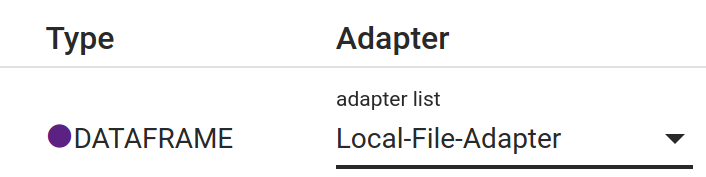
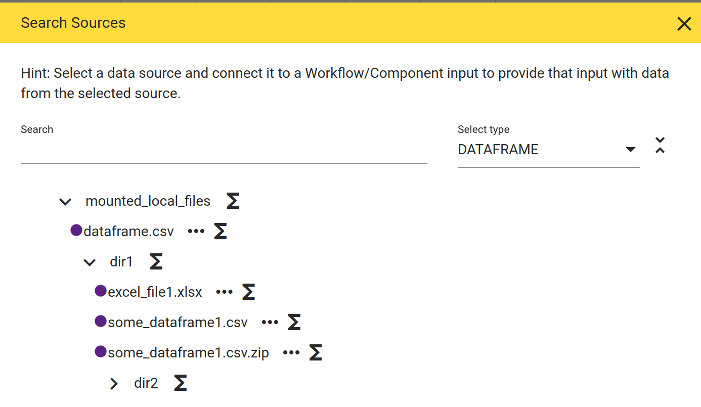

# Local File Adapter

The built-in local file adapter allows to read and write files (e.g. csv, excel) in directories that are mounted (as volumes) into the runtime container.

It allows to access data from files, typically

* at early stages of an analytical project working with dumps from databases when it is still unclear whether the benefits of properly integrating this data justify development of a a distinguished adapter for that database

* if these data files are too large for the manual input, i.e. data files exceeeding several hundred lines etc.

Furthermore even some production setups may work with data files instead of proper databases, for example via mounted SFTP directories. Note however that the local file adapter does not come with proper guarantees like for example atomic read/write operations, proper file locking etc which may reduce its applicability for such production scenarios!

## Configuration

This section explains how to make directories available for the local file adapter via the default docker-compose setup.

### Mounting directories

First a directory must be mounted into the runtime service. The default [docker compose file](https://github.com/hetida/hetida-designer/blob/release/docker-compose.yml) includes a configuration for a directory with demo data:

```yaml
  hetida-designer-runtime:
    ...
    volumes:
      ...
      - ./runtime/demodata/local_files:/mnt/mounted_local_files
```

You can for example replace the path `./runtime/demodata/local_files` with a path to a directory on your machine. Note that you can mount multiple volumes this way by adding more than one such volume mounts to make multiple directories available.

### Configuring the runtime

The local file adapter is built into the runtime and needs to know which mounted directories it should offer. This is configured via the environment variable `RUNTIME_LOCAL_FILE_ADAPTER_LOCAL_DIRECTORIES` of the runtime service which accepts a json-string containing a json-list of all mounted directories:

```yaml
  hetida-designer-runtime:
    ...
    environment:
      RUNTIME_LOCAL_FILE_ADAPTER_LOCAL_DIRECTORIES: '["/mnt/mounted_local_files"]'  
```

### Configuring the backend

Additionally the local file adapter itself needs to be [registered](./adapter_registration.md) in the designer backend. In the default docker-compose setup the local file adapter's part of the environment variable looks like this:

```
local-file-adapter|Local-File-Adapter|http://localhost:8090/adapters/localfile|http://hetida-designer-runtime:8090/adapters/localfile
```

If you have not changed anything else in your setup you may just leave this as is.

## Usage

### Basic Usage

After having made adaptions to the configuration described above you need to (re)start with

```bash
docker-compose stop
docker-compose up
```

Now all mounted directories and included local files with known extensions (.csv, .excel) should be available via selecting "Local File Adapter" in the Execution dialog:





This makes them available for reading with default settings, i.e. the default settings employed by the corresponding Pandas functions [read_csv](https://pandas.pydata.org/pandas-docs/stable/reference/api/pandas.read_csv.html) or [read_excel](https://pandas.pydata.org/pandas-docs/stable/reference/api/pandas.read_excel.html). The next sections describe how to

* allow writing of files

* use different settings for reading/writing than the default settings

### Accompanying .settings.json - Writing and load/write settings

Allowing writing of files and also configuring the settings for loading / writing is done via an accompanying file starting with the same name but with `.settings.json` appended. E.g. if you have a file `/my/dir/data.csv` you may place a file `/my/dir/data.csv.settings.json` beside it. This new file contains a json object structured as follows:

```json
{
    "loadable": true,
    "load_settings": {
        "sep": ";"
    },
    "writable": true,
    "write_settings": {
        "sep": ";"
    }
}
```

The entries `loadable` and `writable` are self-explanatory – you only need to know that at least one of them must be `true`. Note that if `writable` is `true` this allows overwriting of the file if it exists. Furthermore: If the file does not exists a .settings.json file with `writable` set to `true` nevertheless may be placed to allow to create/write that file.

The `load_settings` and `write_settings` contain a keyword-to-value mapping which is passed as `**kwargs` to the respective loading/writing function (in case of csv for example the Pandas read_csv function). This allows to configure all the settings supported by these functions.

## Adding your own file formats

The local file adapter is not restricted to the built-in supported file formats – you can add/register your own code for loading / writing your use case specific file format. This is done in the [hetdesrun_config.py](https://github.com/hetida/hetida-designer/blob/release/runtime/hetdesrun_config.py) in a straight-forward way. See there for further details and use the existing configuration for csv and excel files as examples/guideline on how to integrate your own file format.
