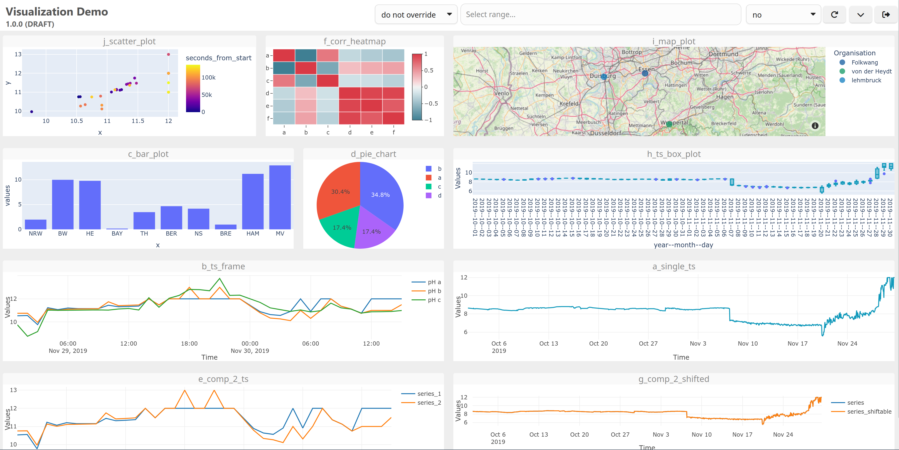
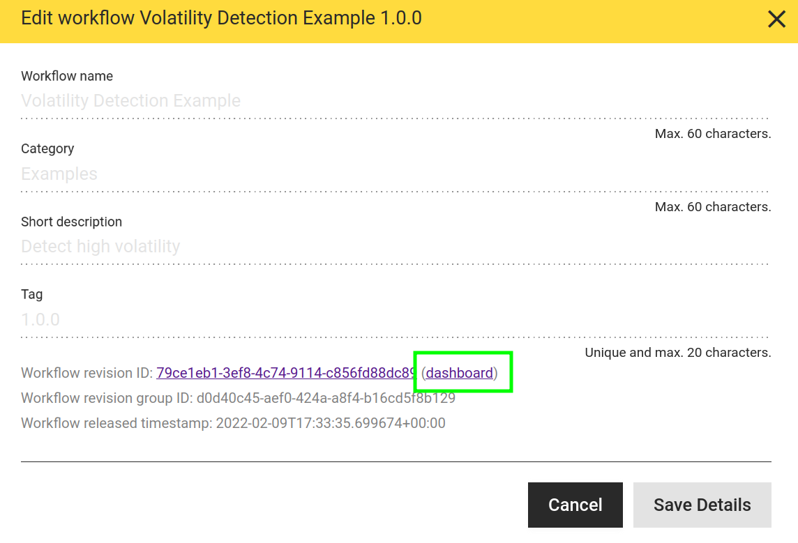

# Experimental Dashboarding
hetida designer workflow/component execution can generate outputs containing plotly json objects, which in turn can be rendered using plotly.js. One actually quite common use case for hetida designer is to use it as a backend service for providing highly customized analytical plots written in Python using Plotly to specialized frontends or dashboards.

hetida designer provides an experimental (read: proof of concept / demo!) dashboard view for each component/workflow to demonstrate these capabilities. I.e. to each component / workflow a dashboard exists that by default is tied to the current test wiring in the execution dialog.



Notes:
* In practice you would set the wiring directly in your web application's front- or backend and call the execution endpoint.
* The dashboard here is provided as pure html with inline styles and pure javascript while loading additional js libraries and CSS from external CDNs. Typically one would prefer to use a modern frontend framework with plotly wrapper components and accompanying build system and so on. On the other side the approach here makes the resulting dashboard pages self-contained / downloadable as single html pages.

## Basics
The experimental dashboards are backend-generated and reachable via the url:

```
URL_TO_BACKEND-API/transformations/<id>/dashboard
```

The id is the corresponding transformation revision id which you can find in the "Edit Details" dialog of a component / workflow. E.g. http://localhost/hdapi/transformations/28120522-a6a5-418f-a658-ab19d5beefe2/dashboard is the url of the multitsframe plot component's dashboard when working with the default docker-compose setup.

This link to the dashboard can always be found in the details dialog of your transformation in the frontend:



## Usage
* By default, the dashboard is tied to the current test wiring which you set in the hd frontend's execution dialog. 
    * In particular you need to execute your component / workflow there at least one time in order for the test wiring to be stored. Before that, the dashboard cannot work.
    * When you change the component/workflow you should do so again to ensure that the dashboard will have a fitting/correct wiring.
* When your component/workflow is released (or deprecated) you can also tie the dashboard to the "release wiring", i.e. the test wiring at the time of release. To do so you just need to append the query parameter `use_release_wiring=true` to the dashboard url. Tying to this fixed wiring avoids unexpected changes by someone else changing the current test wiring and hence is a basic requirement for exchanging permalinks to dashboards (see below for details). Example:

```
http://localhost:8080/api/transformations/f28d403f-88bb-4328-afd5-6a4aa53aa039/dashboard?use_release_wiring=true
```

* Via url query parameters you can override the used wiring's details. The format is `i.<INPUT_NAME>.property=value` for input wirings and `o.<OUTPUT_NAME>.property=value` for output wirings. This also allows to create completely new wirings 
    * Example: changing adapter_id for an input: `i.input_1.adapter_id=my_adapter`
    * Example: adding new direct_provisioning input wiring or overriding existing input wiring: `i.input_1.val=42`. This is actually a shortcut to change the `value` filter and set everything else to the defaults for a wiring with adapter_id `direct_provisioning`.
    * Example: overrding filter for output `o.output_1.filters.my_filter_key=new_filter_value`
* The "view/hide dashboard configuration" button in the upper right will show you the test wiring, the release wiring, indicates which of these two is used as base for overriding and finally the updated (overridden) wiring that is actually used when executing.
* The dashboard shows all plotly outputs of the component / workflow and all string outputs as html. It (currently) ignores all other outputs!
    * String outputs with a "_" at the end of the output name will result in only the html shown, i.e. the header with the output name is hidden.
    * Arbitrary html can be part of the string output and is rendered as such. Note that this may have security implications, depeding on how the string output is generated from trafo input data in the underlying Python code of your workflows/components!
    * For simple data tables we recommend to use the "Display Table" component (or a custom variant of it).
* You can rearrange the plots by dragging them around using their titlebar or resize them using the resize handles in the bottom corners. The arrangement is saved automatically as part of the test wiring. Furthermore the layout is mapped to url query params automatically. Layout query parameters have higher priority than what is stored in the test wiring allowing to exchange permalinks to dashboards with fixed layout.
* You can set the dashboard to auto-update every X seconds by selecting a value for X in the appropriate selection element in the dashboard user interface.
* You can override all the time ranges of the used wiring with a common absolute or relative time range selectable in the dashboard. 
    * Relative time ranges are practical for autupdating dashboards and combined allow to watch timeseries data progress.
    * Absolute time ranges can be used to depict and share (see below) specific historic data situations with co-workers.
    * Note that time ranges of course only affect those inputs — typically of type SERIES or MULTITSFRAME — which are wired to sources from adapters which actually provide a time range filter. In particular manual input is of course not affected.
* Autoupdate and time-range override settings are stored in the URL. Simply copy that URL if you want to access the dashboard with the same settings later or want to share it with a colleague.
* Inputs can be exposed via the configuration view, which means that they are shown as a dashboard element and can be edited directly. The new values will be wired as direct_provisioning inputs (manual inputs). This is mainly meant for single value parameters, not for mass data. It allows to play around with parameters interactively.

## Reproducible Dashboards via Permalink
A typical use case of dashboarding is to prepare a dashboard and exchange it with others (domain / business experts). In particular this is a good method to share an analytically prepared view on a specific data situation.

To do so we recommend the following steps:
* Create a workflow with the needed analytical preparation and the necessary plot components
* Run test execution in hetida designer selecting the interesting data for your situation
* Release your workflow to both fix the workflow and the test wiring as release wiring
* Open the dashboard (e.g. via the link in the details dialog)
* add the query parameter `use_release_wiring=true` to your url (example: `https://my_hd_designer.com/api/transformations/f28d403f-88bb-4328-afd5-6a4aa53aa039/dashboard?use_release_wiring=true`)
* Arrange plots and texts in the dashboarding view. Note how the layout is synced to the url query parameters
* Change other settings like time range override. Note how these settings are synced to url query parameters `i.input_1.val=42`
* Maybe override some wiring details, e.g. a manual input value of a parameter by adding the corresponding query parameter (e.g. )
* Copy the url and send it to the respective relevant recipients.

Note that the url is now a permalink since
* you used a released workflow
* you use the release wiring (instead of the current test wiring which may change at any time) as base
* all overrides and the layout are encoded in the url

Form here you may iterate on any level:
* Create revisions or copies of your workflow to change the analytical preparatin or plots
* Change wiring overrides to show effects depending on parameters for direct_provisioning / manual input parameters
* Change time ranges or the ingoing data via wiring overrides to get permalinks for different situations.

## Authentication
Dashboards require login according to the Backend auth settings (see [auth docs](./enabling_openidconnect_auth.md) for details).

In addition to the configuration described there you need to specify how the dashboard frontend can reach the auth provider (like keycloak) via setting the backend's `HD_DASHBOARDING_FRONTEND_AUTH_SETTINGS` environment variable to a json object: The default setup working with the setup described in the [auth docs](./enabling_openidconnect_auth.md) is

```
{ 
    "auth_url" : "http://localhost:8081/",
    "client_id": "hetida-designer",
    "realm": "hetida-designer"
}
```