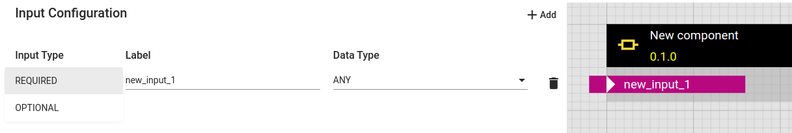
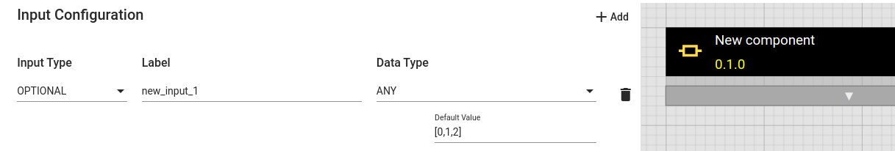
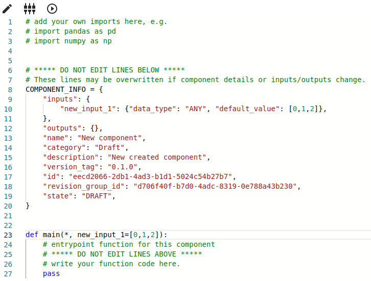
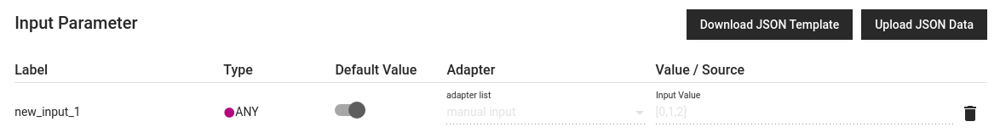
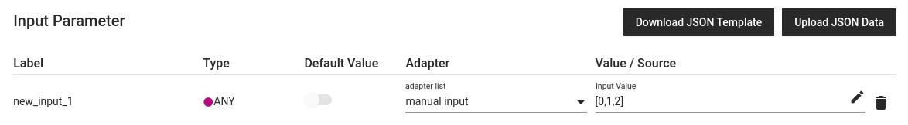
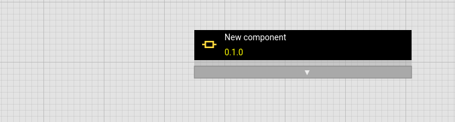
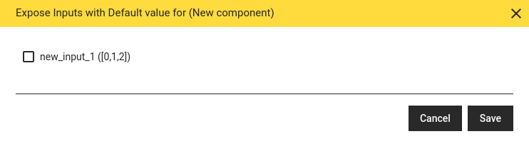
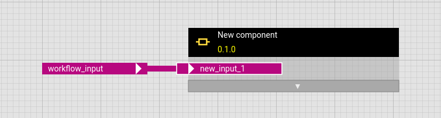
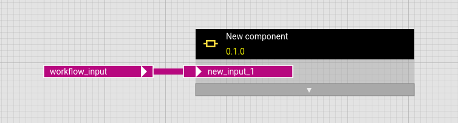

# Using Default Values

You can set default values for input parameters of compoments and workflows in the hetida designer. To do this, first open the dialog for configuring inputs and outputs.

Change the input type from "REQUIRED" to "OPTIONAL", then the input field for the default values appears.

Not entering a value will result in the default value `None` for all data types, even for inputs of type `STRING`.
As a workaround, enter a string and remove it to obtain an empty string as the default value.

Optional inputs are not displayed in the preview, but a grey bar with a white triangle in the center pointing down indicates the presence of optional inputs.

For components, the code is updated accordingly after saving the changes so that the actual default value is clear.

## Use or overwrite default values during execution

As you may expect, it is not necessary to provide an input wiring for optional inputs: If no input wiring is provided the respective default value will be used during execution.

In the execution dialog, for optional inputs, there is a toggle to switch between using the respective default value

or a value from some adapter (e.g. manual input) to override it:

Important Note: To overwrite the default value of an optional operator input in a workflow, the respective input must be exposed (see below!).

## Use or overwrite default values of operators in workflows

When an operator is added to a workflow, its optional inputs are not displayed.
A grey bar with a white triangle in the center pointing down indicates the presence of optional inputs.

Clicking on the grey bar opens a pop-up window in which all optional inputs are displayed with their default values and can be exposed or hidden by ticking or unticking them.

The exposed operator input can then be linked to another operator's output or to a workflow input.
A white border around the operator input indicates that it is an optional input that can be hidden if desired.

Just like component inputs, workflow inputs can be made optional, which is also indicated by a white border around the workflow input.
As expected in such a case, the outer default value overwrites the inner default value.

