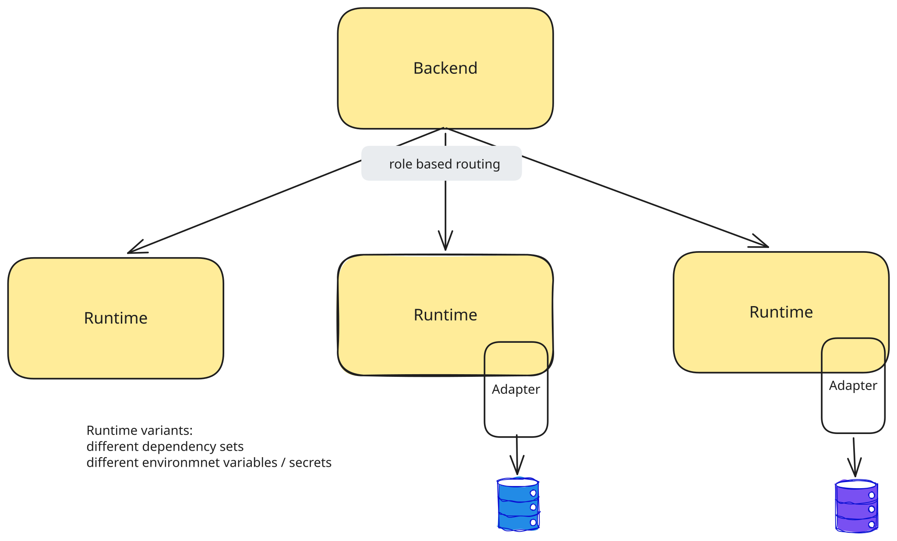

# Runtime Variants

Using `HD_AUTH_RUNTIME_ENGINE_URL_BY_ROLE`, you can employ different runtime service deployments, e.g. with varying runtime docker image and environment variables. Which runtime service variant is invoked depends on a role in the bearer token provided with the execution request, i.e dispatching/routing depends on a claim in the token.

This can be used to have runtime deployments varying for example in

* installed [Python dependencies](./managing_python_dependencies.md)
* available environment variables, in particular credentials




!!! info
    You may also be interested in [Trafo Restricted Execution Services](../integration_guide/trafo_exec_guide/restricted_webservice.md), which is a way to set up separate backend services that only offer execution restricted to only a fixed set of transformations.

## Usage Examples

### Managing privileged access to external systems

As an example, executions triggered by a more privileged (service) user may be routed/dispatched to a runtime deployment with additional credentials. These credentals can then be used by a [component adapter](../integration_guide/adapter_system/builtin_adapters/component_adapter.md) source component or a [general custom adapter](../adapter_system/general_custom_adapters/instructions.md) to access an external system that ordinary users should not have access to.

!!! note
    Generic Rest Adapters will use the bearer access token if [auth](authentication.md) is configured appropriately, so their access can be managed directly by the adapter's webservice.

### Resource Management

In some cases, resource intensive or high-priority executions should happen in another runtime deployment which may run on special cluster nodes. Consider e.g. access to GPUs or resource-intensive model training.

## Configuration

[Authentication](./authentication.md) must be active.

The `HD_AUTH_RUNTIME_ENGINE_URL_BY_ROLE` environment variable for the backend is configured with a json object mapping role strings to runtime service urls, e.g. 

```
{"hd-privileged-user": "http://privileged-runtime:8090"}
```

If no matching role is found in the token as configured by `HD_AUTH_ROLE_KEY`, the backend falls back to calling the default runtime service configured via `HETIDA_DESIGNER_RUNTIME_ENGINE_URL`. 

!!! warning
    So if using this mechanism to manage privileged access to resources, make sure `HETIDA_DESIGNER_RUNTIME_ENGINE_URL` points to the runtime service with the fewest privileges.

See [config.py](https://github.com/hetida/hetida-designer/blob/release/runtime/hetdesrun/webservice/config.py), especially the description of `auth_runtime_engine_url_by_role` for details. 

