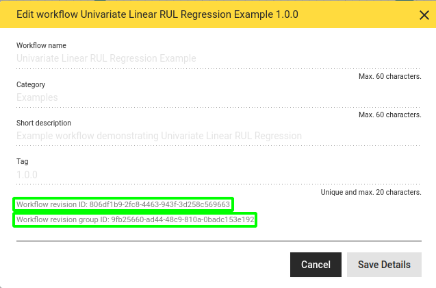

# Running Workflow and Component Revisions

Every transformation revision, whether component or workflow type, is immediately available for execution through the POST web service endpoint 

`/api/transformations/execute`

of the hetida designer backend service, whether in "draft" or "released" state.

For example the default docker-compose setup this endpoint can be reached via http://localhost:8080/api/transformations/execute

Additionally, the latest released revision of a revision group can be executed through the POST web service endpoint

`/api/transformations/execute-latest`

:warning: **Warning:** Depending on the latest revision present, this endpoint might not only yield different results for the same input but might even fail, if inputs or outputs have changed.

## The JSON payload and response for execution

The payload for the two endpoints is almost the same. The only difference is that either the revision id is provided with the key "id" or the id of the revision group with the key "revision_group_id".

The payload for the execute endpoint looks as follows:

```
{
  "id": "string", // the id of the respective transformation revision
  "wiring": {
    "id": "string", // the wiring id (if coming from a stored wiring)
                    // can be an arbitrary uuid.
    "input_wirings": [
      {
        "adapter_id": "string", // e.g. "direct_provisioning" or
                               // "local-file-adapter"
        "filters": { 
          // depends on adapter.
          // direct_provisioning adapter inputs require an entry with key
          // "value" and value being a string containing the actual value
          // as json value.
          "key1": "value1",
          "key2": "value2"
        },
        "ref_id": "string",     // id of THINGNODE, SOURCE, SINK (depending
                               // on redIdType)
                               // should be omitted or set to null for 
                               // direct_provisionig adapter
        "ref_id_type": "string", // one of THINGNODE, SOURCE, SINK. If type
                               // is metadata(...) this indicates to what
                               // structural element the metadata is tied.
                               // Otherwise this should be SOURCE for input
                               // wirings (and SINK for output wirings)
                               // Should be omitted or set to null for 
                               // direct_provisionig adapter
        "ref_key": "string",    // metadata key if type is "metadata(...)"
                               // should be omitted or be null otherwise
        "type": "string",      // type: see below
        "workflow_input_name": "string" // name of workflow input
      }
    ],
    "output_wirings": [
      {                        // see explanations above for input wiring
        "adapter_id": "string",
        "ref_id": "string",
        "ref_id_type": "string",
        "ref_key": "string",
        "type": "string",
        "workflow_output_name": "string"
      }
    ]
  },
  "run_pure_plot_parameters": "string",
  "job_id": "string"
}
```

#### Getting the transformation revision id and revision group id

The id of a workflow revision as well as its revision group id are shown in the "Edit workflow details" dialog: Open the workflow revision and click on the pencil button in the user interface


Then the id and below it the group ID are displayed at the bottom of the dialog window:



The procedure is analogous for a component revision.

#### Input and output wirings

See the section 'Enumeration "type"' in the [description of webservice endpoints of generic Rest adapters](../adapter_system/generic_rest_adapters/web_service_interface.md) for the possible values of "type".

The input wirings and output wirings tie inputs of the workflow or component revision to data sources via an adapter (and analogously the outputs to data sinks). Typically `ref_id` is a source id for inputs (i.e. `ref_id_type` is "SOURCE") and it is a sink id for outputs (i.e. `ref_id_type` is "SINK"). Note however that this may differ in the case of metadata. If the adapter provides metadata tied to a sink that should be read into an input the `ref_id_type` for this input is "SINK" instead, and the `ref_id` is the id of the sink the metadata is tied to.

#### Optional parameters

* `run_pure_plot_operators` (optional, default value: `false`): controls whether pure plot operators should be executed. Pure plot operators are operators (i.e. component instances) in the workflow which 
  
  * only have outputs of type PLOTLYJSON
  
  * and have an entrypoint function with `pure_plot_component` being set to `True` in the `register` decorator, e.g.:
    
    
  
  During production executions one typically does not want plot outputs. This feature allows to use a workflow with plots in production without the plot computing overhead.
  
  If `run_pure_plot_operators` is `false` these operators will not be run and return an empty dictionary `{}` for every PLOTLJSON outputs instead.

* `job_id` (optional, by default an arbitrary UUID will be generated): unique identifier which enables checking if the respective execution process is completed and match log messages to a specific execution process.

### Response

For both web service endpoints a successful response contains the result values for those workflow outputs that are wired via the "direct_provisioning" adapter. Also hetida designer internal types are for each output is provided. Outputs wired via other adapters do not occur.

```
{
    "result": "ok",
    "output_results_by_output_name": {
        "output_name_1": 42.2   // JSON VALUE or JSON object
        "output_name_2": {
            "column1": {
                "2019-08-01T15:45:36.000Z": 1,
                "2019-08-02T11:33:41.000Z": 2
            },
            "column2": {
                "2019-08-01T15:45:36.000Z": 1.3,
                "2019-08-02T11:33:41.000Z": 2.8
            }
        }
    },
    "output_types_by_output_name": {
        "output_name_1": "FLOAT",
        "output_name_2": "DATAFRAME"
    }
}
```

## JSON payload Examples

### Only "direct_provisiong" for both inputs and outputs

This is the payload for running the Example workflow "Volatility Detection Example" with the default wiring (everything "manual input" respectively "Only Output")

#### Payload

```
{
    "id": "79ce1eb1-3ef8-4c74-9114-c856fd88dc89",
    "wiring": {
        "input_wirings": [
            {
                "adapter_id": "direct_provisioning",
                "filters": {
                    "value": "{\"2018-05-19T22:20:00.000Z\":86.9358994238,\"2018-05-19T22:25:00.000Z\":78.6552569681,\"2018-05-19T22:30:00.000Z\":93.515633185,\"2018-05-19T22:35:00.000Z\":96.3497006614,\"2018-05-19T22:40:00.000Z\":83.1926874657,\"2018-05-19T22:45:00.000Z\":69.9740743464,\"2018-05-19T22:50:00.000Z\":90.5433921349,\"2018-05-19T22:55:00.000Z\":97.4750274531,\"2018-05-19T23:00:00.000Z\":101.6738801355,\"2018-05-19T23:05:00.000Z\":85.8482897506}"
                },
                "workflow_input_name": "input_series"
            },
            {
                "adapter_id": "direct_provisioning",
                "filters": {
                    "value": "600.0"
                },
                "workflow_input_name": "threshold"
            },
            {
                "adapter_id": "direct_provisioning",
                "filters": {
                    "value": "180min"
                },
                "workflow_input_name": "window_size"
            },
            {
                "adapter_id": "direct_provisioning",
                "filters": {
                    "value": "center"
                },
                "workflow_input_name": "window_timestamp_location"
            }
        ],
        "output_wirings": [
            {
                "adapter_id": "direct_provisioning",
                "workflow_output_name": "data_and_alerts"
            },
            {
                "adapter_id": "direct_provisioning",
                "workflow_output_name": "score"
            }
        ]
    },
    "run_pure_plot_operators": false,
    "job_id": "00000000-0000-0000-0000-000000000002"
}
```

#### Response (shortened):

Here the only outputs are of type PLOTLYJSON. They may be `{}` if query `run_pure_plot_operators`  was `false.` Since both outputs were wired via the "direct_provisioning" adapter their output values are returned in the response in 

```
{
    "result": "ok",
    "output_results_by_output_name": {
        "data_and_alerts": ...
        "score": ...
    },
    "output_types_by_output_name": {
        "data_and_alerts": "PLOTLYJSON",
        "score": "PLOTLYJSON"
    }
}
```

## Mixed example

Here both inputs are wired via the Python demo adapter. One of them is wired to metadata from a node of the adapter's hierarchy. The example workflow actually has two outputs of which only one is wired to a sink. The other one will be automatically inferred to use the direct_provisioning adapter.

```
{
    "id": "79ce1eb1-3ef8-4c74-9114-c856fd88dc89",
    "wiring": {
        "input_wirings": [
            {
                "adapter_id": "demo-adapter-python",
                "filters": {},
                "ref_id": "root.plantA.alerts",
                "ref_id_type": "SOURCE",
                "type": "dataframe",
                "workflow_input_name": "df_in"
            },
            {
                "adapter_id": "demo-adapter-python",
                "filters": {},
                "ref_id": "root.plantA",
                "ref_id_type": "THINGNODE",
                "ref_key": "Plant Age in Years",
                "type": "metadata(int)",
                "workflow_input_name": "int_in"
            }
        ],
        "output_wirings": [
            {
                "adapter_id": "demo-adapter-python",
                "ref_id": "root.plantA.alerts",
                "ref_id_type": "SINK",
                "type": "dataframe",
                "workflow_output_name": "df_out"
            }
        ]
    },
    "run_pure_plot_operators": false,
    "job_id": "00000000-0000-0000-0000-000000000002"
}
```

The response:

```json
{
    "result": "ok",
    "output_results_by_output_name": {
        "int_out": 8
    },
    "output_types_by_output_name": {
        "int_out": "INT",
        "df_out": "DATAFRAME"
    }
}
```

## Running workflow and component revisions using Kafka

see the documentation for [Execution via Apache Kafka](./execution_via_kafka.md).

