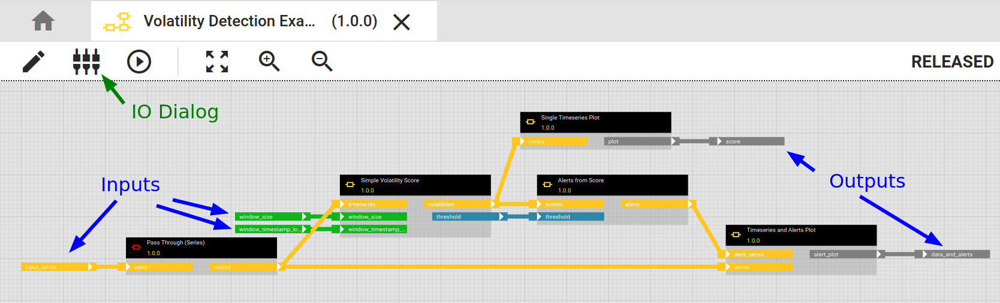
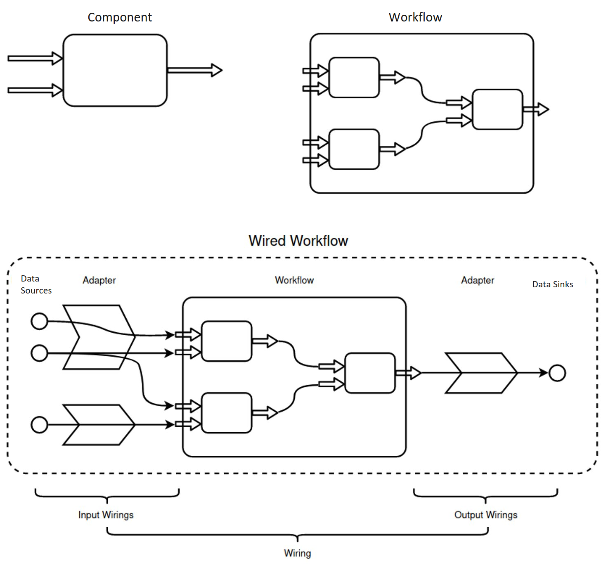

# Introduction to hetida designer adapter system

hetida designer provides a flexible adapter system enabling integration of arbitrary data sources and sinks. Besides including builtin adapters it allows you to write your own custom adapters and makes them available in user interfaces making it possible to discover, browse and search data sources and sinks. One example for such a user interface is the hetida designer test execution dialog itself.

The adapter system allows to execute the exact same transformation on csv files as inputs during experimentation/development and then switch to production database data simply through swapping adapters in a so-called "wiring" data structure.

## Why not in/egestion operators?
Often graphical workflow tools have "Load table from Postgres" or "Write to csv file" data **in/egestion operators** that you pull into your analytical workflows. This couples analytics with data engineering in a way that makes it cumbersome and difficult to employ the same workflow in different contexts.

At its worst it requires the user to manage several variants of their workflow, e.g. one with CSV-loading operators for development and one with database operators for production. If a workflow is reused over several facilities with different backing database systems one may furthermore need to handle even more variants.

Another disadvantage is that with such operators your workflow has side effects (in a functional programming sense) while the analytics itself typically is side-effect free. This can impose technical restrictions on some scaling / parallelizing / deployment scenarios. Generally it is a good idea to separate analytics from data engineering whenever possible and think of it as a three-step process:

**data goes in** :arrow_right: **analytics** :arrow_right: **results go out**.

!!! note "Note"
    It certainly is possible to write and use such in/egestion operators in hetida designer since any Python code can be used when writing components. But it is not the recommended way of getting data into and out of your workflows. Workflows in hetida designer are meant to contain only analytics and not data in/egestion, but this is not enforced.

So in contrast to these tools, through its adapter system, hetida designer *decouples* in/egestion from analytics and also allows to browse data sources and sinks in the hetida designer user interface (and even your custom web applications through using the dialog component or the adapter webservice endpoints in external software).

## Goals

The hetida designer adapter system has the following **main goals**:

* :dart: **Integration**: Allow flexible integration of arbitrary data sources and sinks

* :dart: **Decoupling**: Separate data engineering and in particular data in/egestion from analytics

* :dart: **Discoverability**: Make it easy to browse, filter and find data sources and sinks in (possibly external) user interfaces

## How It Works
A workflow or component exposes an interface consisting of its dynamic inputs and outputs. This is what you configure in the IO dialog. Inputs and outputs have types like "DATAFRAME" or "SERIES" or "FLOAT" that correspond to the Pandas/Python types used internally.

When a workflow is executed a **wiring** is necessary to provide the required information from where data sources should be ingested into what inputs and similary which output should go to what data sink. A wiring is a json object. The [Execution via API](../trafo_exec_guide/execution_via_api.md) documentation has some example wirings.

A wiring contains references to **adapters** which actually do the job of ingesting the data and sending it to sinks. Adapters also provide web service endpoints, i.e. an API conforming to the [adapter API interface specification](./adapter_rest_api_interface.md), for browsing and filtering the available data in user interfaces in order to construct wirings. An adapter consists of software.

Adapters need to be [registered](./adapter_registration.md) by the hetida designer backend. The hetida designer backend [API](../api.md) then provides an endpoint `/api/adapters` that gives information about available adapters und how to reach them, in particular urls to their REST API. Frontends or external services can use this to request and search available sources and sinks from these [adapters' APIs](./adapter_rest_api_interface.md) and to create wirings from them.

!!! example
    E.g., what hetida designer's own test execution dialog actually does is creating a wiring from user selection/input and using this to execute a workflow.

During execution the hetida designer runtime fetches data from the wired adapter data sources for each input, then executes the workflow with that data and at the end sends output data to the wired data sinks.

How it fetches and sends the actual data depends on the adapter. Generally there are two types of adapters:

* **Generic Rest adapters**: They provide and receive data via HTTP / their Rest [API in a specified fashion](./adapter_rest_api_interface.md).
* **General Custom adapters**: Arbitrary Python code is supplied to the hetida designer runtime via a Plugin system. E.g. to directly access a database. Their API is only used for searching and selecting data sources and sinks.

!!! info
    Some of the [builtin adapters](./builtin_adapters/), like the [component adapter](./builtin_adapters/component_adapter.md) or [virtual structure adapter](./builtin_adapters/virtual_structure_adapter.md) work differently.

## Next Steps

* Use some of the [builtin adapters](./builtin_adapters/)
* Write a component for the [component adapter](./builtin_adapters/component_adapter.md) to quickly integrate a custom source or sink.
* Write and deploy your completely own [custom adapter](./custom_adapters/)

