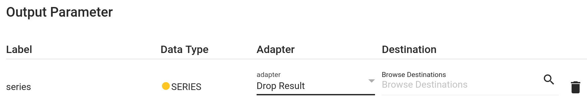

# Drop Result Adapter

A built-in adapter that only can be wired to outputs: It simply drops/swallows the result, i.e. does not send it anywhere and does not return it in the execution response (in contrast to selecting Only Output, i.e. the [direct provisioning](./direct_provisioning.md) adapter).

This is practical for components or workflows that provide a result that is not needed in all use cases. Or that provide the same result in two different ways, e.g. as a plot and as a SERIES: Interactively you may set the plot output to *Only Output* and the SERIES output to *Drop Result*. For automated background executions it is probably vice versa.

!!! warning
    Wiring an output to the drop adapter does not mean that the output value is not calculated: hetida designer execution is not lazy with respect to Drop. So dropping the result does not help avoiding resource- or time-intensive computations. 
    
    Instead the [execution endpoint](../../trafo_exec_guide/execution_via_api.md#optional-parameters) supports an option `run_pure_plot_operators` that sould be disabled to actually avoid building and sending plots in automated production background jobs.

!!! note
    There is also a base component named "Forget" that accepts an input and has no output and actually does nothing. Use this as an operator in your workflow if you even want to deny the choice of wiring an (unused) output of a workflow.