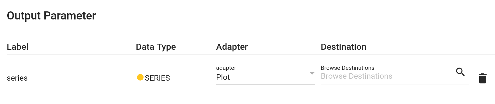

# Plot adapter

The plot adapter can only be wired to outputs and replaces the result with a PLOTLYJSON, using a fixed visualization depending on the output type.

It can be used to get a quick visualization of an output instead of the json object. E.g. for a SERIES output it provides a simple single timeseries plot.

In hetida designer UI this is a quick way to visualize output data when testing components/workflows that are meant for automation, avoiding the need to add a visualization component operator to the workflow.

The PLOTLYJSON results are returned with the execution response in the same way the original outputs would be returned if *Only Output*, i.e. the [direct provisioning](./manual_input.md) adapter, was selected. The type in `output_types_by_output_name` is set to PLOTLYJSON and the value in `output_results_by_output_name` is the plotly json object.