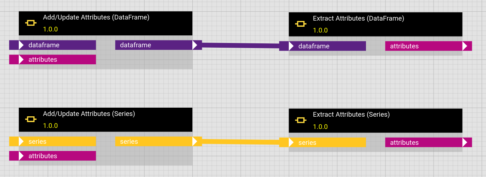

# DataFrames, MultiTSFrames and Series with attached Metadata

Metadata to a dataset is an essential ingredient for many analytical operations. E.g. if you want to detect gaps in an irregular timeseries and you only get the timestamp, value pairs of a time interval, you cannot know where the interval starts and ends. Consequently you are unable to say whether there is a gap at the beginning or end.

Both [pandas DataFrames](https://pandas.pydata.org/docs/reference/api/pandas.DataFrame.attrs.html) and [pandas Series](https://pandas.pydata.org/pandas-docs/version/1.0.0/reference/api/pandas.Series.attrs.html) can have metadata attached in their attribute `attrs`. The hetida designer and its [adapter system](./adapter_system/generic_rest_adapters/web_service_interface.md) support enriching and receiving such metadata.

## Add Attributes and Extract Attributes components

To extract or update the metadata the corresponding base components "Extract Attributes (DataFrame)", "Extract Attributes (MultiTSFrame)", "Extract Attributes (Series)", "Add/Update Attributes (DataFrame)", "Add/Update Attributes (MultiTSFrame)" and "Add/Update Attributes (Series)" are available in the category "Connectors".

 

The "Extract Attributes" components reads `attrs` from the underlying Dataframe/Series object and outputs it as a Python dictionary.

The "Add/Update Attributes" components update the metadata dictionary stored in `attrs` of the underlying Dataframe/Series.

## Providing and outputting metadata with manual input (direct provisioning)
You can provide such metadata when manual inputting data by using a wrapped format as follows:
```json
{
    "__hd_wrapped_data_object__": "DATAFRAME",
    "__metadata__": {"test": 43},
    "__data__": {"a": [2.3, 2.4, 2.5], "b": ["t", "t", "k"]}
}
```
for a DATAFRAME input,
```json
{
    "__hd_wrapped_data_object__": "DATAFRAME",
    "__metadata__": {"test": 43},
    "__data__": {
        "metric":["a","b"],
        "timestamp": ["2023-01-01T00:00:00.000Z","2023-01-01T00:00:00.000Z"],
        "value": [2.3, "t"]
    }
}
```
for a MULTITSFRAME input or
```json
{
    "__hd_wrapped_data_object__": "SERIES",
    "__metadata__": {"test": 43},
    "__data__": [1.2, 3.7, 8.9]
}
```
for a SERIES input.

Here the content of the `__data__` field can be anything which the corresponding actual DataFrame or Series parsing may understand. See below for more parsing options!

This "wrapper" format is also received when using the direct provisioning adapter for outputs ("Output Only").

Note that the unwrapped format (i.e. sending only the content of the `__data__` field unwrapped) also works and provides the parsed object with an empty dictionary `{}` as `.attrs` attribute.

**Note:** The local file adapter does not support sending or receiving metadata in `attrs` currently.


## Metadata field conventions

The following metadata fields should be attached to timeseries objects (typically MULTITSFRAME or SERIES inputs/outputs). I.e.
* We strongly recommend that custom adapter implementations provide them!
* Some base components may expect these metadata fields in the `.attrs` dictionary of input dataframes (or multitsframes) or series.
* Some base components may provide these metadata fields in the `.attrs` dictionary of output dataframes (or multitsframes) or series objects.

```
{
    # Start / End timestamps of the queried time interval in explicit UTC isoformat:

    "ref_interval_start_timestamp": "2023-01-01T00:00:00+00:00", 
    "ref_interval_end_timestamp": "2023-01-01T00:00:00+00:00",


    # Type of queried time interval (one of
    # "left_closed", "right_open", "right_closed", "left_open", "closed", or "open"):

    "ref_interval_type": "closed",


    # Queried metrics as array/list (List with exactly one entry for a 
    # single timeseries)

    "ref_metrics": ["sensor_a", "sensor_b"],


    # Fixed frequency (timedelta between subsequent datapoints) of the timeseries as
    # Pandas date offset alias or a timedelta string.
    # In combination with an offset this defines the absolute timestamps at which data is expected.

    "ref_data_frequency": {"sensor_a": 5min}
    "ref_data_frequency_offset": {"sensor_a": 4min}

}
```

Some remarks:
* `ref_interval_start_timestamp`, `ref_interval_end_timestamp` together with `ref_interval_type` carry all information necessary for the "gap detection" use case described at the beginning of this page.
* `ref_metrics` is additionally necessary for this use case if one wants to implement it for a bundle of timeseries received as multitsframe: If there is no datapoint at all for a certain metric, you need to know that you should return an interval sized gap for that metric.
* `ref_metrics` can even be helpful for a single (time)series when organizing data / results. Therefore we recommend to always attach it.

## Adapter support
Several builtin adapters support sending and receiving metadata:
* The direct provisioning adapter's special format was mentioned above.
* See [here](./adapter_system/generic_rest_adapters/web_service_interface.md) for how to provide and receive `.attrs` metadata for your own generic rest adapters.
* The [sql adapter](./adapter_system/sql_adapter.md) timeseries table feature provides the metadata from the above convention for its MULTITSFRAME source(s).

## Wrapped format parsing options
The wrapped format allows to specifiy the actual data in different ways and to add corresponding parsing options. For example 

```json
{
	"__hd_wrapped_data_object__": "SERIES",
	"__metadata__": {},
	"__data__": {
		"name": "series_name",
		"index": [
				"2020-01-01T01:15:27.000Z",
				"2020-01-01T01:15:27.000Z",
				"2020-01-03T08:20:04.000Z"
		],
		"data": [
			42.2,
			18.7,
			25.9
		]
		},
		"__data_parsing_options__": {
			"orient": "split"
		}
	}
```
provides SERIES data with a name, in "split" format (see Pandas [read_json](https://pandas.pydata.org/pandas-docs/stable/reference/api/pandas.read_json.html) documentation). In particular this allows to provide / enter duplicate indices via direct_provisioning.

You may provide other parsing options as well, but you have to make sure that the structure under `__data__` is parsable with your parsing options.

hetida designer always outputs the wrapped format for ouputs wired against the `direct_provisioning` adapter. For SERIES it uses the non-default "split" orient in order to preserve index duplicated. For DATAFRAME / MULTITSFRAME it expects all relevant information to be present in columns and therefore uses the default json serialization format for dataframes.


