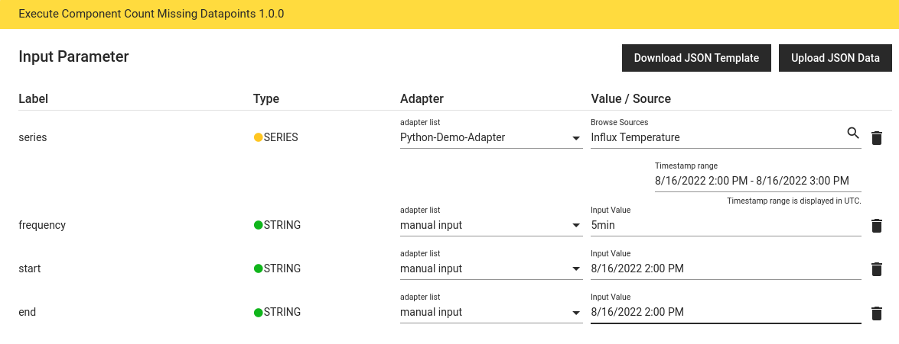
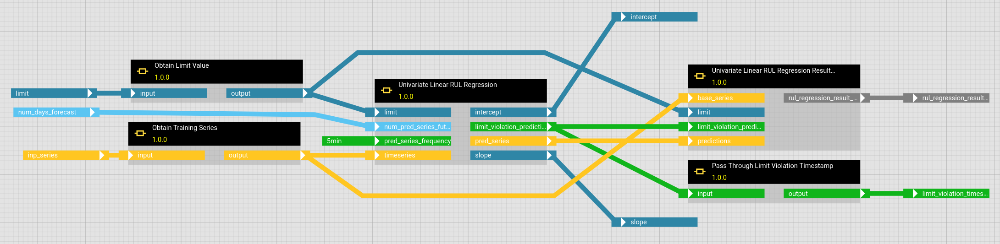
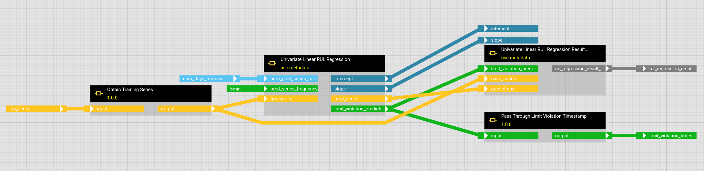

# DataFrames and Series with Metadata

Both DataFrames and Series offer the possibility to store metadata in the form of key-value pairs in addition to the actual data.

Metadata can be sent together with the data from the adapter to the hetida designer runtime or vice versa from the runtime to the adapter via the corresponding [endpoints of a generic REST adapter](./adapter_system/generic_rest_adapters/web_service_interface.md).
To access the metadata within a component just use the 'attrs' attribute.

To extract or extend the metadata of a DataFrame or a Series within a workflow, corresponding base components are available in the category "Connectors".

Usually it will be possible to create a component or workflow with the corresponding inputs and outputs instead, but their usage might be both cumbersome and error-prone:
For example, let's assume that you have time series where values are included or not included at a fixed frequency, and you want to know how many values are not included for a given time period.
Instead, you can configure the adapter to pass the start and end time of the queried period and the frequency associated with the time series in the metadata.

Passing a specific value each time in addition to the time series can also quickly become messy:

Last but not least the base components mentioned above are essential to test components or workflows which expect Series or DataFrames with metadata to create these and check the metadata afterwards.
