# hetida designer

## What is hetida designer?

hetida designer is an open source, scalable analytics engine for people wanting to do production data science and machine learning in Python without the hassles.

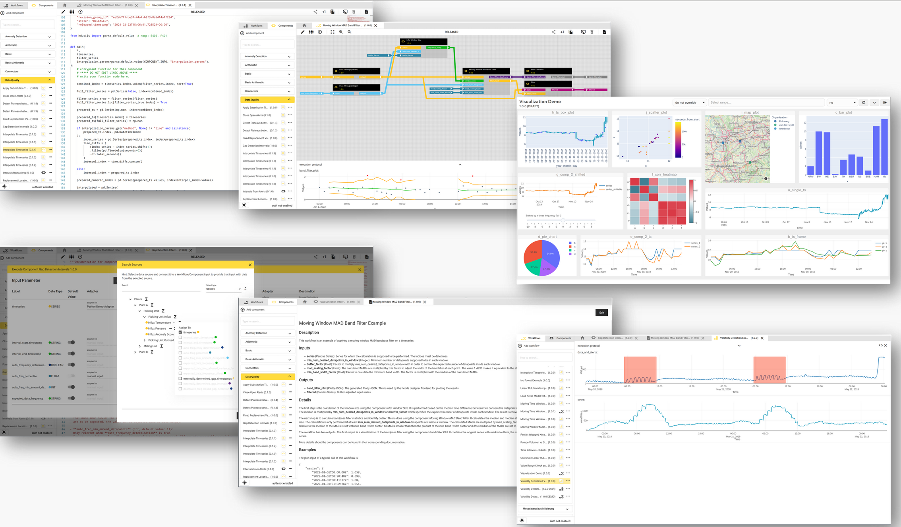

### From a user point of view
On the one hand, hetida designer is aimed at **data scientists** and **subject matter experts** who can write Python data science code and want to deploy it productively. Once hetida designer is set up, these users can develop, test, manage, document and employ their Data Science artifacts in its UI on their own without having to acquire professional software engineering knowledge (git, yaml files, Dockerfiles / containerization, deployment and ci / cd, devops, writing Rest APIs ...).

On the other hand, it enables **professional software or data engineers** to invoke, use, automate and integrate these artifacts and provide and receive data to/from them: Executing is just a REST call away, immediately. Adapters can be written to provide controlled and discoverable access to development as well as production data sources and sinks.

### From a technical point of view
hetida designer manages (versioning, lifecycle), exposes (Rest, Kafka) and scalably runs Python code and workflows while decoupling data access and egress via its adapter system. It furthermore integrates metadata in an opinionated way and treats visualization as a first class output, even for automated production runs.

hetida designer typically runs on Kubernetes to enable appropriate scaling, in particular for its runtime. Often it is part of a larger data (iot, timeseries) platform setup, like https://hetida.io/en/. A docker-compose setup is provided for small installations and trying out hetida designer.

hetida designer comes with a web UI, a backend / API, a runtime, a CLI Tool (hdctl) for maintenance and import/export tasks, built-in adapters for its adapter system and a set of base / example components and workflows. Additionally, experimental dashboard functionality is available, as well as simple scheduling.

### Main features
* managing Python data science code artifacts and workflows in a UI including versioning, lifecycle and documentation
* decoupling data provisioning and delivery from analytics
* zero deployment overhead: anything built in hetida designer is immediately invokable via REST or Kafka 
* visualization outputs (Plotly) are first-class citizens. A surprisingly prevalent use case for hetida designer is to provide custom Plotly visualizations for other applications' dashboarding.
* Data Scientists and Subject Matter Experts not required to learn git, yaml, ci/cd, devops, ... they can do everything in the UI. This enables collaboration with and between team members having varied skill level and exposure to software engineering.
* modularity and reusability through nestable workflows and components being able to import other components.
* pytest unittesting and standard Python logging
* maintainable data science through versioning and lifecycle management
* clear and precise visualization of data flow in workflows: See at a glance which output connects to which input
* simple cron scheduling
* experimental dashboarding: Every component/workflow defines a dashboard.

### What is it not?
* an orchestration and automation framwork or platform (despite having simple built-in cron scheduling.)
* a low-code / no-code graphical programming environment:
    * User's are expected to write their own components using Python at an early point.
    * hetida designer is far from providing a comprehensive and complete set of core components and workflows for data science.
    * workflows in hetida designer are just [DAGs](https://en.wikipedia.org/wiki/Directed_acyclic_graph): Looping and conditional logic need to be done in component code.
* a database
* a dashboarding solution
* a data platform. See https://hetida.io/en/ for a platform that integrates hetida designer as its analytics engine.
* an alternative to tableau, knime, rapidminer, alteryx, n8n, nodered, mlflow, kubeflow, kedro, bento, prefect, windmill.dev, dataiku, dagster, apache airflow, flyte, ... (add yours to the list when tempted to ask "So hetida designer is like X?"). hetida designer has its own distinct set of features and philosophy: hetida designer focusses on data science code and workflows (instead of models or experiments and general automation) and running them in production with modifiable data sources and sinks. Its philosophy is to make this possible without requiring data scientists and subject matter experts to grapple with git, yaml files, deployments, DevOps, and the like.

### More Screenshots 📸

??? note "Show more UI Examples"
    
    Home Tab
    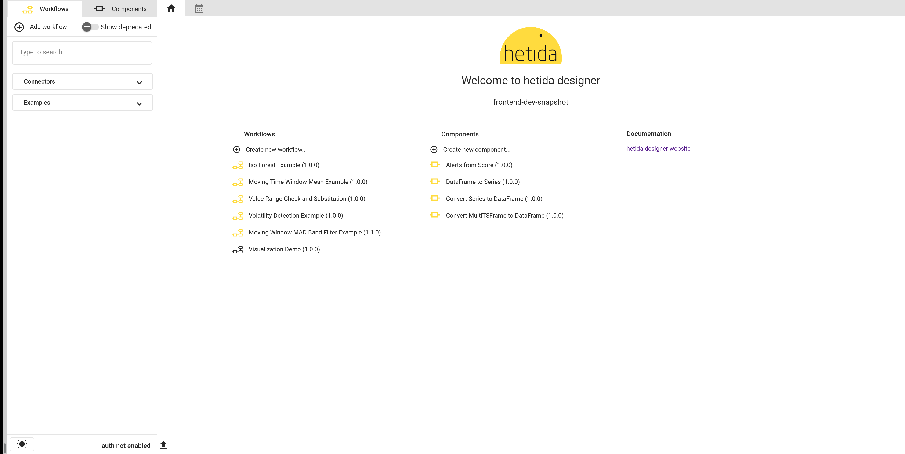

    Component Editor
    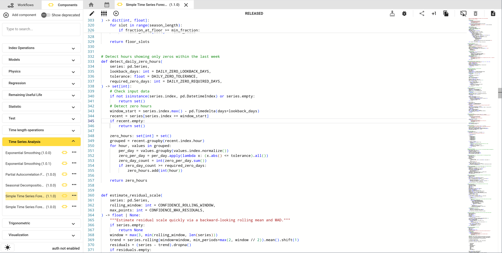

    Workflow
    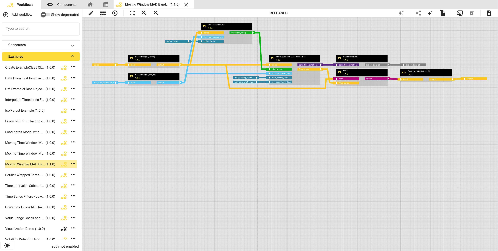

    Test Execution Dialog
    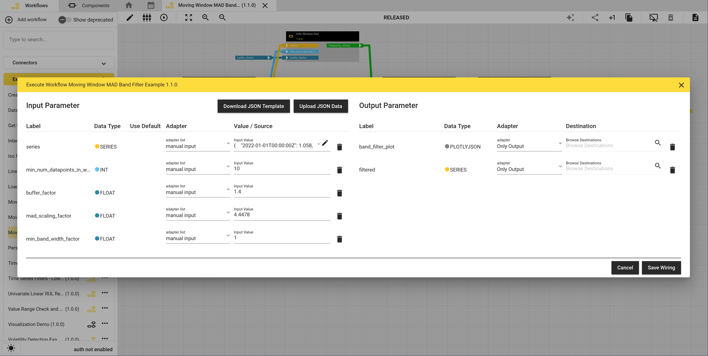

    Select Data From Adapter
    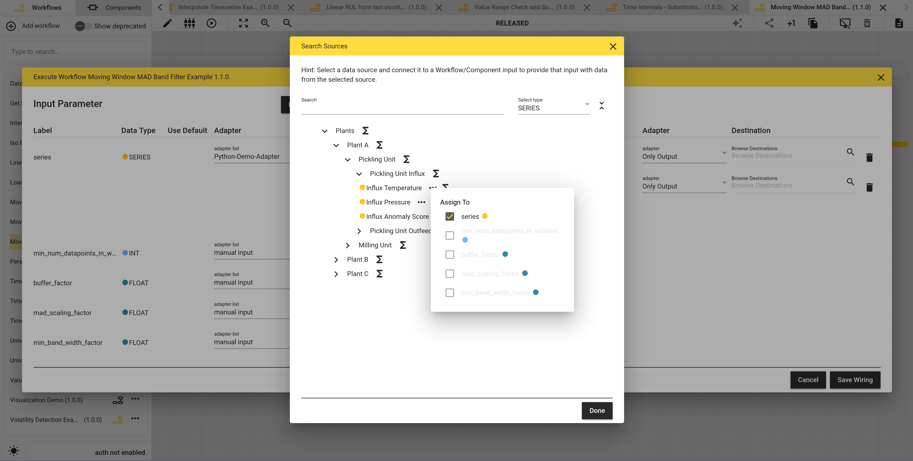

    Test execution result
    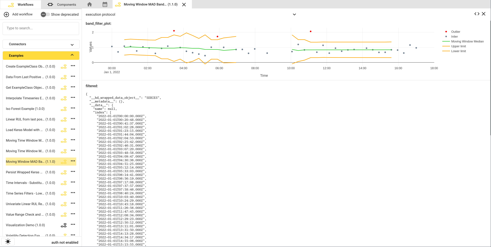

    Markdown Documentation Editor
    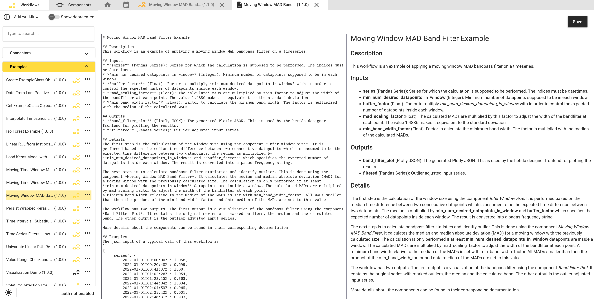

    Details Dialog
    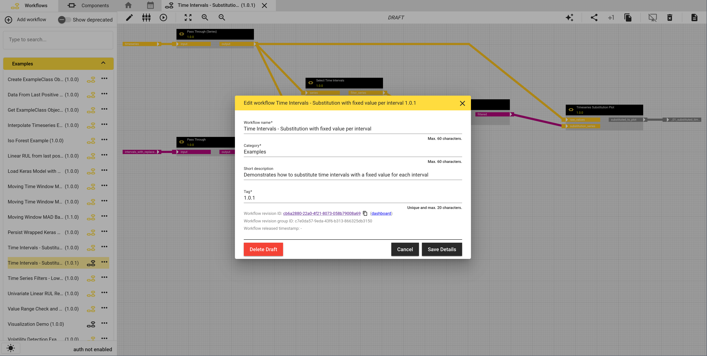

    Input/Output configuration dialog
    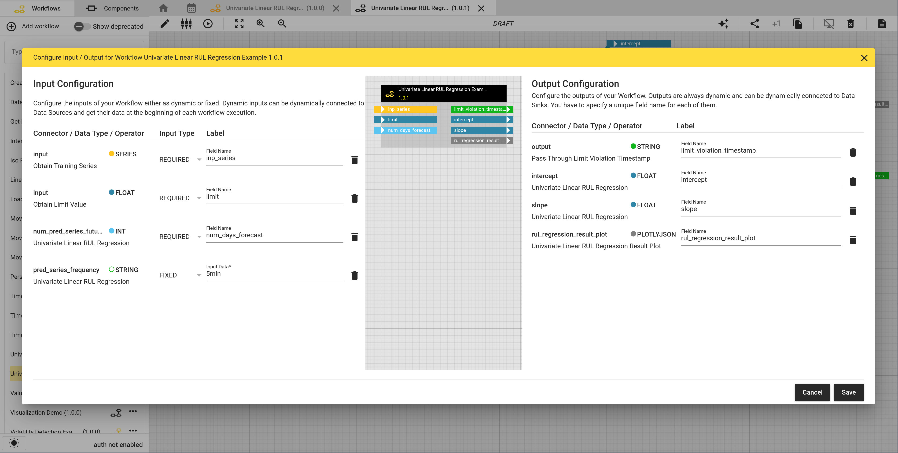

    Dashboard (experimental)
    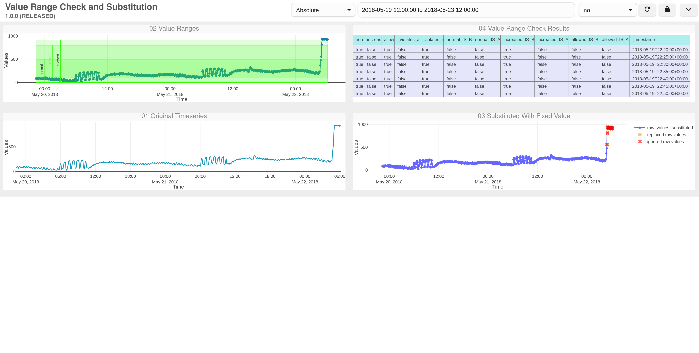

    Scheduling
    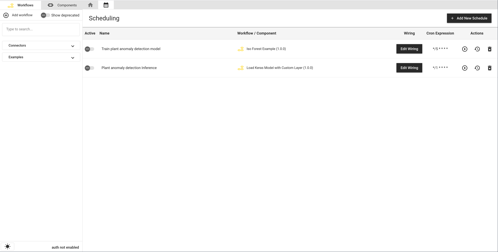

    Another Workflow Example
    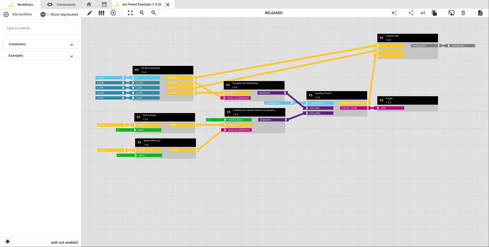

    Screenshot collection
    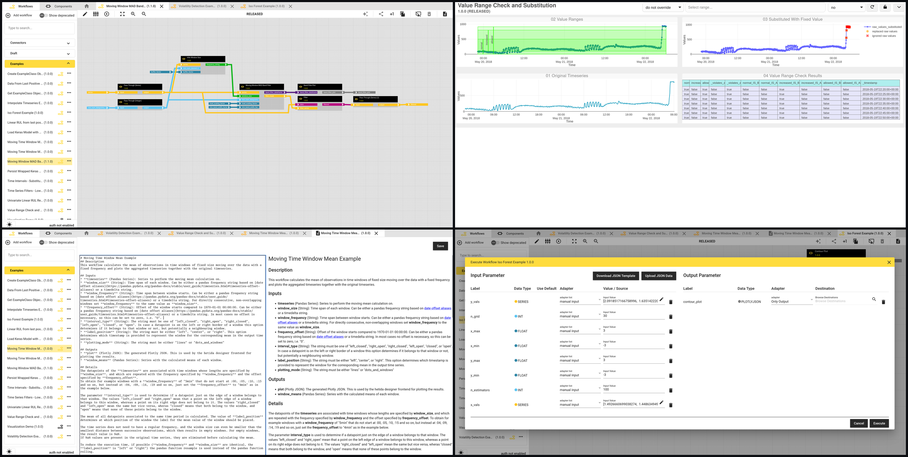

