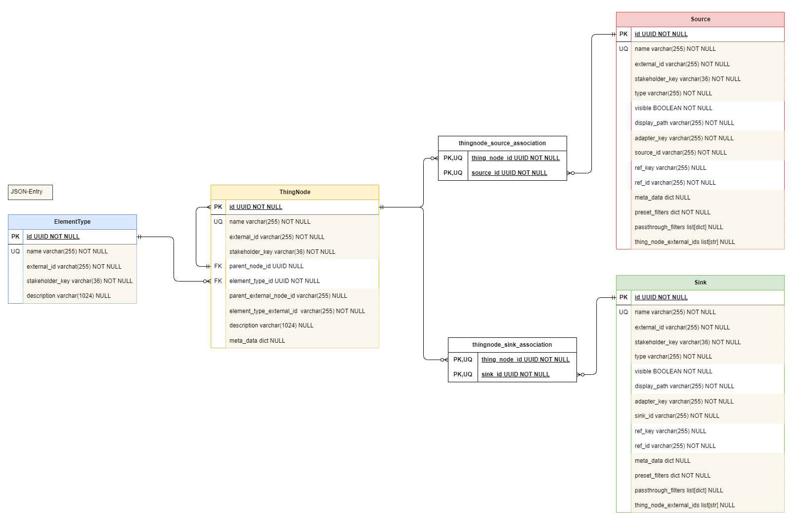

### Structure Service Package

The **Structure Service Package** provides functionality for managing and organizing hierarchical data structures within a system. It is useful when dealing with complex data models, such as those found in IoT systems like water management or financial portfolios. The Structure Service Package helps you create a structured representation of these systems, allowing for organized data flow and management that is aligned with the underlying data model. The package interacts with the [Virtual Structure Adapter](adapter_system/virtual_structure_adapter.md) to ensure that data is categorized and processed according to the domain-specific logic defined by the user.

#### Purpose and Use

The purpose of the Structure Service Package is to enable users to define, manage, and interact with hierarchical structures in a way that reflects both real-world and abstract systems. For example, this package can be used to represent the domain-specific logic of a wide range of complex systems, including but not limited to::

- **Water Treatment Systems**: Users can model the structure of water treatment plants, storage tanks, and associated data flows such as energy consumption monitoring and anomaly detection.

- **Financial Portfolios**: It can be used to organize and manage a hierarchical structure of financial assets, where portfolios contain different sectors, and sectors contain individual stocks, each with associated data sources such as market data and analytical outputs.

- **Supply Chain Networks**: The package can model the hierarchical structure of a supply chain, detailing various levels such as suppliers, manufacturers, distribution centers, and retailers, with associated data flows like inventory levels, shipment tracking, and demand forecasting.

- **File Systems**: Users can model a file system hierarchy, including directories, subdirectories, and files, with data sources representing file contents and data sinks representing backups or version control output.


This hierarchical structure is not just a static model, but a dynamic one that can be updated, extended, or modified as the system evolves. The Structure Service Package ensures that all parts of this hierarchy are consistent and aligned with the domain-specific requirements, providing a clear and organized view of the entire system.

### Key Concepts and Their Relevance

In order to effectively use the Structure Service Package to model complex systems, it is important to understand the key concepts:

- **ThingNode**: Represents individual elements within your hierarchical structure, such as a water treatment plant or a storage tank in a waterworks system. ThingNodes are the building blocks of your hierarchy and can have parent-child relationships, helping you create a clear, nested structure of your system.

- **Source**: Represents data inputs in your system, such as sensor data from a pump in a waterworks facility. Sources are linked to ThingNodes and provide real-time or historical data that feeds into the system for analysis or monitoring.

- **Sink**: Represents outputs or results within your system, such as calculated anomaly scores based on energy consumption data. Sinks are also linked to ThingNodes and are the endpoints where processed data is stored or utilized.

- **ElementType**: Defines the type of a ThingNode, such as "Plant" or "Storage Tank," and encapsulates its characteristics. This ensures that each node behaves according to its role within the system.

- **CompleteStructure**: Encapsulates the entire hierarchical data model, including all ThingNodes, Sources, Sinks, and ElementTypes. This concept ensures that the system's structure is managed as a unified whole, keeping all parts of the hierarchy in sync.

The following ERM (Entity-Relationship Model) diagram provides a visual representation of how these key concepts are structured and interrelated within the Structure Service Package:

 

This diagram illustrates the relationships between ThingNodes, Sources, Sinks, and ElementTypes, showing how they are linked within the system to ensure consistent and organized data management. The gray-highlighted fields in each entity represent attributes that must be provided in a JSON structure. These fields are required to correctly integrate the respective entity into the hierarchical data model. Non-highlighted fields are defined internally within the system and do not need to be provided in the JSON structure. The IDs are automatically generated and managed by the system.

### Integration with the Virtual Structure Adapter

The Structure Service Package is closely integrated with the Virtual Structure Adapter, which overlays domain-specific logic onto the hierarchical data structures. While the Virtual Structure Adapter is responsible for organizing and categorizing data flows according to the domain-specific requirements defined by the user, the Structure Service Package provides the interface to the database, handling the CRUD (Create, Read, Update, Delete) operations.

For detailed information on how the Virtual Structure Adapter works and how it applies domain-specific logic to these structures, refer to the [Virtual Structure Adapter Documentation](adapter_system/virtual_structure_adapter.md).

### Practical Example: Waterworks System

To illustrate the application of the Structure Service Package in a real-world scenario, consider a waterworks system. The system includes various nodes such as plants and storage tanks, each with associated data sources and sinks. The Structure Service Package manages this underlying data structure, ensuring that each facility’s data is accurately linked and organized.

Below is an example of how such a system might be modeled using the Structure Service Package:

#### JSON Structure Example

The hierarchical structure of the waterworks system can be represented in a JSON format, where each entity (ThingNode, Source, Sink, etc.) is clearly defined and connected within the overall hierarchy. This structure can be imported into the system to automatically set up the necessary data model.

**Example JSON Structure for a Waterworks System:**

```json
{
    "element_types": [
        {
            "external_id": "Waterworks_Type",
            "stakeholder_key": "GW",
            "name": "Waterworks",
            "description": "Type element for waterworks facilities"
        },
        {
            "external_id": "Plant_Type",
            "stakeholder_key": "GW",
            "name": "Plant",
            "description": "Type element for plants"
        },
        {
            "external_id": "StorageTank_Type",
            "stakeholder_key": "GW",
            "name": "Storage Tank",
            "description": "Type element for storage tanks"
        }
    ],
    "thing_nodes": [
        {
            "external_id": "Waterworks1",
            "stakeholder_key": "GW",
            "name": "Waterworks 1",
            "description": "Root node for Waterworks 1",
            "parent_external_node_id": null,
            "element_type_external_id": "Waterworks_Type",
            "meta_data": {
                "location": "Main Site"
            }
        },
        {
            "external_id": "Waterworks1_Plant1",
            "stakeholder_key": "GW",
            "name": "Plant 1",
            "description": "First plant",
            "parent_external_node_id": "Waterworks1",
            "element_type_external_id": "Plant_Type",
            "meta_data": {
                "location": "North"
            }
        },
        {
            "external_id": "Waterworks1_Plant2",
            "stakeholder_key": "GW",
            "name": "Plant 2",
            "description": "Second plant",
            "parent_external_node_id": "Waterworks1",
            "element_type_external_id": "Plant_Type",
            "meta_data": {
                "location": "South"
            }
        },
        {
            "external_id": "Waterworks1_Plant1_StorageTank1",
            "stakeholder_key": "GW",
            "name": "Storage Tank 1, Plant 1",
            "description": "First storage tank in Plant 1",
            "parent_external_node_id": "Waterworks1_Plant1",
            "element_type_external_id": "StorageTank_Type",
            "meta_data": {
                "capacity": "5000",
                "capacity_unit": "m³",
                "description": "Water storage capacity for Storage Tank 1"
            }
        }
    ],
    "sources": [
        {
            "external_id": "EnergyUsage_PumpSystem_StorageTank",
            "stakeholder_key": "GW",
            "name": "Energy usage of the pump system in Storage Tank",
            "type": "multitsframe",
            "adapter_key": "sql-adapter",
            "source_id": "improvt_timescale_db/ts_table/ts_values",
            "meta_data": {
                "1010001": {
                    "unit": "kW/h",
                    "description": "Energy consumption data for a single pump"
                }
            },
            "preset_filters": {
                "metrics": "1010001"
            },
            "passthrough_filters": [
                {
                    "name": "timestampFrom",
                    "type": "free_text",
                    "required": true
                },
                {
                    "name": "timestampTo",
                    "type": "free_text",
                    "required": false
                }
            ],
            "thing_node_external_ids": [
                "Waterworks1_Plant1_StorageTank1"
            ]
        }
    ],
    "sinks": [
        {
            "external_id": "AnomalyScore_EnergyUsage_PumpSystem_StorageTank",
            "stakeholder_key": "GW",
            "name": "Anomaly Score for the energy usage of the pump system in Storage Tank",
            "type": "multitsframe",
            "adapter_key": "sql-adapter",
            "sink_id": "improvt_timescale_db/ts_table/ts_values",
            "meta_data": {
                "10010001": {
                    "description": "Anomaly score for a single pump",
                    "calculation_details": "Window size: 4h, Timestamp location: center"
                }
            },
            "preset_filters": {
                "metrics": "10010001"
            },
            "passthrough_filters": [
                {
                    "name": "timestampFrom",
                    "type": "free_text",
                    "required": true
                },
                {
                    "name": "timestampTo",
                    "type": "free_text",
                    "required": false
                }
            ],
            "thing_node_external_ids": [
                "Waterworks1_Plant1_StorageTank1"
            ]
        }
    ]
}
```


### Configuration

To configure the hierarchical structures managed by the Structure Service Package, you can utilize JSON files that define the layout of ThingNodes, Sources, Sinks, and ElementTypes. These JSON files can be loaded into the system to create or update the structure. The Virtual Structure Adapter can then organizes and categorizes the data flow, ensuring that data is processed according to the hierarchy defined by the user.

Key configuration options include:

- **JSON Structure Files**: These files define the hierarchy of ThingNodes, their relationships, and the associated data sources and sinks. By loading a JSON file, you can set up or modify the structure as needed.

- **Environment Variables**: The system may use environment variables to control how structures are prepopulated or updated at startup, particularly when integrating with the [Virtual Structure Adapter](adapter_system/virtual_structure_adapter.md).

### Technical Information

The Structure Service Package integrates tightly with the Virtual Structure Adapter to manage and maintain hierarchical data structures within a database. The technical components ensure that the database accurately reflects the current structure and supports the necessary operations, such as creating, querying, updating, and deleting data.

- **Database Interaction**: The Structure Service Package uses SQLAlchemy ORM models to map Python objects to database records. This allows for interaction with the underlying database, ensuring that data structures are accurately represented and managed.

- **Data Integrity**: The Structure Service Package ensures that all relationships between ThingNodes, Sources, Sinks, and ElementTypes are consistent. This is important for maintaining the integrity of the data model as it evolves.

- **Updating Structures**: The package allows for updating existing structures by adding new elements or modifying existing ones. However, elements not present in a new structure will not be deleted unless the entire structure is removed and reinserted.

