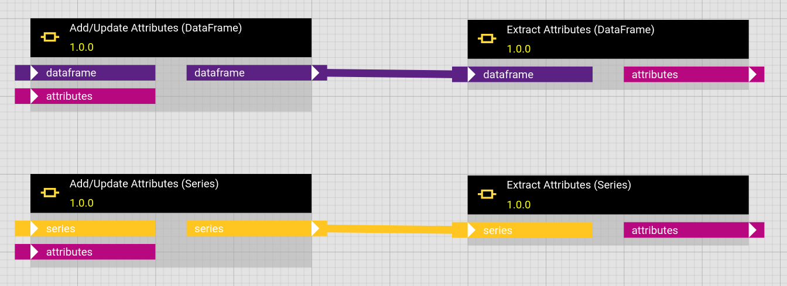

# DataFrames, MultiTSFrames, SingleTSFrames and Series with attached Metadata

Metadata is an essential ingredient for many analytical operations. E.g. if you want to detect gaps in an irregular timeseries and you only get the timestamp, value pairs loaded for a time interval, you cannot know where the interval starts and ends. Consequently you are unable to say whether there is a gap at the beginning or end. The loaded interval boundaries are necessary metadata for the gap detection.

Both [pandas DataFrames](https://pandas.pydata.org/docs/reference/api/pandas.DataFrame.attrs.html) and [pandas Series](https://pandas.pydata.org/docs/reference/api/pandas.Series.attrs.html) can have metadata attached in their attribute `attrs`.

hetida designer and its [adapter system](../integration_guide/adapter_system/adapter_system_introduction.md) support enriching and receiving such metadata. Especially for timeseries data hetida designer propagates conventions described further below and provides helper functions to gather metadata fields.

## Simple, convention-agnostic, metadata access

To extract or update the metadata the corresponding base components "Extract Attributes (DataFrame)", "Extract Attributes (MultiTSFrame)", "Extract Attributes (SingleTSFrame)", "Extract Attributes (Series)", "Add/Update Attributes (DataFrame)", "Add/Update Attributes (MultiTSFrame)", "Add/Update Attributes (SingleTSFrame)" and "Add/Update Attributes (Series)" are available in the category "Connectors".

<figure markdown="span">
{ height="110" width=850}
</figure>

The "Extract Attributes" components read `attrs` from the underlying Dataframe/Series object and output it as a Python dictionary.

The "Add/Update Attributes" components update the metadata dictionary stored in `attrs` of the underlying Dataframe/Series.

Both components do not in any way assume any structure of the metadata dictionary. We recommend to adhere to the conventions described below and use the respective helper functions instead.

## Providing and outputting metadata with manual input (direct provisioning)

You can provide metadata when manual inputting, i.e. using the [direct provisioning adapter](../integration_guide/adapter_system/builtin_adapters/direct_provisioning.md) data by using a wrapped format as follows:

```json
{
  "__hd_wrapped_data_object__": "DATAFRAME",
  "__metadata__": { "test": 43 },
  "__data__": { "a": [2.3, 2.4, 2.5], "b": ["t", "t", "k"] }
}
```

for a DATAFRAME input,

```json
{
  "__hd_wrapped_data_object__": "DATAFRAME",
  "__metadata__": { "test": 43 },
  "__data__": {
    "metric": ["a", "b"],
    "timestamp": ["2023-01-01T00:00:00.000Z", "2023-01-01T00:00:00.000Z"],
    "value": [2.3, "t"]
  }
}
```

for a MULTITSFRAME input or

```json
{
  "__hd_wrapped_data_object__": "SERIES",
  "__metadata__": { "test": 43 },
  "__data__": [1.2, 3.7, 8.9]
}
```

for a SERIES input.

Here the content of the `__data__` field can be anything which the corresponding actual DataFrame or Series parsing may understand. See below for more parsing options!

This "wrapper" format is also received when using the direct provisioning adapter for outputs ("Output Only" in the execution dialog).

!!! info "Unwrapped Format"
Note that the unwrapped format (i.e. sending only the content of the `__data__` field unwrapped) also works and provides the parsed object with an empty dictionary `{}` as `.attrs` attribute.

!!! info "Mounted Files Adapter"
The [local file adapter](../integration_guide/adapter_system/builtin_adapters/local_file_adapter.md) does not support sending or receiving metadata in `attrs` currently.

## Metadata conventions

For writing generalizable (base) components, it is preferred to have a metadata structure convention that adapters can conform to in order to make these components work with the data they provide. E.g. a component that plots timeseries data should expect the units at a specific point in the metadata which is independent on which adapter is used.

When writing your own adapters, we therefore strongly advise to follow the conventions defined here. On the other side adapters, when receiving data can make use of metadata to decide how to handle this data, e.g. whether existing data in the target interval should be invalidated / overwritten.

The metadata conventions defined here should be used for timeseries data of type SERIES, SINGLETSFRAME or MULTITSFRAME

### Basic concepts

We differentiate between

- metadata associated to the dataset
  - Examples: Loaded interval boundaries, aggregation level, requested metrics, ... Furthermore when the dataset is sent somewhere: How should it treat existing data, eg. invalidate it / overwrite it, etc.
- metadata associated to the metrics / timeseries
  - Examples: name, location
- metadata associated to individual value dimensions for a multidimensional timeseries
  - A multitsframe typically comes with one column "value" which defines a value dimension of that name for each metric. But multitsframes support arbitrary columns in addition to the fixed `timestamp` and `metric` columns. All these additional columns define a value dimension for each metric.
  - Examples: unit, measurement
  - For example you may have two metrics "pressure" and "temperature" in a multitsframe which only has one value column. You need to know that for the "pressure" metric the unit associated to the value dimension "value" is "bar" and for the "temperature" metric the unit associated to the value dimension "value" is "°C"
- metadata associated to each datapoint (pointwise)
  - Examples: state (valid/invalid), ingestion timestamp

#### Metadata associated to each datapoint

Such metadata should be a dedicated column in a multitsframe and thus is handled as an additional column, defining a value dimension for each metric. We hence consider such point-wise metadata as data.

### General structure of .attrs

Described as json

```yaml
{
  "dataset_metadata": {
    # metadata
    # * specific to the dataset (typically interval)
    # * what should happen during saving, in particular invalidation / deletion of existing data

    "metric_key": "id", # which key from the metric metadata identifies the metric in the
    # metric column of the dataframe. optional, if missing or none, "id" should be used.

    # "single_metric"
    # if only a single metric is present (e.g. in SERIES), this is the key
    # of the single metric occurring as single entry under "metrics" in the
    # key specified via "metric_key".
    # This should not be present / null, if more than one metric is present!
    "single_metric": "series",

    "queried_metrics": ["metric1", "metric2"],  # or null. Since not all queried metrics may have
    # data in the queried interval, it may be possible that a metric entirely is missing
    # in the dataset and depending on the providing adapter even from the "metrics"
    # metadata. Therefore it should be explicitly listed which metrics were requested.

    ... # see below!

  },
  "metrics": [
    {
      "id": "abcdef-1234",
      "name": "metric1",
      "value_dimensions": [
        {
          "column": "value", # actual column name in the multitsframe. This connects the
          # value_dimension to the actual column.
          "name": "temperature"
          "unit": "°C",
          ...
        }
      ]
      ...
    },
    ...
  ],
  "value_dimensions_shared": [
      # fallback / default information per value dimension or metadata for value dimensions
      # that actually have the same meaning for all metrics
      {
        "column": "value", # actual column name in the multitsframe. This connects the
        # value_dimension to the actual column.
        "name": "value",
        "unit": "UNKNOWN",
        ...
      }
      ...
  ]
}
```

Important hints:

- structure is the same for MULTITSFRAME, SINGLETSFRAME and SERIES
- The invalidation / overwrite / delete behaviour will be defined on the dataset, not on individual metrics or even value dimensions.
- metadata information can be omitted or null. E.g. value_dimensions does not need to be provided. Components should not require metadata and should have good default behaviour for missing metadata.
- additional metadata fields can be present at every point in the structure.

#### Example for SERIES

```yaml
{
  "dataset_metadata": {
    "single_metric": "my_series",
    "metric_key": "metric"
    ...
  },
  "metrics": [
    {
      "metric": "my_series",
      "unit": "kg",
      ...
    }
  ]
}
```

!!! info "Series => exactly one value dimension"
A SERIES inherently has exactly one value dimension (1-dimensional timeseries), which we expect to be "value". Because of the cascading fallback behaviour described further below, metadata for this value dimension can be directly provided in the metric object, like "unit" in this example.

#### Example for SINGLETSFRAME

A [SINGLETSFRAME](data_types/singletsframes.md) holds exactly one metric — like a SERIES — but arbitrarily many value dimensions — like a MULTITSFRAME. Its metadata therefore combines both: the single metric is named via `dataset_metadata.single_metric`, and its value dimensions are listed under `value_dimensions`.

```yaml
{
  "dataset_metadata": {
    "single_metric": "abc.temp", # the one metric this frame contains.
                                 # * is expected to uniquely appear in "metrics" below,
                                 #   under the key given by "metric_key".
                                 # * in contrast to a MULTITSFRAME there is no metric column
                                 #   in the dataframe that it could refer to.
    "metric_key": "external_id",
    ...
  },
  "metrics": [
    {
      "external_id": "abc.temp",
      "name": "ABC temperature",
      "value_dimensions": [
        {
          "column": "value", # actual column name in the singletsframe
          "name": "temperature",
          "unit": "°C",
          ...
        },
        {
          "column": "state", # a second value dimension of the same timeseries
          "name": "measurement state",
          ...
        }
      ]
      ...
    }
  ]
}
```

!!! info "Exactly one entry under metrics"
Since a SINGLETSFRAME holds exactly one metric, `metrics` should contain exactly one entry, namely the one identified by `single_metric`. If `single_metric` is missing and only one metric is present, components should use that one metric.

#### Example for MULTITSFRAME

```yaml
{ "dataset_metadata": { "metric_key":
        "external_id" # key which identifies the metric
        # * is expected to be used in metric column of actual dataframe
        # * is expected to uniquely appear in "metrics" below., ... }, "metrics": [{ "external_id": "abc.pressure", "name": "ABC pressure", ... }, { "external_id": "abc.temp", "name": "ABC temperature", ... }, ...] }
```

This implies that the "metric" column of the data uses the entries of "external_id" to identify the metric and that this key's values are unique in the metrics under "metrics" in the metadata.

### dataset_metadata structure

We include the default values that each field should be considered to have if missing.

```yaml
    "dataset_metadata": {
        "metric_key": ..., # as described above!
        "single_metric": ..., # as described above!
        "queried_metrics": ..., # as described above!

        # Whether the ref dataset should be considered as discrete, i.e. isolated datapoints,
        # not an interval.
        "ref_dataset_discrete": false,
        # if set, this has higher priority than all interval settings for the ref dataset.

        # Start / End timestamps of the queried time interval in explicit UTC isoformat:
        "ref_interval_start_timestamp": "2023-01-01T00:00:00+00:00",
        "ref_interval_end_timestamp": "2023-01-02T00:00:00+00:00",

        # Type of queried time interval (one of
        # "left_closed", "right_open", "right_closed", "left_open", "closed", or "open"):
        "ref_interval_type": "closed",

        # Define an invalidation dataset, separate from the ref dataset.
        "invalidation_interval_start": "2023-01-01T00:00:00+00:00",
        "invalidation_interval_end": "2023-01-02T00:00:00+00:00",
        # one of "left_closed", "right_open", "right_closed", "left_open", "closed", or "open":
        "invalidation_interval_type": "closed"

        # Whether invalidation should occur. If no extra invalidation dataset is specified,
        # existing data in the time domain of the ref dataset is invalidated, else
        # existing data in the invalidation dataset is invalidated instead.
        # If no dataset is specified and there is at least one datapoint, a ref interval
        # is inferred from the provided datapoints (taking first and last and building
        # a closed interval from their timestamps, possibly with length 0). If no dataset is
        # specified and no datapoints provided, no invalidation can occur.
        "invalidate_dataset": true # Optional[bool]. Should be handled as null if missing.
        # What null means depends on the adapter: It can decide to default to invalidation or not.

        "delete_invalidated": null, # Optional[bool]. Whether invalidated data should be
        # deleted instead. What null means depends on the adapter: It can decide to default to
        # deletion or not. If this is true or the adapter interprets null or missing as true,
        # then instead of invalidating, all data that is to be invalidated should be actually deleted.
        # If false or the adapter interprets null or missing as false, then invalidation should
        # be applied.
        # Note that an adapter is of course allowed to simply not support deletion.

        # A common invalidation_timestamp can be specified to be applied to all invalidated
        # datapoints if invalidation occurs. If no invalidation_timestamp is send (missing or null)
        # the execution_timestamp provided as query parameter to generic rest adapter should be used
        # or if that is also not present, the adapter should calculate "now" as utc timestamp
        # when receiving the request.
        # "invalidation_timestamp": null # or valid UTC timestamp "2025-08-01T00:00:00+00:00"

        # If the following flag is true, only invalidation should occur, but new data should
        # not be stored.:
        "only_invalidate": false # should be considered false if missing.
        # Cannot be true if "invalidate_dataset" is false

        # optionally new data provided with the ref dataset can be given a
        # (for all datapoints common) invalidation date in advance:
        "new_data_invalidation_date": null # or valid UTC timestamp "2026-01-01T00:00:00+00:00"
        # if unset or null, this should be ignored. If set to a valid utc isoformat timestamp
        # it should be stored together with the new data points.
      }
```

### metric metadata

```yaml
  {
    "id": "some id",
    "name": "Long name of metric",
    "display_name": "My metric", # A shorter name for labels / captions / plot titles
    "short_display_name": "my_met", # For legends in plots
    "description": "A one sentence description"
    "external_id": "unique id/key in external source systems", # often one would like
              # to use this as the identifying column entry in "metric" column of the dataframe
    "channel_id": "abc123-..." # actual platform channel id

    "inherited": { # metadata inherited from a hierarchy
      # typically this should be "deepest wins"
      # and should not contain names, ids or descriptions

      # some conventions for geo data:
      "longitude": 42.12345,
      "latitude": 66.12345,
      "elevation": 125.2
    }
    "comments": [
      { # comments attached to metric.
        # Typically timestamped somehow, describing situations in the timeseries data.
        ...
      },
      ...
    ],
    "value_dimensions": [
      {
        "column": "value", # actual column name in the multitsframe. This connects the
        # value_dimension to the actual column.
        "name": "value", # or "latitude", "pressure", ... # can of course be same as column
        "short_display_name": "val", # can be missing
        "display_name": "The Value", # can be missing
        # for a SERIES or generally the case where there is only one
        # value dimension:
        # if name, display_name, short_display_name are not present here,
        # the ones from the metric itself can/should be used
        "description": "some description" # default: empty String ""
        "unit": "m/s",
        "value_data_type": "float",
      },
      ...
    ]
  }
```

Remarks:

- The fields concerning invalidation and deletion are only relevant if the adapter supports these operations, e.g. the SQL-adapter.

## Adapter system and adapter support

Several builtin adapters support sending and receiving metadata, however they currently do not necessarily follow the above conventions, since standardization is still ongoing.

- The direct provisioning adapter's special format was mentioned above.
- See [here](../integration_guide/adapter_system/adapter_rest_api_interface.md) for how to provide and receive `.attrs` metadata for your own generic rest adapters.
- The [sql adapter](../integration_guide/adapter_system/builtin_adapters/sql_adapter.md) timeseries table feature provides some metadata for its MULTITSFRAME source(s).
- InputWiring objects can have a field `attrs` that contains a possibly nested dict of metadata with which the loaded data's attrs dict is updated after loading before giving to the executed transformation.
  - In particular, the [virtual structure adapter](../integration_guide/adapter_system/builtin_adapters/virtual_structure_adapter.md) allows to set a `meta_data` field on virtual sources. Its value is provided as attrs to the actual adapter wiring.

## Accessing structured metadata inside component code

For accessing and extracting metadata which adheres to the above convention (and some other / older variants), hetida designer provides helper functions in `hetdesrun.helpers.metadata`. E.g. to access the unit of each value dimension of each metric in a MULTITSFRAME you can write in your component code:

```python
from hetdesrun.helpers.metadata import get_units

# provides a defaultdict of defaultdicts with default value None at the lower entry:
units_by_metric_by_val_dimension = get_units(loaded_multitsframe)

# unit for metric "my_metric" for the "value" value dimension:
units_by_metric_by_val_dimension["my_metric"]["value"]
```

Similar for SERIES you can use `get_series_unit(my_series)`to get its single value dimension's unit.

Currently it provides for MULTITSFRAME:

```python
get_units
get_names
get_display_names
get_short_display_names
get_measurements
```

with result structure analogous to the get_units example above.

For SERIES it provides:

```python
get_series_unit
get_series_name
get_series_display_name
get_series_short_display_name
```

with a single value result when called on the Pandas series object, defaulting to `None`.

For SINGLETSFRAME it provides:

```python
get_singlets_units
get_singlets_names
get_singlets_display_names
get_singlets_short_display_names
get_singlets_measurements
```

Since a SINGLETSFRAME has exactly one metric but possibly multiple value dimensions, these return a single defaultdict keyed by value dimension (i.e. by column name) with default value `None`:

```python
from hetdesrun.helpers.metadata import get_singlets_units

units_by_val_dimension = get_singlets_units(loaded_singletsframe)

# unit of the "value" value dimension:
units_by_val_dimension["value"]
```

Additionally `get_singlets_metric_info(loaded_singletsframe, "name")` provides metadata of the single metric itself. The metric is identified via `dataset_metadata.single_metric`; if that is absent and the metadata contains exactly one metric, that metric is used.

Notes:

- There is a fallback behaviour incorporated into these functions that tries to find the respective information in the metric for the "value" value dimension and in the globally shared value dimensions ("value_dimensions_shared") for all value dimensions.
- short_display_name falls back to display_name and this falls back to name if missing / null.
- There is fallback behaviour to some older / simpler metadata formats built-in

Furthermore this module provides helper functions to define your own metadata accessor functions with similar fallback behaviour, using the [glom](https://github.com/mahmoud/glom/) library: `get_value_dimension_info`, `get_series_info` and `get_metric_info`. See the source code and its docstrings for details.

## Wrapped format parsing options

The wrapped format allows to specify the actual data in different ways and to add corresponding parsing options. For example

```json
{
  "__hd_wrapped_data_object__": "SERIES",
  "__metadata__": {},
  "__data__": {
    "name": "series_name",
    "index": ["2020-01-01T01:15:27.000Z", "2020-01-01T01:15:27.000Z", "2020-01-03T08:20:04.000Z"],
    "data": [42.2, 18.7, 25.9]
  },
  "__data_parsing_options__": {
    "orient": "split"
  }
}
```

provides SERIES data with a name, in "split" format (see Pandas [read_json](https://pandas.pydata.org/pandas-docs/stable/reference/api/pandas.read_json.html) documentation). In particular this allows to provide / enter duplicate indices via direct_provisioning.

You may provide other parsing options as well, but you have to make sure that the structure under `__data__` is parsable with your parsing options.

hetida designer always outputs the wrapped format for outputs wired against the `direct_provisioning` adapter. For SERIES it uses the non-default "split" orient in order to preserve index duplicates. For DATAFRAME / MULTITSFRAME it expects all relevant information to be present in columns and therefore uses the default json serialization format for dataframes.

All this does not affect the `__metadata__` field.
