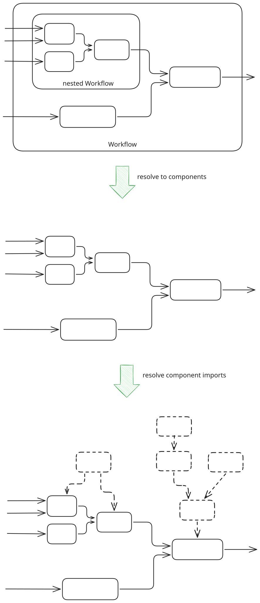

# Importing other components

## Usage
In your component code it is possible to import other components and use functions / classes etc from them:

```python
from hetdesrun.component.load import import_comp
# refer to other component by its id:
my_other_component = import_comp("abcdef12-4567-890a-bcde-f1234567890a")
func_from_other = my_other_component.func_from_other

# ...
def main(...):
    # ...
    func_from_other(...)
    # ...
```

You can obtain another component's id by opening its "Edit component details" dialogue (pencil icon) in hetida designer.

If the id is valid, you can hover over it in the code to see its name and version and you can ++ctrl+lbutton++ on it to access the imported component.

Note that for releasing, all imported components must also be released.

Note also that `import_comp` must be called in a global assignment statement for this to work.

## Use Case: Deserialization of persisted models with custom classes
Besides reusing code / functions etc. one use case is to provide custom classes that are necessary for deserialization, e.g. when loading [persisted models](../persisting_models.md): When unpickling objects, Python requires all necessary imports from used classes / functions etc. to be available at the exact same import path. See [Deserialization hints](../repr_pitfalls.md) for details.

For example, loading a persisted trained model that uses a custom class, you can import that class or just the training component where this class is defined in your inference component. This ensures that the class is available at the exact same import path.

!!! tip
    Only a released component has a fixed import path (depending on a hash of its then unchangeable code). If the imported training component is still in DRAFT state, you may experience non-working deserialization after code changes in the training component and need to re-train and persist your model.


## Technical Notes
During execution every workflow is resolved into the underlying component operators. Component imports are resolved from those underlying component revisions:

<figure markdown="span">
{height=200 width=300}
</figure>

The underlying component revisions together with component revisions of the closure of the import relations are then provided to the runtime for execution.

Component code is imported in each worker process in each runtime instance where an execution using this component is actually run. Component imports happen at during this import exactly when `import_comp` is called during import.