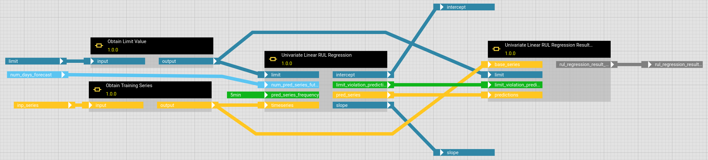
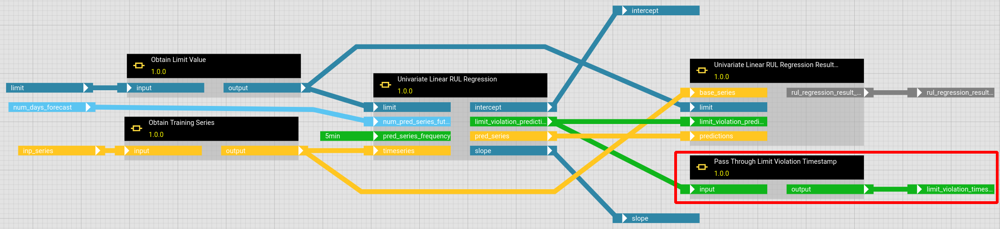
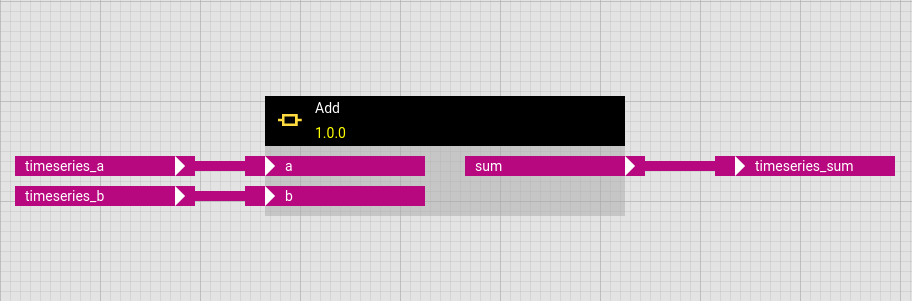
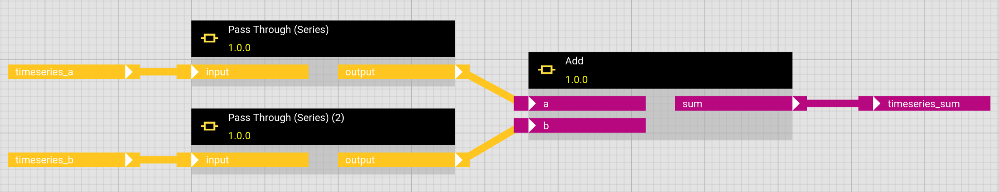

# Debugging

## General notes on debugging

Since hetida designer is a web application, it is not possible to read the print function output in the user interface directly. Because of that print cannot be used for debugging. Similarly, setting breakpoints will not work as there is no direct access to a terminal where the code actually runs.

!!! tip "Debugging externally"
If you depend on print and breakpoints you can of course first write / develop component code in your preferred IDE (or Jupyter notebooks), test and debug it there and afterwards copy-paste the relevant functions into component code. We, the creators of hetida designer, use this approach ourselves all the time. Indeed, we often extract, refactor and generalize the relevant parts of an analysis from Jupyter notebooks into "polished" designer components. See [Sync and hybrid working](../../deployment_operation/trafo_import_export/sync.md) for a way to simplify this style of development.

In the designer user interface both components as well as workflow revisions can be executed with the test wiring already in the DRAFT state to test if they perform as expected.

## Debugging components

To understand why and how an error occurred it is often necessary to understand which value a variable has at certain steps of running the code.

The recommended way is to use logging: See [here](./execution/logging.md). Logs are shown in the execution result view / protocoll.

Another way to achieve this in components is to temporarily add a line that raises an exception like a `ValueError` and pass the the variable converted to a string as error message to the ValueError object.

## Debugging workflows

### Use a copy

If a workflow does not perform as expected or causes errors, additional information on intermediate variable values might be helpful.
You might want to copy your workflow to have a second version in which you can add and remove operators freely without compromising your actual workflow.
In case of errors you may remove the respective component(s) so that the reduced workflow can be executed and all outputs will be displayed.

In order to add an output for an intermediate variable, which is passed from an operator output to some other operators input, add a "Pass through" component with matching data type as operator.
These components are in the category "Connectors".
The output of the "Pass through" operator can be used, to set a new workflow output.

<figure markdown="span">
{ height=250 width=1090}
<figcaption>Original workflow</figcaption>
</figure>

<figure markdown="span">
{ height=250 width=1090}
<figcaption>Copied workflow with additional debugging operator</figcaption>
</figure>

### Use Pass Through with explicit data type

The data wired to a workflow is parsed and converted to the workflow input data type before execution by the runtime. For example json data provided to a workflow input of type SERIES will be parsed into a Pandas.Series object.

One caveat of this behaviour is, that if the input is of type ANY the data will be just parsed only into a json object.

If a component like "Add" uses ANY to allow e.g. both Series and DataFrames to be send to it and indeed expects one of these two options, it probably will error if provided with json input directly from the outside.

E.g. a series provided as a json to a workflow input of type ANY will result in a dictionary instead of a Pandas Series object. This will cause an error message which starts e.g. (for the "Add" component) like

```
{
    "error": "Exception during Component execution of component instance Add (operator hierarchical id: :1e969104-6ef1-4c45-a9d9-a9e0d5c9fceb):
unsupported operand type(s) for +: 'dict' and 'dict'",
...
```

This can be avoided by putting a "Pass through (Series)" component in front of it, so that the input data type is changed and thus explicit:

<figure markdown="span">
{ height=160 width=485}
<figcaption>Parsing inputs as ANY</figcaption>
</figure>

<figure markdown="span">
{ height=160 width=485}
<figcaption>Parsing inputs as SERIES</figcaption>
</figure>

So the general tip is to avoid ANY as input that needs to be wired and instead to put the respective Pass Through component in front.
