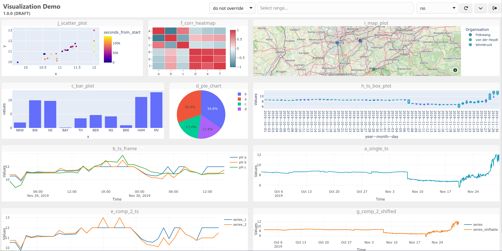
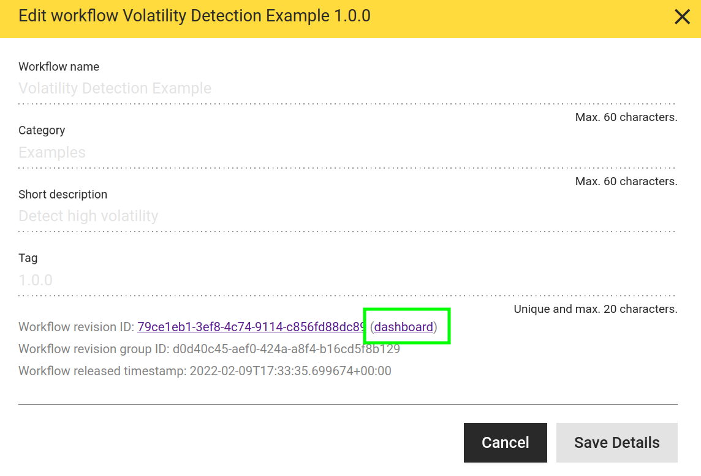

# Experimental Dashboarding

hetida designer workflow/component execution can produce outputs of type PLOTLYJSON, which contain [Plotly](https://plotly.com/) JSON objects that are rendered with plotly.js. In addition, outputs of type [ANY](./data_types/any.md) that conform to a specific JSON structure can provide HTML, PDFs, images and file downloads, which are shown in the result view as well. See the [visualization documentation](./visualizations.md) for details.

A common use case for hetida designer is to run it as a backend service that provides highly customized analytical plots — written in Python, for example with Plotly — to specialized frontends or dashboards.

To demonstrate these capabilities, hetida designer includes an experimental (read: proof-of-concept / demo!) dashboard view for every component and workflow. Each component/workflow has a dashboard that is tied, by default, to the current test wiring from the execution dialog.



Notes:

* In your own web application, you would configure the wiring directly in your web application's frontend or backend and call the designer execution endpoint from there, using the results to build your dashboard / visualization views.
* See the [hetida platform](https://hetida.io/en/) for an example of a data platform that integrates hetida designer in exactly this way, so that plots generated by hetida designer can be shown on customizable dashboards.
* The dashboarding here is served as plain HTML with inline styles and plain JavaScript, loading additional JS libraries and CSS from external CDNs. Typically you would instead use a modern frontend framework with Plotly wrapper components, an accompanying build system, and so on. On the other hand, the approach used here makes each resulting dashboard self-contained and downloadable as a single HTML page.

## Basics

The experimental dashboards are backend-generated and reachable at the URL:

```
URL_TO_BACKEND-API/transformations/<id>/dashboard
```

Here `<id>` is the id of the corresponding transformation revision, which you can find in the "Edit Details" dialog of a component/workflow. For example, with the default docker compose setup, http://localhost/hdapi/transformations/28120522-a6a5-418f-a658-ab19d5beefe2/dashboard is the URL of the multitsframe plot component's dashboard.

This link to the dashboard can always be found in the details dialog of the transformation in the frontend:

<figure markdown="span">
{ width=400 }
</figure>


## Usage

* By default, the dashboard is tied to the current test wiring that you set in the hd frontend's execution dialog.
    * In particular, you need to execute your component/workflow there at least once so that the test wiring is stored. The dashboard cannot work before that.
    * Whenever you change the component/workflow, execute it again to ensure the dashboard uses a matching, correct wiring.
* Once your component/workflow is released (or deprecated), you can instead tie the dashboard to the "release wiring", i.e. the test wiring as it was at the time of release. To do so, append the query parameter `use_release_wiring=true` to the dashboard URL. Tying the dashboard to this fixed wiring prevents unexpected changes caused by someone else modifying the current test wiring, and is therefore a basic requirement for sharing permalinks to dashboards (see below for details). Example:

```
http://localhost/hdapi/transformations/f28d403f-88bb-4328-afd5-6a4aa53aa039/dashboard?use_release_wiring=true
```

* You can override details of the wiring in use via URL query parameters. The format is `i.<INPUT_NAME>.property=value` for input wirings and `o.<OUTPUT_NAME>.property=value` for output wirings. This can also be used to create entirely new wirings.
    * Example — changing the adapter_id of an input: `i.input_1.adapter_id=my_adapter`
    * Example — adding a new direct_provisioning input wiring or overriding an existing one: `i.input_1.val=42`. This is a shortcut that sets the `value` filter and leaves everything else at the defaults for a wiring with adapter_id `direct_provisioning`.
    * Example — overriding a filter for an output: `o.output_1.filters.my_filter_key=new_filter_value`
* The "view/hide dashboard configuration" button in the upper right shows you the test wiring and the release wiring, indicates which of the two is used as the base for overriding, and shows the resulting (overridden) wiring that is actually used when executing.
* The dashboard renders:
    * Plotly outputs (PLOTLYJSON type) of the component/workflow as Plotly plots using plotlyjs.
    * All string outputs as HTML.
        * If a string output's name ends with an underscore ("_"), only the HTML is shown and the header with the output name is hidden.
        * Arbitrary HTML can be part of the string output and is rendered as such. Note that this may have security implications, depending on how the string output is generated from the transformation's input data in the underlying Python code of your workflows/components!
    * Dataframe / multitsframe outputs as a sortable and filterable table.
    * ANY outputs that conform to the special JSON structure specified in the [ANY type documentation](./data_types/any.md).
    * Outputs of other types are not visualized.
        * For single-value types (like FLOAT), we recommend writing a Plotly component, e.g. using Plotly indicators or gauges.
* You can rearrange the plots by dragging them around by their title bar, or resize them using the resize handles in the bottom corners. The arrangement is saved automatically as part of the test wiring. The layout is also mapped to URL query parameters automatically. Layout query parameters take priority over what is stored in the test wiring, which lets you share permalinks to dashboards with a fixed layout.
* You can have the dashboard auto-update every X seconds by choosing a value for X in the corresponding selection element in the dashboard user interface.
* You can override all time ranges of the wiring in use with a single absolute or relative time range selected in the dashboard.
    * Relative time ranges are handy for auto-updating dashboards; together they let you watch timeseries data progress over time.
    * Absolute time ranges can be used to show and share (see below) specific historic data situations with co-workers.
    * Note that time ranges only affect those inputs — typically of type SERIES or MULTITSFRAME — that are wired to sources from adapters which actually provide a time range filter. In particular, manual input is not affected.
* Auto-update and time-range override settings are stored in the URL. Simply copy that URL if you want to open the dashboard with the same settings later, or share it with a colleague.
* Inputs can be exposed via the configuration view, which means they are shown as a dashboard element and can be edited directly. The new values are wired as direct_provisioning inputs (manual inputs). This is intended mainly for single-value parameters, not for mass data, and lets you experiment with parameters interactively.

## Reproducible Dashboards via Permalink

A typical use case for dashboarding is to prepare a dashboard and share it with others (domain / business experts). This is a good way to share an analytically prepared view of a specific data situation.

We recommend the following steps:

* Create a workflow containing the required analytical preparation and the necessary plot components.
* Run a test execution in hetida designer, selecting the data relevant to your situation.
* Release your workflow to fix both the workflow and its test wiring (as the release wiring).
* Open the dashboard (e.g. via the link in the details dialog).
* Add the query parameter `use_release_wiring=true` to the URL (example: `https://my_hd_designer.com/hdapi/transformations/f28d403f-88bb-4328-afd5-6a4aa53aa039/dashboard?use_release_wiring=true`).
* Arrange the plots and texts in the dashboard view. Note how the layout is synced to the URL query parameters.
* Change other settings, such as the time range override. Note how these settings are synced to the URL query parameters as well.
* Optionally override some wiring details, e.g. the manual input value of a parameter, by adding the corresponding query parameter (e.g. `i.input_1.val=42`).
* Copy the URL and send it to the relevant recipients.

The URL is now a permalink because

* you used a released workflow,
* you use the release wiring (instead of the current test wiring, which may change at any time) as the base, and
* all overrides and the layout are encoded in the URL.

From here you can iterate on any level:

* Create revisions or copies of your workflow to change the analytical preparation or the plots.
* Change wiring overrides to show effects that depend on parameters for direct_provisioning / manual input parameters.
* Change time ranges or the incoming data via wiring overrides to obtain permalinks for different situations.

## Authentication

Dashboards require login according to the backend auth settings (see the [auth docs](../deployment_operation/authentication.md) for details). See the section on configuring [auth for dashboarding](../deployment_operation/authentication.md#dashboarding) for the additional configuration required.
