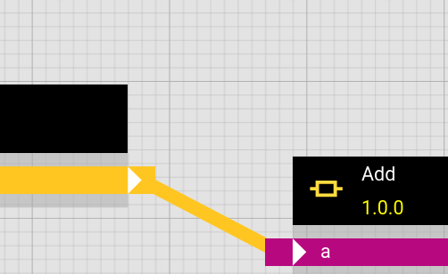
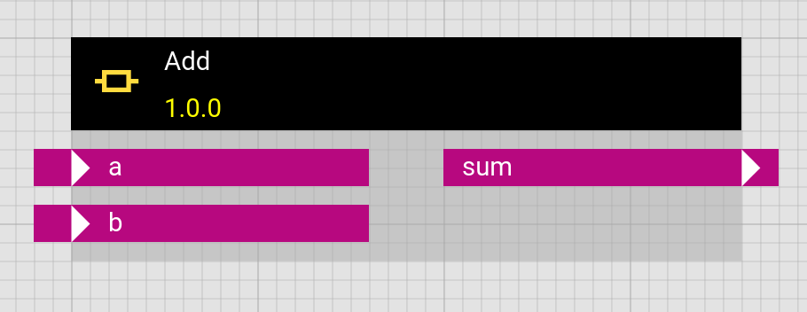
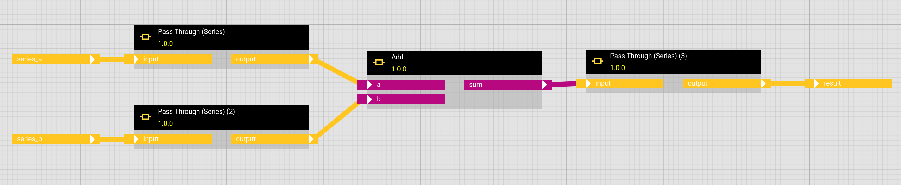

# Any

The **Any** input/output type represents arbitrary Python objects.

On the one side they can be arbitrary Json serializable objects which can be provided or returned via the [direct provisioning adapter](../../integration_guide/adapter_system/builtin_adapters/direct_provisioning.md) (e.g. manual input). This in particular includes specially structured objects of form 

```json
{
  "content_type": "application/pdf",
  "encoding": "base64",
  "name": "Daily Report XYZ - 2026-06-19",
  "data": "JVBERi0xLjMKJe....MwolJUVPRgo=",
  "height": "60vh"
}
```

that represent PDFs, HTML, Images or File, where the actual data is stored in a (base64 encoded) "data" field. The hetida designer frontend knows how to render these objects in its result view as well as in [experimental dashboarding](../dashboarding.md). That is, ANY is an alternative to plotly for providing visualizations.


On the other side binary objects can be provided and received by other adapters, e.g. the [blob storage adapter](../../integration_guide/adapter_system/builtin_adapters/blob_storage_adapter.md). One use case is storing and loading [trained machine learning models](../persisting_models.md).

## ANY in transformations

### Connections to and from ANY inputs/outputs

The **Any** type is special in that in workflows ANY outputs of operators can be connected to any other input, ignoring its type (and every operator output can be connected to an ANY input).

<figure markdown="span">
{width=200}
</figure>

It is up to the auther of the workflow and the receiving component code to handle the incoming objects appropriately!

### Generic trafos via ANY inputs/outputs
This allows to create workflows/components that are more flexible, e.g. allowing an incoming SERIES as well as a DATAFRAME and handle both options. One example is the "Add" component, which works for FLOAT as well as SERIES and even other types:

<figure markdown="span">
{width=200}
</figure>

Doing this comes with the drawback that such a generic workflow/component now has an ANY input or output which prevents hetida designer from parsing input data into the correct type or serializing output data correctly. Furthermore adapters do not offer wiring explicitely typed sources / sinks to ANY inputs/outputs. Such a transformation then may require wrapping it into explicit version using the respective "Pass Through" components to tighten the type:




!!! tip
    Often it is a better idea to have explicit variants (e.g. an "Add Series" component).

## ANY for Visualizations and Files

The hetida designer frontend as well as the [experimental dashboarding](../dashboarding.md) renders some ANY outputs visually. The general form is a json serializable Python dict of from

```python
{
  "content_type": "application/pdf",        # "text/html", "application/pdf",
                                            # "image/svg+xml", "text/csv", ...
  "encoding": "base64",                     # "plain" or "base64"
  "name": "Daily Report - 2026-06-19",
  "height": "50vh",                         # height is optional / can be left out.
  "data": "JVBERi0xLjMKJe....MwolJUVPRgo="  # actual content,
                                            # encoded according to "encoding"
}
```

The rendering is as follows:

* `application/pdf`: Use browser PDF rendering builtin feature (firefox, chrome based browsers)
* `image/svg+xml` and generally image formats: Render as image
* `text/html`: Render HTML in sandboxed IFrame. *Note: Generally we trust the output to be non-malicious!* This can be used to visualize data using other javascript based plotting frameworks like e.g. Apache Echarts or µplot: Simply write a component that generated the respective HTML (including the necessary scripts, e.g. via CDN) and output it in the above-described way as ANY output.
* others (files): Provide a file download link. The "name" will be recommended as file name.

### Display height

The optional `height` field can be used to specify a height for rendering in some contexts / frontends. It is up to the receiving frontend to decide whether / how to use this value. The hetida designer result protocol view will take it into account, the experimental dashboarding ignores it, since it allows arbitrary resizing.

### Examples:

The following static json data examples can be rendered by entering via manual input for the "Pass Through" component (i.e. Pass Through component for the ANY type):

#### HTML

##### Basic HTML
```json
{
  "content_type": "text/html",
  "encoding": "plain",
  "name": "HTML Output via ANY",
  "data": "<h2>HTML example</h2><br>So<b>me</b><br>HTML"
}
```

##### Apache ECharts
[stacked area example](https://echarts.apache.org/examples/en/editor.html?c=area-stack) as html:

```json
{
  "content_type": "text/html",
  "encoding": "base64",
  "name": "ECharts stacked area plot as html",
  "data": "PCEtLQoJVEhJUyBFWEFNUExFIFdBUyBET1dOTE9BREVEIEZST00gaHR0cHM6Ly9lY2hhcnRzLmFwYWNoZS5vcmcvZXhhbXBsZXMvZW4vZWRpdG9yLmh0bWw/Yz1hcmVhLXN0YWNrCi0tPgo8IURPQ1RZUEUgaHRtbD4KPGh0bWwgbGFuZz0iZW4iIHN0eWxlPSJoZWlnaHQ6IDEwMCUiPgo8aGVhZD4KICA8bWV0YSBjaGFyc2V0PSJ1dGYtOCI+CjwvaGVhZD4KPGJvZHkgc3R5bGU9ImhlaWdodDogMTAwJTsgbWFyZ2luOiAwIj4KICA8ZGl2IGlkPSJjb250YWluZXIiIHN0eWxlPSJoZWlnaHQ6IDEwMCUiPjwvZGl2PgoKICAKICA8c2NyaXB0IHR5cGU9InRleHQvamF2YXNjcmlwdCIgc3JjPSJodHRwczovL2Zhc3RseS5qc2RlbGl2ci5uZXQvbnBtL2VjaGFydHNANS9kaXN0L2VjaGFydHMubWluLmpzIj48L3NjcmlwdD4KICAKICA8IS0tIFVuY29tbWVudCB0aGlzIGxpbmUgaWYgeW91IHdhbnQgdG8gZGF0YVRvb2wgZXh0ZW5zaW9uCiAgPHNjcmlwdCB0eXBlPSJ0ZXh0L2phdmFzY3JpcHQiIHNyYz0iaHR0cHM6Ly9mYXN0bHkuanNkZWxpdnIubmV0L25wbS9lY2hhcnRzQDUvZGlzdC9leHRlbnNpb24vZGF0YVRvb2wubWluLmpzIj48L3NjcmlwdD4KICAtLT4KICA8IS0tIFVuY29tbWVudCB0aGlzIGxpbmUgaWYgeW91IHdhbnQgdG8gdXNlIGdsIGV4dGVuc2lvbgogIDxzY3JpcHQgdHlwZT0idGV4dC9qYXZhc2NyaXB0IiBzcmM9Imh0dHBzOi8vZWNoYXJ0cy5hcGFjaGUub3JnL2VuL2pzL3ZlbmRvcnMvZWNoYXJ0cy1nbC9kaXN0L2VjaGFydHMtZ2wubWluLmpzIj48L3NjcmlwdD4KICAtLT4KICA8IS0tIFVuY29tbWVudCB0aGlzIGxpbmUgaWYgeW91IHdhbnQgdG8gZWNoYXJ0cy1zdGF0IGV4dGVuc2lvbgogIDxzY3JpcHQgdHlwZT0idGV4dC9qYXZhc2NyaXB0IiBzcmM9Imh0dHBzOi8vZWNoYXJ0cy5hcGFjaGUub3JnL2VuL2pzL3ZlbmRvcnMvZWNoYXJ0cy1zdGF0L2Rpc3QvZWNTdGF0Lm1pbi5qcyI+PC9zY3JpcHQ+CiAgLS0+CiAgPCEtLSBVbmNvbW1lbnQgdGhpcyBsaW5lIGlmIHlvdSB3YW50IHRvIGVjaGFydHMtZ3JhcGgtbW9kdWxhcml0eSBleHRlbnNpb24KICA8c2NyaXB0IHR5cGU9InRleHQvamF2YXNjcmlwdCIgc3JjPSJodHRwczovL2VjaGFydHMuYXBhY2hlLm9yZy9lbi9qcy92ZW5kb3JzL2VjaGFydHMtZ3JhcGgtbW9kdWxhcml0eS9kaXN0L2VjaGFydHMtZ3JhcGgtbW9kdWxhcml0eS5taW4uanMiPjwvc2NyaXB0PgogIC0tPgogIDwhLS0gVW5jb21tZW50IHRoaXMgbGluZSBpZiB5b3Ugd2FudCB0byB1c2UgbWFwCiAgPHNjcmlwdCB0eXBlPSJ0ZXh0L2phdmFzY3JpcHQiIHNyYz0iaHR0cHM6Ly9mYXN0bHkuanNkZWxpdnIubmV0L25wbS9lY2hhcnRzQDQuOS4wL21hcC9qcy93b3JsZC5qcyI+PC9zY3JpcHQ+CiAgLS0+CiAgPCEtLSBVbmNvbW1lbnQgdGhlc2UgdHdvIGxpbmVzIGlmIHlvdSB3YW50IHRvIHVzZSBibWFwIGV4dGVuc2lvbgogIDxzY3JpcHQgdHlwZT0idGV4dC9qYXZhc2NyaXB0IiBzcmM9Imh0dHBzOi8vYXBpLm1hcC5iYWlkdS5jb20vYXBpP3Y9My4wJmFrPVlPVVJfQVBJX0tFWSI+PC9zY3JpcHQ+CiAgPHNjcmlwdCB0eXBlPSJ0ZXh0L2phdmFzY3JpcHQiIHNyYz0iaHR0cHM6Ly9mYXN0bHkuanNkZWxpdnIubmV0L25wbS9lY2hhcnRzQDUvZGlzdC9leHRlbnNpb24vYm1hcC5taW4uanMiPjwvc2NyaXB0PgogIC0tPgoKICA8c2NyaXB0IHR5cGU9InRleHQvamF2YXNjcmlwdCI+CiAgICB2YXIgZG9tID0gZG9jdW1lbnQuZ2V0RWxlbWVudEJ5SWQoJ2NvbnRhaW5lcicpOwogICAgdmFyIG15Q2hhcnQgPSBlY2hhcnRzLmluaXQoZG9tLCBudWxsLCB7CiAgICAgIHJlbmRlcmVyOiAnY2FudmFzJywKICAgICAgdXNlRGlydHlSZWN0OiBmYWxzZQogICAgfSk7CiAgICB2YXIgYXBwID0ge307CiAgICAKICAgIHZhciBvcHRpb247CgogICAgb3B0aW9uID0gewogIHRpdGxlOiB7CiAgICB0ZXh0OiAnU3RhY2tlZCBBcmVhIENoYXJ0JwogIH0sCiAgdG9vbHRpcDogewogICAgdHJpZ2dlcjogJ2F4aXMnLAogICAgYXhpc1BvaW50ZXI6IHsKICAgICAgdHlwZTogJ2Nyb3NzJywKICAgICAgbGFiZWw6IHsKICAgICAgICBiYWNrZ3JvdW5kQ29sb3I6ICcjNmE3OTg1JwogICAgICB9CiAgICB9CiAgfSwKICBsZWdlbmQ6IHsKICAgIGRhdGE6IFsnRW1haWwnLCAnVW5pb24gQWRzJywgJ1ZpZGVvIEFkcycsICdEaXJlY3QnLCAnU2VhcmNoIEVuZ2luZSddCiAgfSwKICB0b29sYm94OiB7CiAgICBmZWF0dXJlOiB7CiAgICAgIHNhdmVBc0ltYWdlOiB7fQogICAgfQogIH0sCiAgeEF4aXM6IFsKICAgIHsKICAgICAgdHlwZTogJ2NhdGVnb3J5JywKICAgICAgYm91bmRhcnlHYXA6IGZhbHNlLAogICAgICBkYXRhOiBbJ01vbicsICdUdWUnLCAnV2VkJywgJ1RodScsICdGcmknLCAnU2F0JywgJ1N1biddCiAgICB9CiAgXSwKICB5QXhpczogWwogICAgewogICAgICB0eXBlOiAndmFsdWUnCiAgICB9CiAgXSwKICBzZXJpZXM6IFsKICAgIHsKICAgICAgbmFtZTogJ0VtYWlsJywKICAgICAgdHlwZTogJ2xpbmUnLAogICAgICBzdGFjazogJ1RvdGFsJywKICAgICAgYXJlYVN0eWxlOiB7fSwKICAgICAgZW1waGFzaXM6IHsKICAgICAgICBmb2N1czogJ3NlcmllcycKICAgICAgfSwKICAgICAgZGF0YTogWzEyMCwgMTMyLCAxMDEsIDEzNCwgOTAsIDIzMCwgMjEwXQogICAgfSwKICAgIHsKICAgICAgbmFtZTogJ1VuaW9uIEFkcycsCiAgICAgIHR5cGU6ICdsaW5lJywKICAgICAgc3RhY2s6ICdUb3RhbCcsCiAgICAgIGFyZWFTdHlsZToge30sCiAgICAgIGVtcGhhc2lzOiB7CiAgICAgICAgZm9jdXM6ICdzZXJpZXMnCiAgICAgIH0sCiAgICAgIGRhdGE6IFsyMjAsIDE4MiwgMTkxLCAyMzQsIDI5MCwgMzMwLCAzMTBdCiAgICB9LAogICAgewogICAgICBuYW1lOiAnVmlkZW8gQWRzJywKICAgICAgdHlwZTogJ2xpbmUnLAogICAgICBzdGFjazogJ1RvdGFsJywKICAgICAgYXJlYVN0eWxlOiB7fSwKICAgICAgZW1waGFzaXM6IHsKICAgICAgICBmb2N1czogJ3NlcmllcycKICAgICAgfSwKICAgICAgZGF0YTogWzE1MCwgMjMyLCAyMDEsIDE1NCwgMTkwLCAzMzAsIDQxMF0KICAgIH0sCiAgICB7CiAgICAgIG5hbWU6ICdEaXJlY3QnLAogICAgICB0eXBlOiAnbGluZScsCiAgICAgIHN0YWNrOiAnVG90YWwnLAogICAgICBhcmVhU3R5bGU6IHt9LAogICAgICBlbXBoYXNpczogewogICAgICAgIGZvY3VzOiAnc2VyaWVzJwogICAgICB9LAogICAgICBkYXRhOiBbMzIwLCAzMzIsIDMwMSwgMzM0LCAzOTAsIDMzMCwgMzIwXQogICAgfSwKICAgIHsKICAgICAgbmFtZTogJ1NlYXJjaCBFbmdpbmUnLAogICAgICB0eXBlOiAnbGluZScsCiAgICAgIHN0YWNrOiAnVG90YWwnLAogICAgICBsYWJlbDogewogICAgICAgIHNob3c6IHRydWUsCiAgICAgICAgcG9zaXRpb246ICd0b3AnCiAgICAgIH0sCiAgICAgIGFyZWFTdHlsZToge30sCiAgICAgIGVtcGhhc2lzOiB7CiAgICAgICAgZm9jdXM6ICdzZXJpZXMnCiAgICAgIH0sCiAgICAgIGRhdGE6IFs4MjAsIDkzMiwgOTAxLCA5MzQsIDEyOTAsIDEzMzAsIDEzMjBdCiAgICB9CiAgXQp9OwoKICAgIGlmIChvcHRpb24gJiYgdHlwZW9mIG9wdGlvbiA9PT0gJ29iamVjdCcpIHsKICAgICAgbXlDaGFydC5zZXRPcHRpb24ob3B0aW9uKTsKICAgIH0KCiAgICB3aW5kb3cuYWRkRXZlbnRMaXN0ZW5lcigncmVzaXplJywgbXlDaGFydC5yZXNpemUpOwogIDwvc2NyaXB0Pgo8L2JvZHk+CjwvaHRtbD4="
}

```
Note that this html loads the echarts javascript library from a CDN.

##### uplot example
```json
{
    "content_type": "text/html",
    "encoding": "plain",
    "name": "HTML Output via ANY",
    "data": "<link rel=\"stylesheet\" href=\"https://cdn.jsdelivr.net/npm/uplot@1.6.31/dist/uPlot.min.css\">\n    \n    <html lang=\"en\" style=\"width: 100%; height: 100%\"><head>\n        <meta charset=\"utf-8\">\n    </head>\n<script src=\"https://cdn.jsdelivr.net/npm/uplot@1.6.31/dist/uPlot.iife.min.js\"></script>\n<style>\n  #uplot-f26950b8-wrap {\n    width: 100%;\n    height: 100%;\n    overflow: hidden;\n  }\n  #uplot-f26950b8-wrap .u-legend {\n    font-size: 11px;\n  }\n</style>\n\n<div id=\"uplot-f26950b8-wrap\">\n  <div id=\"uplot-f26950b8\"></div>\n</div>\n\n<script>\n(function() {\n  const timestampsIso = [\"2020-01-01T01:15:27.000000Z\", \"2020-01-03T08:20:03.000000Z\", \"2020-01-03T08:20:04.000000Z\"];\n  const values = [42.2, 18.7, 25.9];\n\n  // Convert ISO strings -> Unix seconds here, right before uPlot needs them.\n  const timestamps = timestampsIso.map(t => Math.floor(new Date(t).getTime() / 1000));\n  const data = [timestamps, values];\n\n  const wrap = document.getElementById(\"uplot-f26950b8-wrap\");\n  const el = document.getElementById(\"uplot-f26950b8\");\n\n  let curW = wrap.clientWidth;\n  let curH = wrap.clientHeight;\n\n  const opts = {\n    width: curW,\n    height: curH,\n    series: [\n      { label: \"Time\" },\n      {\n        label: \"Value\",\n        stroke: \"#2563eb\",\n        width: 2,\n        fill: \"rgba(37, 99, 235, 0.08)\",\n      }\n    ],\n    axes: [\n      {},\n      { grid: { stroke: \"#eee\" } }\n    ],\n    scales: {\n      x: { time: true }\n    }\n  };\n\n  const u = new uPlot(opts, data, el);\n\n  function fitToContainer() {\n    const totalW = wrap.clientWidth;\n    const totalH = wrap.clientHeight;\n    if (totalW <= 0 || totalH <= 0) return;\n\n    const chartH = Math.max(10, totalH - 50);\n\n    if (totalW !== curW || chartH !== curH) {\n      curW = totalW;\n      curH = chartH;\n      u.setSize({ width: totalW, height: chartH });\n    }\n  }\n\n  fitToContainer();\n\n  const ro = new ResizeObserver(() => fitToContainer());\n  ro.observe(wrap);\n})();\n</script>\n"
}
```
Note that this html loads the µplot javascript library from a CDN.

There is a "µplot Single Timeseries Plot" base component that renders timeseries data via µplot.


#### CSV file download

```json
{
  "content_type": "text/csv",
  "encoding": "plain",
  "name": "plant_values.csv",
  "data": "timestamp,plant,value\n2026-06-19T00:00:00Z,XYZ,12.5\n2026-06-19T01:00:00Z,XYZ,13.1\n2026-06-19T02:00:00Z,XYZ,11.8\n"
}
```

same example but base64 encoded:

```json
{
  "content_type": "text/csv",
  "encoding": "base64",
  "name": "plant_values.csv",
  "data": "dGltZXN0YW1wLHBsYW50LHZhbHVlCjIwMjYtMDYtMTlUMDA6MDA6MDBaLFhZWiwxMi41CjIwMjYtMDYtMTlUMDE6MDA6MDBaLFhZWiwxMy4xCjIwMjYtMDYtMTlUMDI6MDA6MDBaLFhZWiwxMS44Cgo="
}
```

#### hetida logo as svg

```json
{
  "content_type": "image/svg+xml",
  "encoding": "plain",
  "name": "Logo",
  "data": "<svg version=\"1.1\" id=\"Ebene_1\" xmlns=\"http://www.w3.org/2000/svg\" xmlns:xlink=\"http://www.w3.org/1999/xlink\" x=\"0px\" y=\"0px\" viewBox=\"0 0 511.02 379.53\" style=\"enable-background:new 0 0 511.02 379.53;\" xml:space=\"preserve\">\n<style type=\"text/css\">\n\t.st0{fill:#FFDB3E;}\n\t.st1{fill:#0B0D1B;}\n</style>\n<path class=\"st0\" d=\"M502.92,304.68c2.77-14.96,4.23-30.38,4.23-46.14c0-139.19-112.84-252.03-252.03-252.03  C115.94,6.51,3.1,119.35,3.1,258.54c0,15.76,1.46,31.18,4.23,46.14H502.92z\"/>\n<g>\n\t<path class=\"st1\" d=\"M107.32,282.78h-1.71c-1.71,0-2.73-1.54-2.73-3.25v-57.59c0-16.75-7.01-26.14-25.29-26.14   c-7.35,0-16.58,1.2-23.07,3.08v80.65c0,1.71-1.2,3.25-2.9,3.25h-1.71c-1.71,0-2.91-1.54-2.91-3.25v-121.5   c0-1.71,1.2-3.25,2.91-3.25h1.71c1.71,0,2.9,1.54,2.9,3.25v34.18c6.66-1.71,15.55-3.08,23.07-3.08c23.75,0,32.64,13.67,32.64,32.81   v57.59C110.23,281.24,109.2,282.78,107.32,282.78z\"/>\n\t<path class=\"st1\" d=\"M195.91,237.87h-57.76v3.59c0,28.71,13.84,34.86,30.93,34.86c7.52,0,16.92-1.2,25.29-2.91   c1.71-0.34,3.59,0,3.59,2.22v1.2c0,1.88-0.68,2.73-3.25,3.25c-8.2,1.71-17.94,2.91-25.63,2.91c-21.19,0-38.45-9.23-38.45-41.53   v-11.28c0-23.58,11.96-40.84,34.52-40.84c23.58,0,34,16.4,34,40.67v4.61C199.16,236.5,197.62,237.87,195.91,237.87z M191.64,230.01   c0-21.53-7.18-34.01-26.49-34.01c-18.97,0-27,13.84-27,34.18v0.85h53.49V230.01z\"/>\n\t<path class=\"st1\" d=\"M260.44,282.26c-2.56,0.34-5.98,0.51-8.89,0.51c-12.13,0-19.31-3.76-19.31-18.46V197h-16.92   c-1.88,0-3.25-1.03-3.25-2.74v-1.71c0-1.71,1.37-2.56,3.25-2.56h16.92v-17.6c0-1.71,1.03-3.25,2.91-3.25h1.88   c1.71,0,2.74,1.54,2.74,3.25v17.6h20.34c1.88,0,3.25,0.85,3.25,2.56v1.71c0,1.71-1.37,2.74-3.25,2.74h-20.34v67.33   c0,10.25,4.27,11.79,11.79,11.79h8.2c2.56,0,3.59,0.85,3.59,2.39v1.02C263.34,280.9,262.83,281.92,260.44,282.26z\"/>\n\t<path class=\"st1\" d=\"M288.12,282.78h-1.02c-1.71,0-3.25-1.54-3.25-3.25v-86.29c0-1.71,1.54-3.25,3.25-3.25h1.02   c1.71,0,3.25,1.54,3.25,3.25v86.29C291.36,281.24,289.83,282.78,288.12,282.78z\"/>\n\t<path class=\"st1\" d=\"M376.63,279.53c-7.52,1.54-18.97,3.25-28.71,3.25c-23.58,0-33.49-16.92-33.49-41.53v-11.28   c0-27,11.28-40.84,33.49-40.84c6.66,0,16.92,1.03,23.75,2.56v-33.66c0-1.71,1.2-3.25,2.9-3.25h1.71c1.71,0,2.91,1.54,2.91,3.25   v118.25C379.2,278.33,378.68,279.02,376.63,279.53z M371.68,198.02c-6.49-1.37-17.09-2.22-23.75-2.22   c-18.8,0-25.97,11.62-25.97,34.18v11.28c0,22.04,6.84,34.86,25.97,34.86c8.2,0,17.6-1.2,23.75-2.22V198.02z\"/>\n\t<path class=\"st1\" d=\"M459.17,281.75h-0.85c-1.88,0-3.42-1.54-3.42-3.42v-4.27c-8.37,4.61-18.45,8.72-29.05,8.72   c-12.82,0-26.14-6.15-26.14-27.51v-2.22c0-17.6,11.11-26.32,42.21-26.32h13.16v-6.15c0-17.77-4.96-24.78-21.53-24.78   c-11.28,0-16.23,0.68-24.26,1.54c-1.71,0.17-3.93,0-3.93-2.56v-1.03c0-2.22,1.37-2.73,3.93-3.07c7.18-0.86,12.99-1.54,24.26-1.54   c23.07,0,29.05,12.99,29.05,31.44v57.76C462.59,280.21,461.05,281.75,459.17,281.75z M455.07,233.39h-13.16   c-25.8,0-34.69,5.13-34.69,19.65v2.22c0,15.89,8.37,20.85,18.63,20.85c9.57,0,17.77-2.56,29.22-8.71V233.39z\"/>\n</g>\n<path class=\"st1\" d=\"M348.44,74.8c0,5.8-4.7,10.5-10.49,10.5c-5.8,0-10.5-4.7-10.5-10.5c0-5.8,4.7-10.49,10.5-10.49  C343.74,64.31,348.44,69,348.44,74.8z\"/>\n</svg>"
}
```


### A PDF report
```json
{
  "content_type": "application/pdf",
  "encoding": "base64",
  "name": "Tagesbericht Anlage X - 2026-06-19",
  "data": "JVBERi0xLjMKJenr8b8KMSAwIG9iago8PAovQ291bnQgMQovS2lkcyBbMyAwIFJdCi9NZWRpYUJveCBbMCAwIDg0MS44OSA1OTUuMjhdCi9UeXBlIC9QYWdlcwo+PgplbmRvYmoKMiAwIG9iago8PAovT3BlbkFjdGlvbiBbMyAwIFIgL0ZpdEggbnVsbF0KL1BhZ2VMYXlvdXQgL09uZUNvbHVtbgovUGFnZXMgMSAwIFIKL1R5cGUgL0NhdGFsb2cKPj4KZW5kb2JqCjMgMCBvYmoKPDwKL0NvbnRlbnRzIDQgMCBSCi9QYXJlbnQgMSAwIFIKL1Jlc291cmNlcyA4IDAgUgovVHlwZSAvUGFnZQo+PgplbmRvYmoKNCAwIG9iago8PAovRmlsdGVyIC9GbGF0ZURlY29kZQovTGVuZ3RoIDQ4MTkKPj4Kc3RyZWFtCnicpd3NjuTIeYXhfV8FNwYkwM0hgwz+eCnDHsDwLKxpYDbatDU5PSVNl6SaakjwVfmifCGOyDini5kVPOT3FQSopOruh5EkM14yk8kMzX+869o4N39PP/p+npquHfphTj/isoTm6VP6fdc1cY1tWJpl7Ntlbd5PoR2m5unS/PTudx+ab/69b/oh/7UPPzX/9uHd35r0y6EL7Tg1cerakP7gx6a//ufpU/ObDx8/XX7978vTwx9/fm6a903z3V8enz9++uemW9vmu/97+p8mdGH6bfPhT0lr/utd13wSo5u7uKZfzGPs048lDLH5/bcc1rIdVVja9IdxWNr0L2LfdqF5H0I7LfmR/C4Pekx+erBhbJd4O+bvn788/nh5GdPfmnlt00ig9cvQxvGe65O3zFXvw+XzXy9PH5+/PDV/+M3//usffrulQ1q/a6/toZ+vj6Zi/+eXn55/unxJa/fh058vD89pCf90u4BxnK4bRy0gdmnLheoCfnh4/LH59vLrH3/+e5vwz9/8estPQ9lpFD9NSztN9XX9l8fHy+Pl4fHX56ePP//y5fFTWsgP33wO26WkNTuFvCesaTOm/566Je8P2MZ9vK7Aso3Tmur664K5W8zb3QIbsvyTMV538Jd/kse6Dm2f/kYX096Xh5oe3byM6Ue/TnmnG9YQriP/7uH5+fLLdlX0IT1xJqn3Q2zjdIb//svnzzf7YD/3bT9qfZnzM/fM4D/+42YnzM4g7TAM7TqeWzGPtR1c2fPUzsG30oduaZdO8kO/tn3nWulDHNtp1fqcZyLHSh+762ys7DH933F1rHQ+6ZWdZ+tTu+LrlT6uKQp6X4ypCdOp/eXVSs9zSdB7Y0zbZTg3+NuVHpcx1UXaU9dfnwzmlc6pUNnjcN1bPSt9mq+i5JcpQa6VPoe+nfXeOA/z9ZlsXunzNF/nf2Wn7RJPzrublV6b40sWxnVJufiahfR0GF92/fE6jiUla5HL6rp/6bpth67pST/mEK8BKwMItchgAHy0NwPou/R/55sR4JBn+yOP4H3aXUMlMlKP4boGPHqJjNTTn4XRob8c1sWw8vCNq/B+G5YgqXGEtBX7YTOOl4OKVws+tdkQKrnMtLDx1JpNu/MUK51S+jCMeVa161iX6S/EaeWPnTWLoslxLNejwdqafbXgU2sWpVPLHMOU52XPmkXrpF6mzhN62gXGSukUHsvM6cAROomXqdODl9IpfOqvR+sOHKmT+JSOuk6NvKtUTslz6kh36lnYVQon5XRMtA5G2TKvoYRqDEtqw1J/9ukU7ZwliUQu5bRdJHIOOQcykf1NIjlYFcayWBnGzXL34jKkaawWRqUjjB4dYVQ6wujQmTuhM3ceHWFTOsJ2rC99O4Ra2ITOsHl05ErpyJVDZ5iEzjB5dIRJ6ZjtjvW0UZdamATOMNlxhknhmMkcOMIkcIbJjjNMCkeYjvFqmITMMBllhknJCJNV5tHDvszcmGR7aqYpR0alJsZ27nRqwhvOxsoAZHQ2I9ibWkOaLmrRUTqi49ERHaUjOg6d0RE6o+PRER2lIzrHetp/Y/VsSuiMjkdHdJSO6Dh0RkfojI5HR3SUjpnsWL9/eYDRETijY8cZHYVjPnPgiI7AGR07zugoHNE5xqvRETKjY5QZHSUjOlYZG0nIjI5JtkdnXPMplIrOsObpW0ZnMJ/flMXupKbMW5vl7j3wthtrpVE4pi0HjtAIPGDWsuPsjMIxaTlwZEbhyMwxnrffVMuM0JkZj47tpXRkxqEzM0JnZjw6tpjSMXcd62OawGqZETgzY8eZGYVjBnPgyIzAmRk7zswoHJk58USqZUbIzIxRZmaUjMxYZWwkITMzJtmemWEob8zvZyaEPA6ZmfEN5zZlAPUm9OE6x2xGsLMKQlt9n0nZ8foSpcNGboQduvE6v5ht1kbZsbtuN7uN2CgbsTm257T7Vl9IEzpj49F5cCB0xMahMzZCZ2w8Og8PhI4Z7Fgf27kaG4EzNnacsVE45jEHjtgInLGx44yNwhGbY7waGyEzNkaZsVEyYmOVeUSwLzM2Jtkem7TQWV/WkMYxHFzWEM3nNGWx8pxms9ydBx7vXiBnYxSOacuBIzIC5zmNHWdlFI5Jy4EjMwpHZo7xtOOGuZYZoTMzHh3bS+nIjENnZoTOzHh0bDGlY+461tN8Wn2/RuDMjB1nZhSOGcyBIzMCZ2bsODOjcGTmGK9mRsjMjFFmZpSMzFhlbCQhMzMm2Z6Zrlwcup+ZYVnz9cAyM9MbzmnKANQ5zXYEO6tgaavv1ii7nNM4bORG2DinsdusjbLLOY3DRmyUXWJzwp7GNlbPaYSO2Lh0HhwIvcTGozM2QkdsXDoPD4ReZrATekzPvVpsBI7YOHDGRuFlHvPgiI3AERsHztgoPK7tOJzB0yw41Xoj8Dlf3XxqZ7zHmRyFp8k6dC6chwYCX9MMdGpXvMXN4RmW4fppChGeecifiZDhma3nN1jszvnNq+XuPPY+baShEhypp4l7Xn16SY7U1yl/EMujIzpKD2PIn2Zy6SU7Ui+T2Ak9pv23Uh2FD2US8+AlOhIvk5gDR3MUPpZJzIOX5EgcyTmBp6xWkqNwJseKWy5vR5zkMBCnr8N4ucD2drly3kCo1IIYKvvKRKgkHuNJPE9CtTMjpc9d347Bpc88sBD6OOdP+bh0HlkIPX+E89yMeqvbY5UGc/046X6s0nOwizpWi/8sCQNQL8ttR7A/OdeupJY4JkEHjmgJHC/LOXA2S+GYBB04kqVwnCkd43FI1a81S+g8U/Lo2F5Kx5mSQ2e1hM4zJY+OLaZ0zGjH+nj/mh+yJXBmy44zRgrHfObAESCBM0B2nAFSeJr2plP7er59we3JLwuk+HTGEQcfzwQJfh6Ha+BcPLaZ4tOJ0nBq8r3n7RGK15caVYTGrp30h2q71XzGFHFxoDhj2ix3b45Ncu0tIanjjMmjIz5KxxmTQ2d9hM4zJo+O/Cgd+TnWx/QXay/UKZ358eg8XBA68uPQmR+hMz8enQcMQsd0dkJvl9rHSxXO/Nhx5kfhmMocOPIjcObHjjM/Ckd+TuBpNgrV/Cge+fHwzI/gmR8Xz0MGwSM/dt6enzQrjKvMTxjzLXVUfvo33GcBA5Ah2oxgb7pd6tcmSB0h8ugIkdIRIofOEAmdIfLoCJHSEaJjfcyvK9dCJHSGyKMjREpHiBw6QyR0hsijI0RKx8R2Qm+7qRYigTNEdpwhUjgmNQeOEAmcIbLjDJHCEaJjPA6xXddaiBSPEHl4hkjwDJGLxzZTPEJk5+0hShNVF2WIurmdBx0i890MsFj5EtxmuTuPPqT/XauPwjGVWXHLq+nMlBgGX6z7OoyXV9NvlyvXJYulFoTpz74yGSyFI1jH+Jivu6kFS+gMlkfHVlY6guXQGSyhM1geHVtM6ZgAj/Vh58xJ4AyWHWewFI7Jz4EjWAJnsOw4g6VwBOsYj2n27odasBSPYHl4BkvwDJaLxzZTPIJl5+3B6vp8diaCFda+DfpSh/4N90TAAFS6tiPYOz9Y21hLl8LLpObBESSBI0gOnBFSeJnSPDgipPASoRN4eg7E2kXdSkeEXDoPNYReImTXv/6FE3fPYq7EOJCrl3G8HI68WvC5e9fxsEMss0yKJx57SLNbLWICR8QcOCOm8DIhenBETOCImANnxBReInYCn7p156xL8SViDt5yeM3ciYEgd7X9+fWSz839PHARCy0R9D16WwTDEq/32xYRnHnX8P0Imu/RgMWqFw23y92f44falRNSLy8auvQSP6mXFw09OuqndLxo6NJL/qSO/B3r12vdK/lTOvPn0XG4onTkz6Ejakpn1Dw6DliUjnwd6yE9ASv5UjjzZceRL4kjXw685EvhzJcdR74kjnyd2KIxlWip5EvyyJeHR5QUzyi5eGwzxSM/dt6en2nJ53kqPzHNSvriif4N927AAGSINiPYn2672uuHUkeIPDpCpHSEyKEzREJniDw6QqR0hOhYT6uw+nknpTNEHh0hUjpC5NAZIqEzRB4dIVI6JrZjPbShdg8HhTNEdpwhUjgmNQeOEAmcIbLjDJHCEaITW3SY2qH2YqDkESIPzxAJniFy8dhmikeI7Lw9RDHkcy0VorFPRdEhMt/XAYuV+dksd2+STWuy9rknqSM/Hh35UTry49CZH6EzPx4d+VE68nOsp1U41V4GVDrz49GRH6UjPw6d+RE68+PRkR+lYzo71vM3vdXyI3Dmx44zPwrHVObAkR+BMz92nPlROPJzjI9pGFPtKj7JIz8envkRPPPj4nnIIHjkx87b8zPEfK6l8pOm9Hhw8cQb7veAAcgQbUawN92O7TzVQqR0hMijI0RKR4gcOkMkdIbIoyNESkeIjvW0E/d9LURCZ4g8OkKkdITIoTNEQmeIPDpCpHRMbCe2ahtqNxlSOENkxxkihWNSc+AIkcAZIjvOECkcITrGhy7eXySI7aV4hMjDM0SCZ4hcPLaZ4hEiO28PUb/mcy0Vom7Nt6KQITLf/wGLlfnZLHdvv0sPt3YthNSRH4+O/Cgd+XHozI/QmR+PjvwoHfk51qe+fo87pTM/Hh35UTry49CZH6EzPx4d+VE6prMTW/X+puDIj8CZHzvO/CgcU5kDR34EzvzYceZH4cjPMR66tAKr50GKR348PPMjeObHxWObKR75sfP2/HQhn2uJ/PTr9XuNZX7ecEcHDKA+mZf73m1HsLMeluoledIu971z2IiQsHHfO7vNBCm73PfOYSNAyi4BOmFPw91tLRkgoSNALh0BUnoJkEdngISOALl0BEjpZUI7oXd3kwkDJHAEyIEzQAovk5kHR4AEjgA5cAZI4eUmq2fwWnuEjJusWmVmR8nlJqtmmUcJ+zJusmqTzbHpl6mN8l53aSn5nn4yNuY7N2Cx6rLv7XL3XthI67DSGImXacuDl8goHJd9O3BURuJl0vLgJTMSR2aO8fQcvf32I2RG6cyMR8f2Ujoy49CRGaUzMx4dW0zpyMyxnp6gQyUzCmdm7DgyI3FkxoGXzCicmbHjyIzEkZljvJYZJTMzRhmZkTIyY5WxkYTMzJhke2bmtFnk1+D1cW1n/TV44Q13aMAAZHA2I9jd28baDRokjgnMgSM4Amdw7DiDo3BMXw4cwVE4gnOMz+nErfa+jtIZHI/OAwShIzgOncEROoPj0XmIIHTMYsf6q6u4ERyBMzh2nMFROOYyK/71z098uItpEsNgmr4O4+XDMPfLPTU9MVhqkQjWiUdeC5aQGSyjzGApGcGyyjyq2JcZLJNsD1Yc8mmXCtY45Bupy2CZ7+SAxe5kaspfEb5d7s4Df58eYe2LW6VeviLcpSNUSi9fEe7RWSqh4yvCXTpSpXSk6lhP23CtvQekdKbKo/PQQuhIlUNnqoTOVHl0HlwIHfPXsR7avnYJgsKZKjvOVCkcs5gDR4AEzgDZcaZG4UjNMV5NjZCZGqPM1CgZqbHKPJ7Yl5kak2xPzTDnUy+VmvQ8W/TX6YU33IMBA5DR2Yxgb2q9390YHaUjOh4d0VE6ouPQGR2hMzoeHdFROqJzrC/h7uU+RkfojI5HR3SUjug4dEZH6IyOR0d0lI6Z7FgPaRauRUfgjI4dZ3QUjvnMgSM6Amd07Dijo3BE5xivRkfIjI5RZnSUjOhYZWwkITM6JtkendDl0ycVnb7Lv5TRMd/zAIuVqdksd29CTT2ufame1JEaj47UKB2pcehMjdCZGo+O1CgdE9exnibUoVYageM7jjw4QqNwTFx2nJ0ROL7jyIMjMwrH3HWMp81Xfd9H4MyMHWdmFI4ZzIFjawmcmbHjzIzCkZljvJoZITMzRpmZUTIyY5V5LLAvMzMmOb960geeViA6287EV53pxnzuxM4s+YsNX54E+TuS0v688HW8cruiIeWR0ckD+PDx082DKyUpMB/bDdx3c7sMJ+Tl7uZ87Iiy028Tcmz3a9w5ZVH6urZTd0J/dX9RVETY+Urp9cz6fp+ep9X3cxS+XI9ojvFpvPs0KiMi8Hzr3jmeWecxfwFl7X4Fkp+XfBXOid0lUbX75ih8TGNP7DH+6o53zIjC03MhHekd48PtN5gxIoKOabqYzjyH5nB3j3BGROHT9SMBx/j9l9KxIcKe+pC3ybF9/x4UE6LsmLRw6smfpva+lhGlp390atoap66/e4qyJYKfxz7/9sRT9NXd6tgToeeepHSfWO03Zy3V+9RVf//7b9+VpMxj/sBHf72b9/vyIw+CZx3L9qwjP0di/kdTKjQ+v5ro4e5HHlfTfPfxHw+fv3xufrg8PTcPj82Pl6f8u+b7v3785fly/I5i9fd52OucX2LcG/d1lEOf55Zzw3x4fD3M9PP1MOcu5nHMY+w3w7mup+H1ekrz8JjfLvx6PBC7dbn7kUfw/eXh+dJsdu7/BxCtMZoKZW5kc3RyZWFtCmVuZG9iago1IDAgb2JqCjw8Ci9CYXNlRm9udCAvSGVsdmV0aWNhLUJvbGQKL0VuY29kaW5nIC9XaW5BbnNpRW5jb2RpbmcKL1N1YnR5cGUgL1R5cGUxCi9UeXBlIC9Gb250Cj4+CmVuZG9iago2IDAgb2JqCjw8Ci9CYXNlRm9udCAvSGVsdmV0aWNhCi9FbmNvZGluZyAvV2luQW5zaUVuY29kaW5nCi9TdWJ0eXBlIC9UeXBlMQovVHlwZSAvRm9udAo+PgplbmRvYmoKNyAwIG9iago8PAovQmFzZUZvbnQgL0hlbHZldGljYS1PYmxpcXVlCi9FbmNvZGluZyAvV2luQW5zaUVuY29kaW5nCi9TdWJ0eXBlIC9UeXBlMQovVHlwZSAvRm9udAo+PgplbmRvYmoKOCAwIG9iago8PAovRm9udCA8PC9GMSA1IDAgUgovRjIgNiAwIFIKL0YzIDcgMCBSPj4KL1Byb2NTZXQgWy9QREYgL1RleHQgL0ltYWdlQiAvSW1hZ2VDIC9JbWFnZUldCj4+CmVuZG9iago5IDAgb2JqCjw8Ci9DcmVhdGlvbkRhdGUgKEQ6MjAyNjA2MjkxMTUxNDNaKQo+PgplbmRvYmoKeHJlZgowIDEwCjAwMDAwMDAwMDAgNjU1MzUgZiAKMDAwMDAwMDAxNSAwMDAwMCBuIAowMDAwMDAwMTAyIDAwMDAwIG4gCjAwMDAwMDAyMDUgMDAwMDAgbiAKMDAwMDAwMDI4NSAwMDAwMCBuIAowMDAwMDA1MTc3IDAwMDAwIG4gCjAwMDAwMDUyNzkgMDAwMDAgbiAKMDAwMDAwNTM3NiAwMDAwMCBuIAowMDAwMDA1NDgxIDAwMDAwIG4gCjAwMDAwMDU1ODggMDAwMDAgbiAKdHJhaWxlcgo8PAovU2l6ZSAxMAovUm9vdCAyIDAgUgovSW5mbyA5IDAgUgovSUQgWzxDRTJBODc2NTI3ODEzQjc4OEFGRUVENDMzQTY2NzMzNj48Q0UyQTg3NjUyNzgxM0I3ODhBRkVFRDQzM0E2NjczMzY+XQo+PgpzdGFydHhyZWYKNTY0MwolJUVPRgo="
}

```