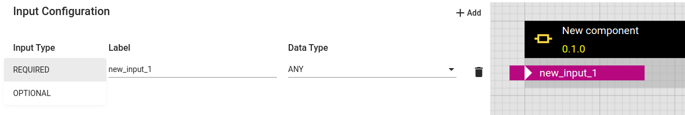
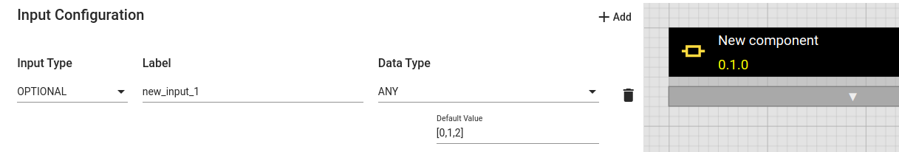
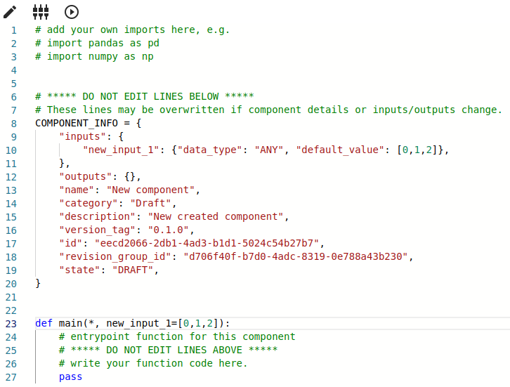
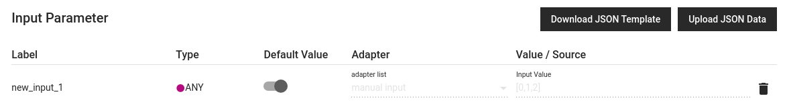
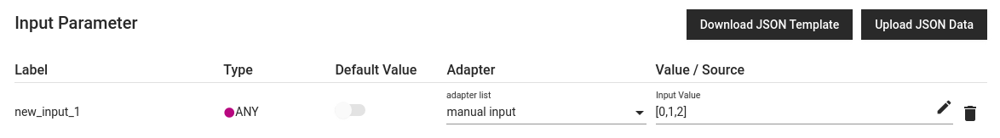
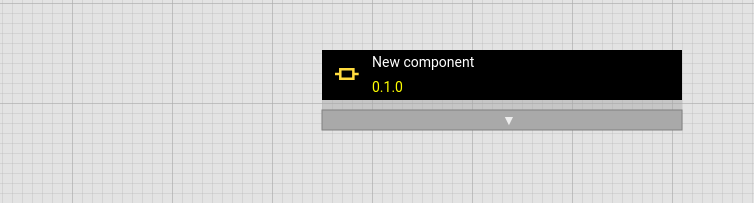
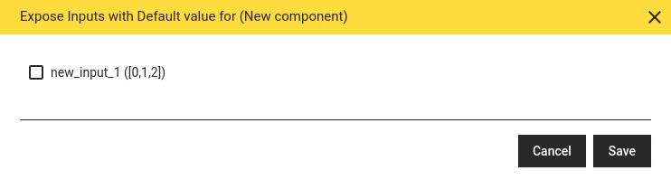
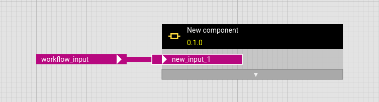
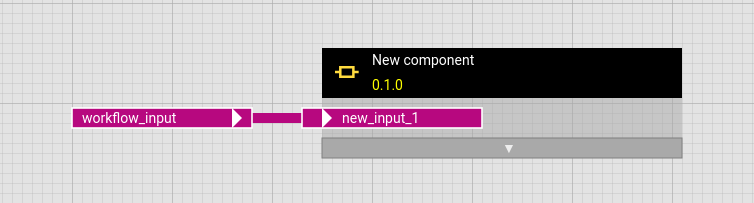

# Optional Inputs and Default Values

## Required vs Optional Inputs

hetida designer component and workflow inputs can be either REQUIRED or OPTIONAL. REQUIRED means a value has to be provided every time when the transformation is invoked (e.g. via manual input / direct provisioning or by specifiying a source from an adapter).

OPTIONAL means two things:

- **nullable**: The input value can be `null` which will be parsed and provided to component main functions as Python's `None`.
- **default value**: The input has a default value (which can be null / `None`, but also (json) value fitting the input data type). This default value is used if no explicit value is provided for this input during execution.

## Setting default values

You can set default values for input parameters of components and workflows in the hetida designer. To do this, first open the dialog for configuring inputs and outputs.

<figure markdown="span">
{ height=110; width=645}
</figure>

Change the input type from "REQUIRED" to "OPTIONAL", then the input field for the default value appears.

<figure markdown="span">
{ height=110, width=645}
</figure>

Just as with [manual input](../integration_guide/adapter_system/builtin_adapters/direct_provisioning.md) in the execution dialog, for simple data types (such as `STRING`, `FLOAT`, `INT`) the data can be entered directly in the input field, while for `SERIES`, `DATAFRAME`, `MULTITSFRAME`, `SINGLETSFRAME` or `ANY` json-data can be entered.

No quotation marks need to be entered for default values for inputs of the `STRING` data type, but if you want to enter a string as the default value for an `ANY` input, it must be enclosed in quotation marks.

If you do not enter a value (by not touching the input field), the default value for all data types is set to `null` which will be parsed as `None` as mentioned above. Also an explicit `null` in the default value field (without quotation marks!) will set the default value to `None`.

!!! success "Recommendation"
We strongly recommend to explicitely enter `null` and not rely on the implicit behaviour if you want `None` as default value.

!!! note
For optional STRING inputs: A default value of `null` will be parsed as `None` and not as string `"null"`.

!!! tip
To get an empty string as the default value for a STRING input, enter any string and remove it again before clicking `Save`.

Optional inputs are not displayed in the preview, but a grey bar with a white triangle in the center pointing down indicates the presence of optional inputs.

For components, the code is updated with the according Python object after saving the changes so that the actual default value is clear.

<figure markdown="span">
{ height=290, width=380}
</figure>

## Use or overwrite default values during execution

As you may expect, it is not necessary to provide an input wiring for optional inputs: If no input wiring is provided the respective default value will be used during execution.

In the execution dialog, for optional inputs, there is a toggle to switch between using the respective default value

<figure markdown="span">
{ height=85, width=625}
</figure>

or a value from some adapter (e.g. manual input) to override it:

<figure markdown="span">
{ height=85, width=625}
</figure>

!!! info "Important Note"
To overwrite the default value of an optional operator input in a workflow, the respective input must be exposed (see below!).

## Use or overwrite default values of operators in workflows

When an operator is added to a workflow, its optional inputs are not displayed.
A grey bar with a white triangle in the center pointing down indicates the presence of optional inputs.

<figure markdown="span">
{ height=105, width=395}
</figure>

Clicking on the grey bar opens a pop-up window in which all optional inputs are displayed with their default values and can be exposed or hidden by ticking or unticking them.

<figure markdown="span">
{ height=105, width=395}
</figure>

The exposed operator input can then be linked to another operator's output or to a workflow input.
A white border around the operator input indicates that it is an optional input that can be hidden if desired.

<figure markdown="span">
{ height=105, width=395}
</figure>

Just like component inputs, workflow inputs can be made optional, which is also indicated by a white border around the workflow input.
As expected in such a case, the outer default value overwrites the inner default value.

<figure markdown="span">
{ height=105, width=395}
</figure>
