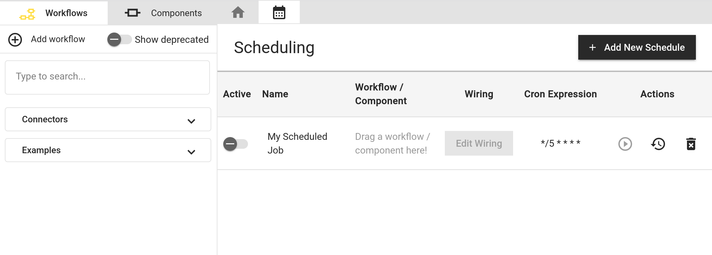
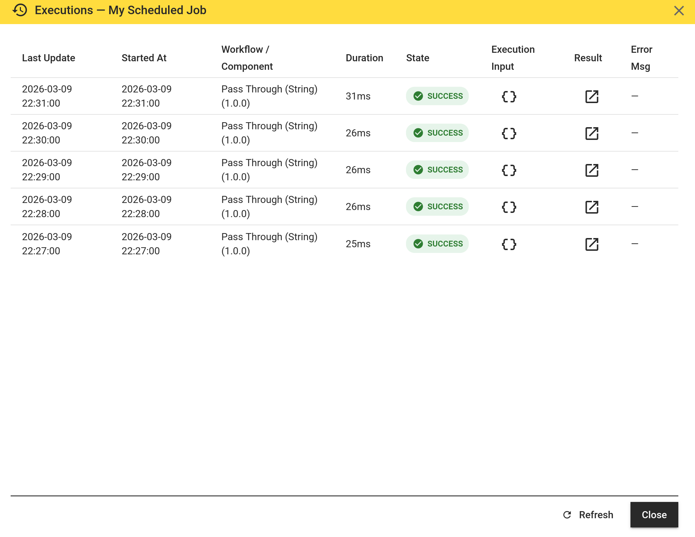

# Scheduling

## Simple Cron Expression Scheduling
hetida designer offers basic cron expression based scheduling for running transformations regularly. Schedules are configured and observed in the scheduling tab of the hetida designer UI:

You can add a schedule, give it a name, assign a workflow/component to it, specify the wiring for execution and a cron expression. After activating a schedule, a scheduler running as part of the backend service will pick it up after some time and trigger its execution when it is due.

Furthermore, from the UI you can execute it manually out of turn, inspect previously run scheduled executions and delete the schedule.

The dialog showing scheduled executions allows to inspect the execution input payload as well as the corresponding execution result including log messages from components.

The result may even contain plots, just like for test executions invoked manually from the hetida designer UI. E.g. a scheduled machine learning model training workflow may output a training progress plot that you want to inspect afterwards.

Scheduled executions are deleted regularly from the database. This "retention" is configurabe (see below).

### Configuration
See [scheduling configuration docs](../deployment_operation/scheduling_configuration.md).

## Advanced production scheduling / automation / orchestration
For advanced automation in production the integrated basic scheduling in hetida designer may not be sufficient. Ultimately, hetida designer is not a job engine / scheduler / orchestrator.

We recommend to employ proper automation solutions like [hatchet](https://github.com/hatchet-dev/hatchet), [temporal](https://github.com/temporalio/temporal) or similar and invoke executions via the designer backend REST API execution endpoints or via [Kafka](./execution_via_kafka.md).