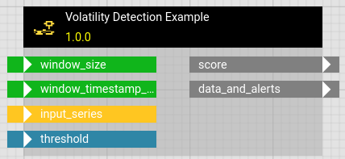
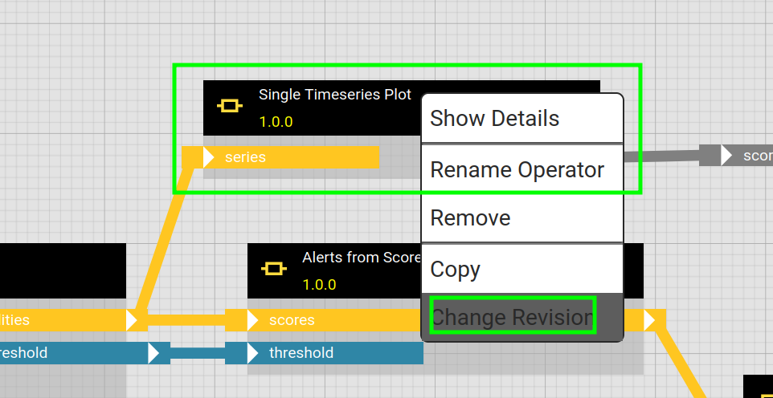
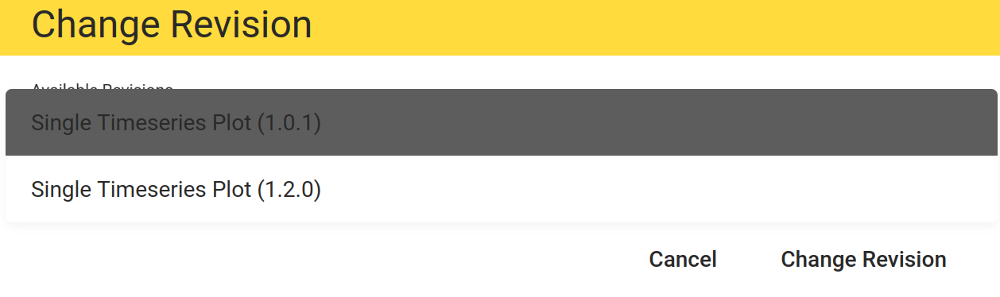
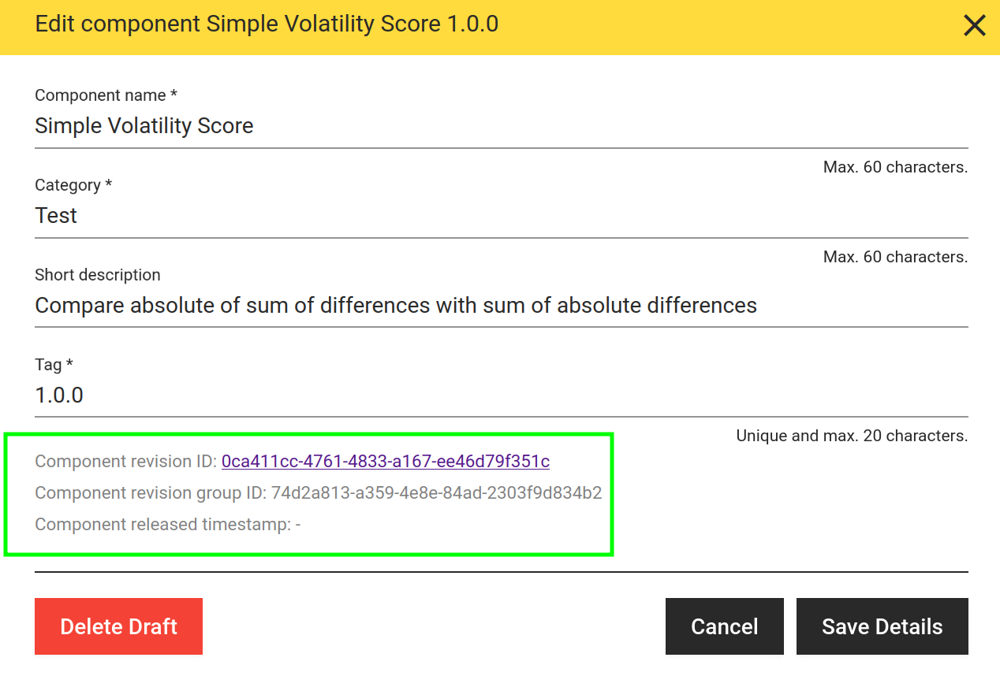
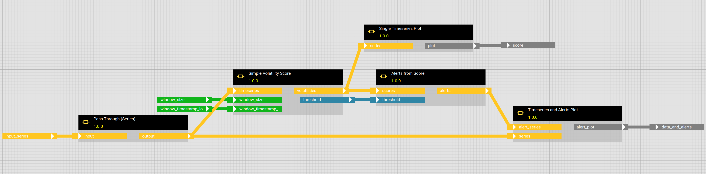
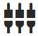
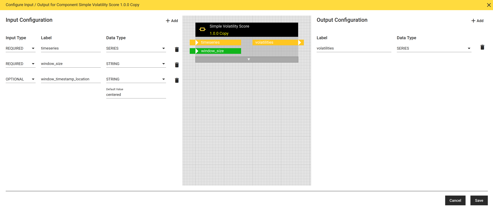
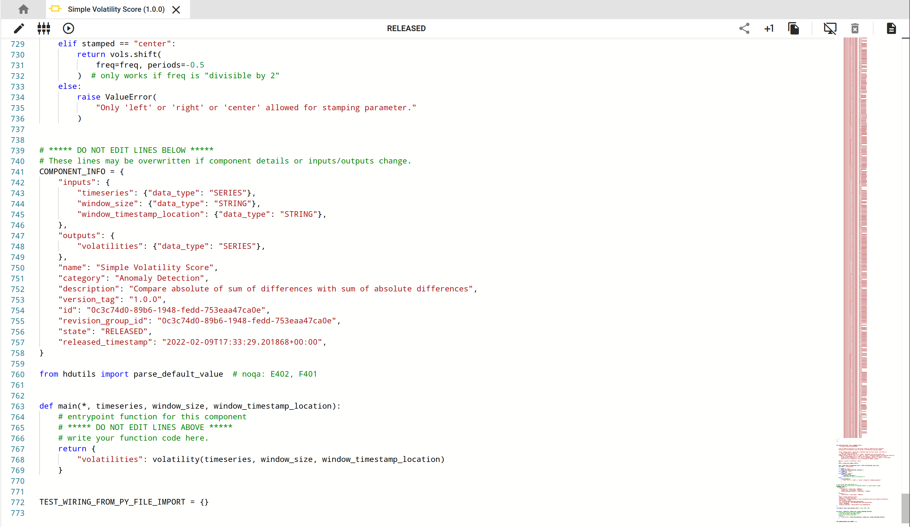
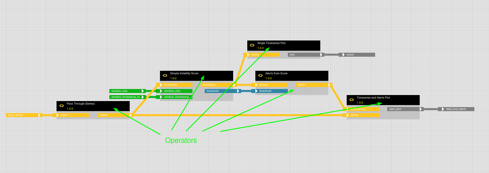
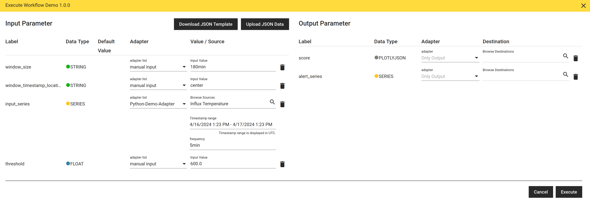

# Basic Concepts

This tutorial introduces the basic concepts that you need to understand in order to use and employ hetida designer efficiently.


### Transformation, Transformation revision (trafo)
The main entity of hetida designer. A transformation revision has a fixed interface (IO) that defines inputs and outputs and their respective data type. It can run a predefined operation on data provided to the inputs to get the resulting output, i.e. it can be "executed". Think of an abstract function with the inputs as arguments and the outputs as result. Ideally, it has no side effects and is deterministic, but that of course depends on the details of the predefined operation, e.g. the underlying code.

Often the shorter term transformation is used to denote a transformation revision.

Transformations come in two variants: Components, which actually consist of Python code and have a main function, and therefore are the basic building blocks. And workflows which are compositions of components and other workflows.

The user interface typically shows name and version of a transformation revision and a preview indicates their IO interface.

<p align="center">

</p>

Beside name and version tag, a transformation revision also comes with
* a description
* a "category" corresponding to the drawer under which you can find it in the sidebar of the user interface. E.g. "Visualization", "Trignometric", etc.
* a markdown documentation.

### Transformation revision group
Transformation revisions are loosely grouped in revision groups. Transformations in the same revision group are not required to have the same input/output interface and can actually be completely different in nearly all aspects. But typically they have evolved from each other, possibly in a non-linear fashion (which is not tracked).

There is a concept of a "latest" revision in each group, which is the transformation revision that was last released (and is not deprecated).

When changing the revision of an operator in a workflow in the hd user interface, you actually get to choose from other trafos of the same revision group.

<p align="center">

</p>
<p align="center">

</p>

You can create a new revision in the same revision group from an existing released (or deprecated) trafo —  and you can copy an existing trafo to create a new transformation revision starting a new revision group.

<p align="center">

</p>

In the edit details dialog of each transformation
<p align="center">

</p>
you can observe the trafo revision uuid and its revision group uuid:
<p align="center">

</p>

See [Versioning and Lifecycle](../../versioning_and_lifecycle.md) for more details.

### Workflow, Workflow Revision
A transformation which is a composition (in form of a [DAG](https://en.wikipedia.org/wiki/Directed_acyclic_graph)) of other transformations (both components and workflows). Workflow is another name for workflow revision.

The building blocks are called operators and are instances of other transformation revisions. Outputs can be then linked to inputs or be exposed as interface of the workflow as part of the workflow's IO configuration.

Workflows are shown in the workflow tab in the sidebar of the UI, can be created there and are edited in the workflow editor:
<p align="center">

</p>

Their IO interface is managed in the IO dialog
<p align="center">

</p>

<p align="center">

</p>


### Component, Component Revision
A transformation represented by a Python code module containing a main function together with some IO configuration that maps to inputs of the main function and to the keys of a output dictionary of the main function. 

Can be used/instantiated as operators in a workflow. In fact, they are the basic building blocks: While workflows can be arbitrarily nested, at the bottom there always are operators referencing component revisions (Note however, that components can in fact import other components, see [component tips](../../component_tips.md)).

Components can be created and edited in the component editor user interface which basically is a code editor:
<p align="center">

</p>

As for workflows, a component's IO interface is managed in the IO dialog.

Typically components arise from code in a local Jupyter notebook or a full Python IDE and then are transferred to hetida designer when they have matured enough.
Component code can be self contained if the documentation is put in the module docstring and a test wiring and possibly a release wiring is fixed.

Besides formatting, the "broom" button can help to achieve this.
<p align="center">

</p>

Note that then the hdctl command line tool can be used to [sync](../../sync.md) components (and workflows) between your local files and a hetida designer instance. There also is an import button on the bottom left corner of the "home" tab where a component can be imported by simply pasting its source code.
<p align="center">

</p>

### Operator
An instance of either a workflow revision or a component revision used in a workflow. These are the "boxes" you can drag and arange in the workflow editor. A workflow can contain multiple operators belonging to the same component or workflow revision.



In a DRAFT Workflow you can change the revision of an operator in its context menu and select another revision from the same revision group.


### IO Config / IO Interface
Transformation revisions have an input/output configuration consisting of pairs of name and type. This is basically the interface that is employed when they are run or used as operators. As mentioned above this is managed in the IO dialog.

<p align="center">

</p>

Note that inputs can have [default values](../../default_values.md). And a required operator input in a workflow can be fixed to a constant value if it is not meant to be exposed.


### Wiring
To run a transformation revision a wiring is necessary. A wiring maps data sources / data sinks via adapters to the inputs/outputs of the workflow revision IO config. I.e. it describes how and what data goes into each input and how and where output data should be sent / stored.

<p align="center">

</p>

A wiring is represented by a json object. Example:
```json
{
    "input_wirings": [
        {
            "adapter_id": "kafka",
            "filters": {
                "message_value_key": "status"
            },
            "ref_id": "base",
            "ref_id_type": "THINGNODE",
            "ref_key": "kafka_cluster1_metadata(any)",
            "type": "metadata(any)",
            "use_default_value": false,
            "workflow_input_name": "in_any"
        }
    ],
    "output_wirings": []
}
```
A wiring does not have to wire all outputs of a transformation revision: Unwired outputs are automatically wired to the [direct_provisioning](../../adapter_system/manual_input.md) adapter which means the results are simply returned as part of the response to the execution request. There are also "shorter" [uri wirings](../../execution/uri_wirings.md).

### Adapter
[Adapters](../../adapter_system/intro.md) are small pieces of software that provide access to data sources or data sinks in order to make them available for execution of transformation revisions.

Typically, adapters connect to databases (SQL, NoSQL, timeseries databases, ...), storage (files, blob/cloud storage) or message queues (e.g. Kafka).

Adapters have two purposes:
* to actually provide and receive data
* "discoverability": to offer data sources and sinks for wiring, e.g in the hd user interface to provide a way to find them in hierarchies and search for them.

For the later an adapter has to provide an [API](../../adapter_system/generic_rest_adapters/web_service_interface.md).

The base installation comes with several [built-in adapters](../../adapter_system/builtin_adapters.md) and a demo adapter that demonstrates how to [develop your own adapters from scratch](#adapter-system).


### Lifecycle State of a transformation: RELEASED, DRAFT, DEPRECATED / DISABLED

Transformation revisions can be in either of these three states.
* They are only editable in the UI in the initial DRAFT state.
* Through **Publishing**  they are switched to RELEASED state. 

  <p align="center">
  
  </p>
  
  RELEASED trafos cannot be edited anymore. This ensures trackable execution runs (reproducibility). You can of course create a new revision to make further edits or a copy. For relasing a workflow, all its operators must refer to released trafos. Similarly, releasing a component is only possible if it does not import other components which are in state DRAFT..

* RELEASED transformations cannot be deleted, but they can be deprecated (aka disabled).

  <p align="center">
  
  </p>
  
  This means they still exist and workflow revisions containing operators refering them can still be executed. They are hidden in the sidebar by default (switch the respective toggle to show them). You cannot create new operators from them. Additionally, the user interface marks existing operatores as deprecated and invites to update to another revision of the same revision group.

* Component and Workflow revisions in DRAFT state can actually be deleted.
  <p align="center">
  
  </p>

See [Versioning and Lifecylce in hetida designer](../../versioning_and_lifecycle.md) for more details.

### Transformation Execution
The process of actually executing (running) a transformation revision always requires a wiring in order to specifiy where input data comes from and where output data should go.

In the hd user interface execution can be triggered via the test execution button. This opens a dialog where you can specify a wiring, including directly providing values via [manual input](../../adapter_system/manual_input.md).

<p align="center">

</p>

In production setups execution is often triggered regularly (scheduled) or event-based by other systems / services.

For the scheduled case this means that the scheduler has to generate the appropriate wiring and then for example calls one of the the hetida designer backend [execution API endpoints](../../execution/running_transformation_revisions.md) like `/api/transformations/execute`.

An option for event-based execution is [Kafka execution](../../execution/execution_via_kafka.md) or, with a focus more nn streaming use cases, the [Kafka consumption mode](../../execution/kafka_consumption_mode.md)

See [Running in production tutorial](./running_in_production.md) for more details

### Documentation
To every workflow and component revision a markdown documentation can be written and used.

<p align="center">

</p>
