# Component and Workflow development
This tutorial explains how to create components and workflows and how to execute them using the hetida designer user interface.

### First workflow

In the hetida designer web user interface, click on "Add Workflow" in the Workflow side bar. 

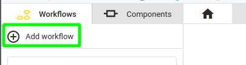

In the "Create new Workflow" dialog, enter a name (like "Demo") and for now leave everything else as it is. Click on "Create Workflow"

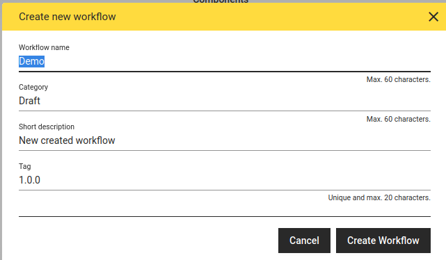

Next, you see the workflow editor, which is empty. Switch to the component sidebar, open one of the category drawers, and drag and drop some components onto the workflow editor pane. Boxes appear indicating operators of your workflow (i.e. instances of the chosen components). 

In this tutorial, we create an example workflow for a univariate anomaly detection: A simple volatility detection on a time series. We add connections between operators by clicking on outputs on the right side of the boxes and then clicking on an input on the left side of another box. You can easily find the components used in the picture below by using the search filter in the component sidebar.

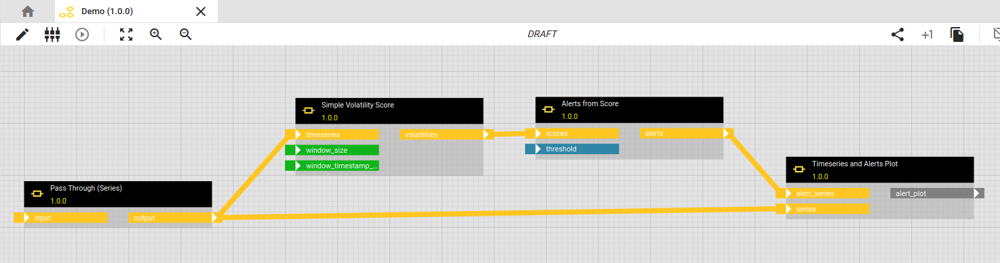

Some Notes: 

* You can delete connections by right-clicking on them and selecting "Delete Link". You can also delete operators (boxes) through their right-click menu.

* Connection lines can be subdivided by left-clicking on them and dragging one of the appearing handles, e.g. to make them go around boxes.
  
  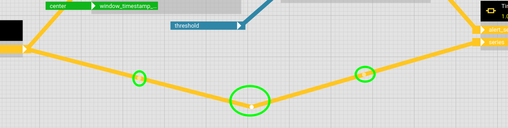

* Connections must respect types of inputs / outputs (indicated by color). However, some inputs /outputs have type "Any" which means that everything can go out/into them.

* You can also drag workflows from the Workflow sidebar as operators into a workflow, i.e. workflows can be nested. For example, consider a workflow containing a common data preparation pipeline that you want to use in several modeling workflows.

* You can drag *DRAFT* components/workflows onto the workflow pane, but you can only release a workflow if all contained operators refer to released revisions. This guarantees revision safety, i.e. once a workflow is released this revision of the workflow is fixed and cannot be changed anymore. To edit a released component/workflow a new revision has to be created.


Note that several inputs are unconnected and that one output (in our example this will be a result plot) is unconnected. There are no "Load Data from DB" or similar operators in our workflow. 

!!! abstract "Decoupling analytics and data provisioning"
    This is a point where hetida designer significantly differs from some similar-looking workflow tools you may know: Data ingestion (and data egestion) is decoupled from analytics and therefore fully flexible for production runs. Of course, this does not prevent you from writing components yourself that directly access data sources or data sinks -- but keep in mind that by doing this you lose the decoupling advantages and flexibility of the adapter system.

!!! tip "All inputs/outputs at a glance"

    Another point where hetida designer's workflow view/editor differs from similar tools: It always shows all inputs and outputs at first glance. You can see immediately what output goes into what input.

#### Configuring IO

We now have to configure which of these inputs should be fixed and which should be exposed to be dynamically connectable to appropriate data sources at execution time. Open the IO Dialog

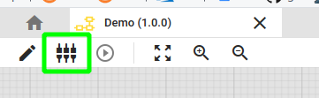

We configure the series input and the threshold input as "Dynamic" and provide exposed field labels "input_series" and "threshold" for them. Furthermore, window_size and window_timestamp_location are configured to be fixed values "180min" and "center" for this example. The resulting alert plot simply gets the field label "alert_plot". The result looks like this:

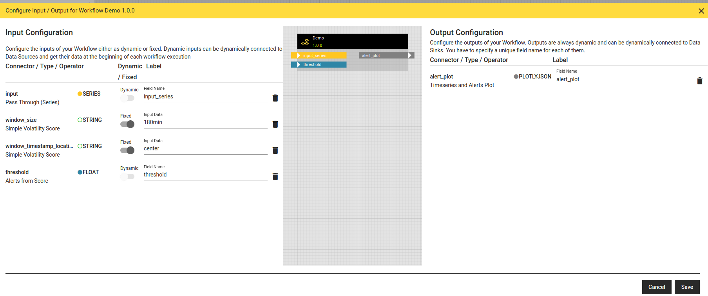

Note that this configuration represents the interface of your workflow. The field labels provided here for dynamic input/output are exactly the JSON field names when calling the workflow as a web service or via a message queue in production. After clicking on "Save" this configuration is represented in the workflow editor pane:

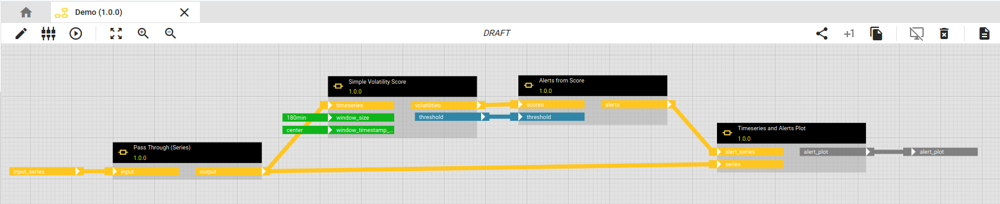

Fixed values get "fixed" to the corresponding operator while dynamic inputs/outputs are indicated by an attached (freely movable) plug.

#### Running the workflow

To run the workflow, click on the "Execute" button

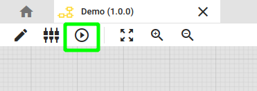

The execution dialog offers two modes for data ingestion into the workflow's dynamic inputs (as configured via the IO Configuration dialog):

* **Manual**: Here you can enter data directly or upload some JSON or CSV file from your computer.
* **Adapter**: Adapters allow to connect data sources (e.g. databases) to dynamic workflow input (and similar for outputs and sinks). They are small pieces of software which can be written individually for your specific data sources and data structures. They may present business views on data for easy selection in the execution dialog. More on that in documentation on the hetida designer adapter system

In your local installation, there probably is either no adapter or only the demo adapters  installed/available, so we choose "Manual" mode everywhere for this demo. For threshold we simply enter the value 600.0. For input_series you may copy or upload demo data from [volatility_detection_data.json](https://github.com/hetida/hetida-designer/blob/release/runtime/demodata/volatility_detection_data.json): Click on the pencil-like symbol in the Input Value field of input_series) and on "Import JSON / CSV" in the upcoming dialog.

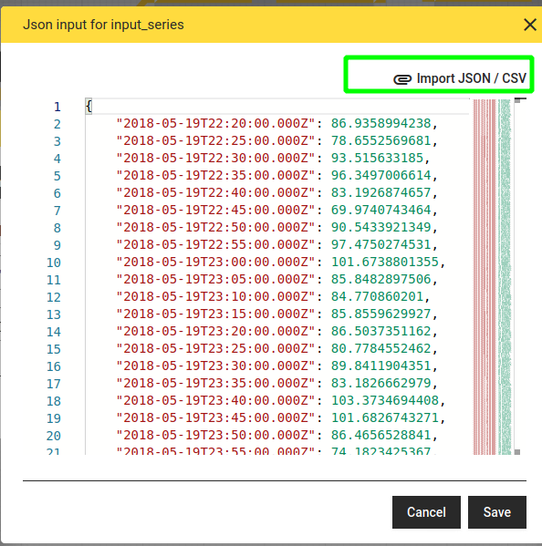

Then, select the downloaded demo data file.

Click "Save" and run "Execute". The result pops up after short time:

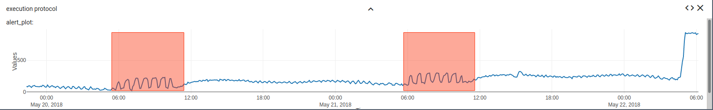

### Editing and writing components

#### Viewing components

Hetida designer makes it easy to examine, edit or create components. Components consist of Python code and an input / output configuration.

If you followed the tutorial above about workflow creation, you may directly view one of the employed components by right-clicking on an operator in your workflow, choosing "Show Details" and expanding the view

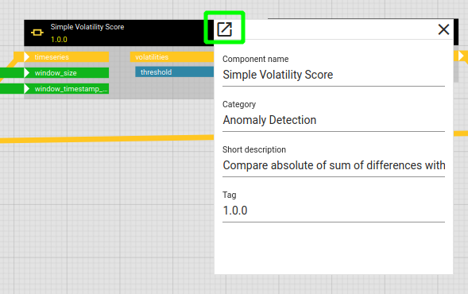

This opens the component editor

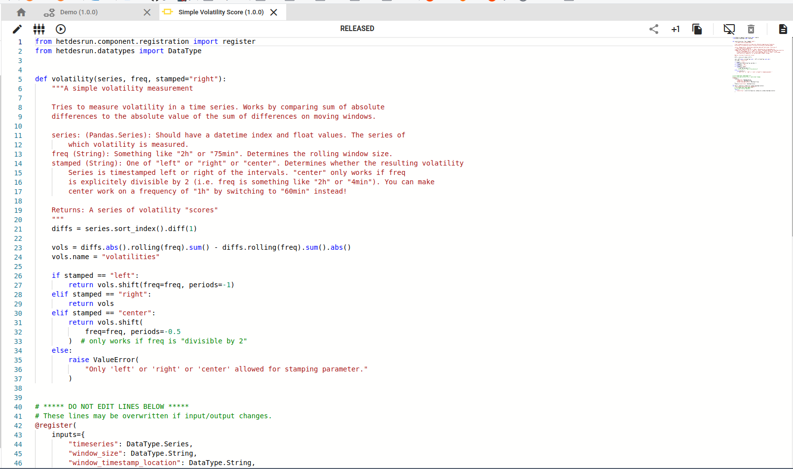

Note that this component revision is "RELEASED" (remember that you should use released component revisions in a workflow to be able to later release it). Therefore, the code editor does not allow to edit the code and you cannot change anything in the input / output configuration dialog either. You need to either create a new revision or a copy via one of the following buttons:

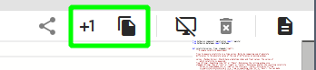

However, for this tutorial we choose to create a completely new component:

#### Adding a new component

This can be done in the component sidebar via the "Add component" button.

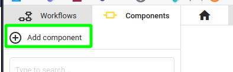

As for workflows, you have to provide at least a name in the appearing dialog window. For this example, we want to create an [Isolation Forest](https://en.wikipedia.org/wiki/Isolation_forest) component (similar to the existing Isolation Forest base component). We call our component "Isolation Forest Demo" and leave everything else as is

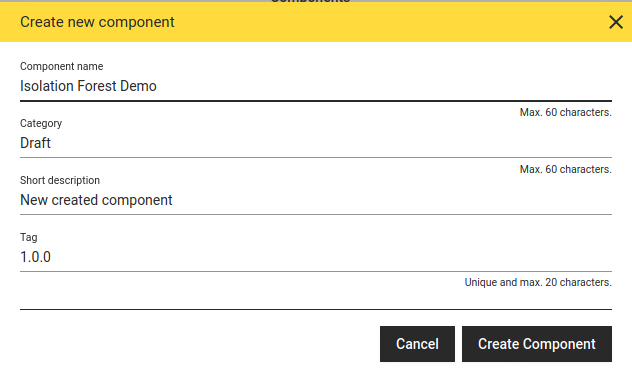

The code editor opens with some absolute basic code doing nothing so far:

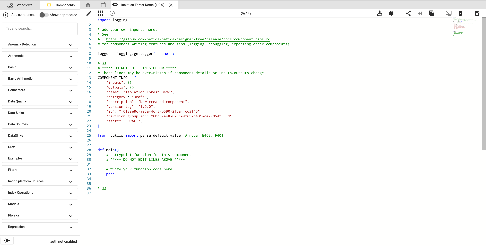

#### Configure IO

The next step is to configure input / outputs for our component. As for workflows, this is done via the IO Dialog. Open it via the button:

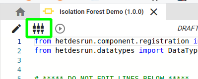

It currently is rather empty. Click the add buttons

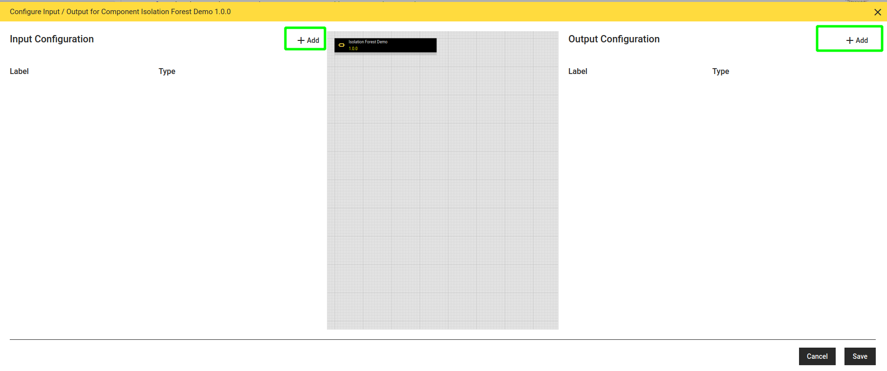

and add inputs and outputs to produce the following result:

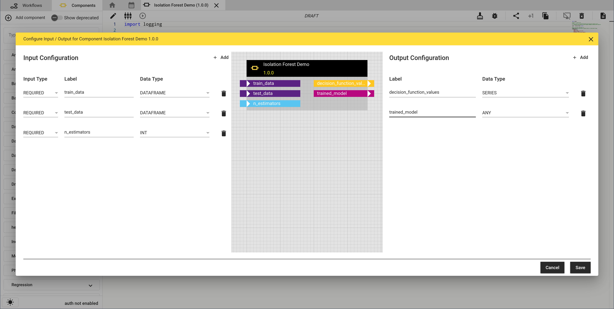

Note how inputs and outputs (colored depending on selected type) appear in the displayed component box. Click save to get back to the code editor.

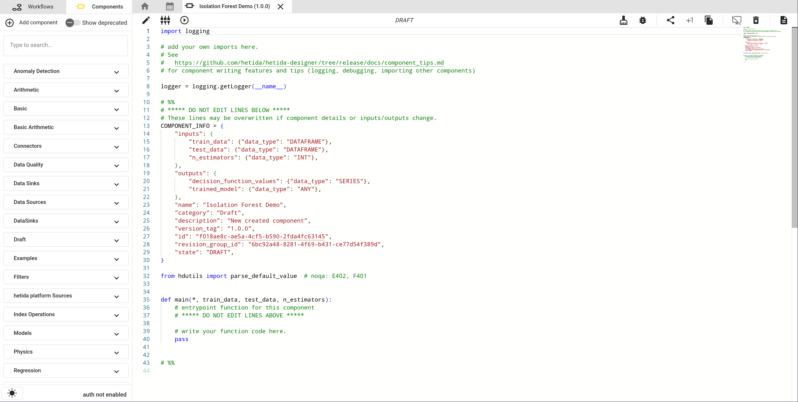

Note that the generated code is adapted to the added IO configuration: Hetida designer tries to support you as long as you do not change the main function definition and the accompanying comments. 

#### Writing code

You may now start to enter custom code at several positions. Here, we first add import statements at the beginning

```python
from sklearn.ensemble import IsolationForest
import pandas as pd
```

and then replace the `pass` statement in the main furnction with

```python
    iso_forest = IsolationForest(n_jobs=-1, n_estimators=n_estimators)
    iso_forest.fit(train_data)

    dec_vals = pd.Series(iso_forest.decision_function(test_data), index=test_data.index)

    return {"decision_function_values": dec_vals, "trained_model": iso_forest}
```

The result looks like this:

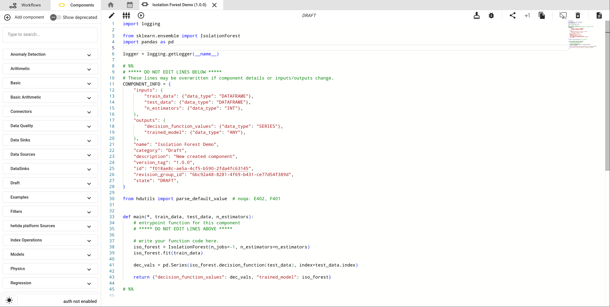

#### Test execution

Like workflows, components can be test executed via the "Execute" button.

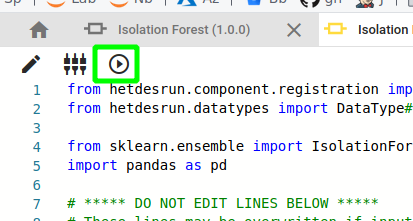

This is of course useful to verify that your component works and your code has no errors. We don't describe this step in detail here since it is completely analogous to the workflow execution. If you want to see an isolation forest component in action, there is an example workflow in the "Examples" category containing visualisations

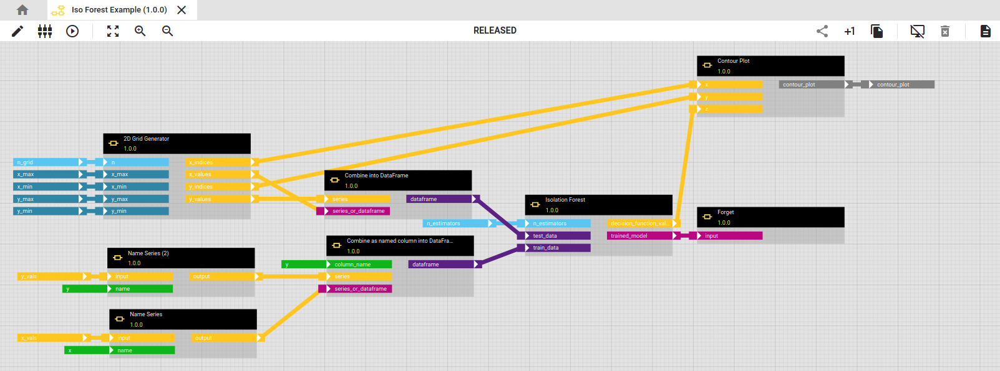

resulting in a visualisation of "what it learned":

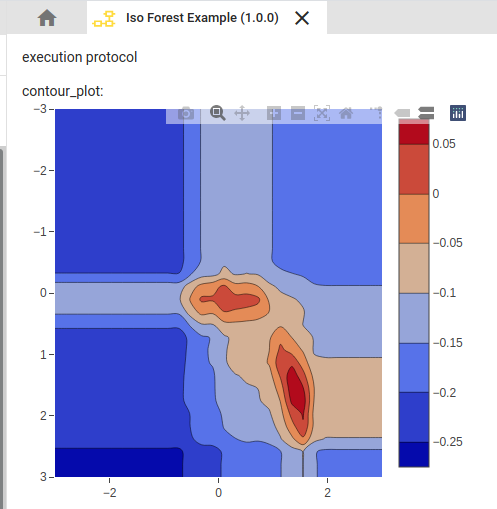

#### Releasing components

"Releasing" (or "publishing") puts the component revision from "DRAFT" state to "RELEASED" state. A component revision in DRAFT state can be edited ad libitum. A RELEASED component revision can not be edited anymore but allows to release workflows where it is used. One has to create a new revision of a released component if one wants to change how it works.

To release a component revision click on the "Publish" button

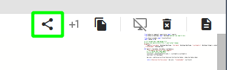

After confirmation the symbol of your component changes in the component sidebar and the "New revision" button is available

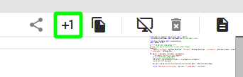