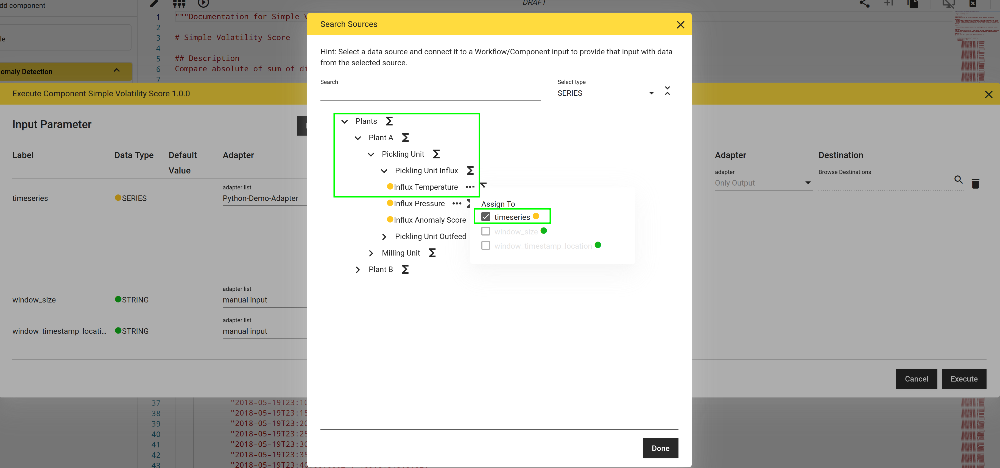

# Execution, Wirings and Adapters

The [Component and Workflow Tutorial](./component_workflow_tutorial.md) describes how to develop and test-execute transformations via the hetida designer user interface. Here we want to dive deeper into the necessary ingredients for transformation execution.

## The Adapter System

hetida designer provides a flexible adapter system allowing integration of arbitrary data sources and sinks. It allows you to write your own custom adapters and makes them available in user interfaces making it possible to discover, browse and search data sources and sinks. One example for such a user interface is the hetida designer test execution dialog itself.

The decoupling provided by the adapter system allows to execute the exact same workflow on local csv files during experimentation/development and then switch to production database data simply through swapping adapters in a so-called "wiring" data structure.


An adapter is a piece of software providing actual access to data sources and sinks as well as make these sources and sinks discoverable. See the [introduction to the adapter system](../../integration_guide/adapter_system/adapter_system_introduction.md) for detailed explanations/documentation.

hetida designer comes with a set of built-in adapters for files in a mounted volume, SQL databases, Kafka or Cloud / Blob storage and more.

Here for demonstration purposes we utilize the Demo Adapter that is provided with the docker compose setup.

## What happens during execution?
We open the component "Simple Volatility Score", make a copy of it for testing purposes
and open its test execution dialog.

There we switch the adapter setting for the `timeseries` input from manual input to Python-Demo-Adapter. In the Browse Sources field we navigate to Plants -> Plants A -> Pickling Unit -> Influx Temperature and via the "..." button assign it to the `timeseries` input.



As Timestamp Range we select the last two weeks and for frequency we set `2h`. For `window_size`we enter `6h` and for `window_timestamp_location` we insert `center`.

Executing with this setting yields a timeseries of volatility scores where input data is coming from the Demo adapter.

Again we enter the execution dialog and for the `volatilities` output we select the Python-Demo-Adapter navigate to Plants -> Plant A -> Pickling Unit -> Influx Anomaly Score and assign the `Influx Anomaly Score` sink and set frequency to `6h`.

Before execution we open the Browser Developer Tools (e.g. F12 using Firefox) and navigate to the Network analysis tab.

Executing we first note, that no output is shown in the execution result view. Instead, examining the POST request to the `/api/transformations/execute` endpoint, we see a payload
```json
{
	"id": "0ca411cc-4761-4833-a167-ee46d79f351c",
	"run_pure_plot_operators": true,
	"wiring": {
		"dashboard_positionings": [],
		"input_wirings": [
			{
				"adapter_id": "demo-adapter-python",
				"filters": {
					"frequency": "2h",
					"timestampFrom": "2024-04-03T13:34:00.000000000Z",
					"timestampTo": "2024-04-17T13:34:00.000000000Z"
				},
				"ref_id": "root.plantA.picklingUnit.influx.temp",
				"ref_id_type": "SOURCE",
				"type": "timeseries(float)",
				"use_default_value": false,
				"workflow_input_name": "timeseries"
			},
			{
				"adapter_id": "direct_provisioning",
				"filters": {
					"value": "6h"
				},
				"use_default_value": false,
				"workflow_input_name": "window_size"
			},
			{
				"adapter_id": "direct_provisioning",
				"filters": {
					"value": "center"
				},
				"use_default_value": false,
				"workflow_input_name": "window_timestamp_location"
			}
		],
		"output_wirings": [
			{
				"adapter_id": "demo-adapter-python",
				"filters": {
					"frequency": "6h"
				},
				"ref_id": "root.plantA.picklingUnit.influx.anomaly_score",
				"ref_id_type": "SINK",
				"type": "timeseries(float)",
				"workflow_output_name": "volatilities"
			}
		]
	}
}
```

and a response
```json
{
	"error": null,
	"output_results_by_output_name": {},
	"traceback": null,
	"job_id": "2c1741e5-ba7c-412f-aaa7-94faa380485e",
	"result": "ok",
	"output_types_by_output_name": {
		"volatilities": "SERIES"
	}
}
```
Analyzing the execution request payload we observe that actually two things are relevant: The transformation id in the field `id` and the `wiring` consisting basically of `input_wirings` and `output_wirings`.

Each input wiring tells hetida designer over what adapter data should be fetched and which data source is requested from that adapter for the respective input.

Here two adapters are mentioned, the Python-Demo-Adapter and a `direct_provisioning` adapter where we have data entered [manually](../../integration_guide/adapter_system/builtin_adapters/direct_provisioning.md).

Similarly for the output a sink with `ref_id` `root.plantA.picklingUnit.influx.anomaly_score` from the Python-Demo-Adapter adapter is wired as expected.

The response basically says everything is okay: In particular the result data for `volatilities` has been sent to the configured Demo adapter sink.

When we run execution again after removing the output wiring the HTTP response again contains the output data. This is because not providing an output wiring makes it default to `direct_provisioning` which in the case of outputs returns the result as part of the execution response.

## Summary
We have seen how a wiring using different adapters allows to control where input data comes from and where output data should go to at execution time.

Running via the `/api/transformations/execute` [API](../../integration_guide/api.md) endpoint is one viable way to run transformations regularly or event-driven in production.
