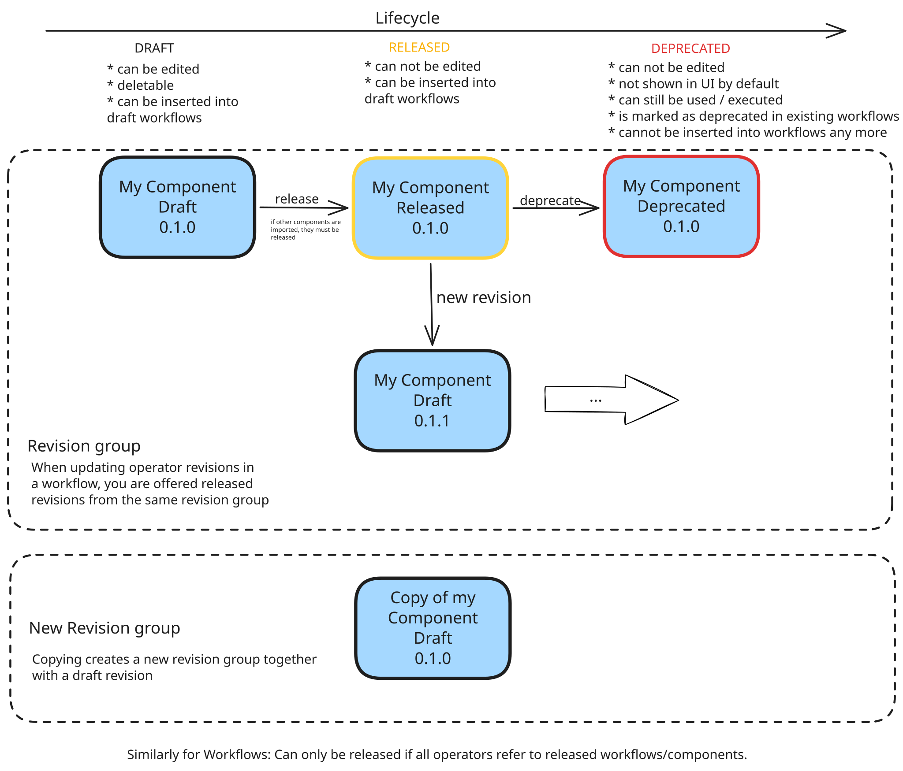

# Component and Workflow versioning and lifecycle

hetida designer comes with a versioning system for both components and workflows. For example when creating a component you have to provide a version tag and you are actually creating a new revision of the component (its first revision in this case).

For both workflows and components what you are actually working on is always a revision! Generally in hetida designer's documentation we often omit the term "revision" when talking about components or workflows in order to simplify the documentation language a bit. For example the entries in the sidebar for both components and workflows always include the version tag and when you double click on such an entry you actually open this revision. But we may simply say "open the component" in the documentation instead.

The same of course applies to the more general terms "transformation revision" and "transformation" (remember: components and workflows are both transformations in hetida designer terminology)

hetida designer does not track history between revisions explicitely. Instead, as explained in [Basic concepts](./user_guide/tutorials/basic_concepts.md) revisions are loosley coupled via a common **revision group**. In particular there is no linear history. Revisions in the same revision group even do not necessarily share the same IO interface or other properties. They can be completely different. There only is a "latest" concept allowing to identify the latest, released (non-deprecated) transformation (by its release timestamp) of a revision group. Being in the same revision group is relevant for features like selecting alternative revisions and auto-updating revisions for operators in workflows. Both take into account only revisions of the same revision group. But again: We do not enforce a linear history!

Moreover components and workflows have a **lifecycle state**: DRAFT, RELEASED or DEPRECATED. This state determines how and where they can be used and whether they can be edited/changed.

## Overview

## Revisions for components
### DRAFT Mode
A new component revision starts its existence in "DRAFT" mode which means it can be edited, i.e. inputs/outputs can be changed and the source code can be modified freely. In "DRAFT" mode, components can be dragged into DRAFT workflows but that inhibits releasing of the workflow. This limitation is necessary in order to guarantee reproducibility and stability of workflow execution in production setups for released workflows. For being able to release a workflow where a component is used, the component needs to be published/released.

### Publishing (Releasing) and Updating
A revision in DRAFT mode can be published via the appropriate button in the UI. After publishing the component revision's mode is now "RELEASED". This means it cannot be edited anymore (neither source code nor inputs/outputs).

Note that a workflow can only be released if all its contained operators refer to released components/workflows. Similarly, a component can only be released if it does not import from draft components.

If later you need to change the component you have to create a new revision for this component through the UI button for "new revision" in the component view. Again you have to provide a version tag for this new revision of your component and it starts in DRAFT mode.

Note that even when publishing this new second revision of your component the instances of your first revision in existing workflows won't be updated automatically! This protects working workflows from unexpected changes in their behaviour and again this is necessary to guarantee stability and reproducibility of workflow execution.

Instead you have to manually update your workflows and replace the old revision with the new one. However there is a mechanism supporting you which is called "deprecation". Furthermore the workflow editor provides a button for DRAFT workflows that automatically updates all operators to the newest released revision in their revision group.

For completely analogous reasons, if this component revision is imported in another one that other one will not be updated to point to the new revision automatically!

### Deprecating revisions
You can deprecate a revision of a component that you do not want to be used anymore (probably because there exists a newer, better revision of this component). To do so you have to press the deprecate button in the component revision's view and confirm this step. After that this component revision is not deleted — instead it is marked as deprecated which has the following consequences:

* The deprecated revision does not occur in the component sidebar anymore by default. There is a toggle that allows to show deprecated revisions.
* Deprecated revisions cannot be dragged into workflows which prevents new uses of it.
* In every workflow where instances of this component revision are used, they are marked as deprecated. If the workflow itself can be edited (i.e. is in DRAFT mode) you can rightclick on such an instance and choose to replace it with another (probably newer) revision. This will replace the instance and hetida designer tries to keep connections that are not changed.
* The deprecated component can still be executed, e.g. by external systems via API or in hetida designer UI if you toggle showing deprecated revisions.
* All workflows with deprecated component revision instances will still work as before. In particular note that workflow revisions which itself are RELEASED cannot be changed even through deprecating. Instead you need to create a new revision for the workflow itself in this case.

Note again: Deprecated revisions are never deleted, they are still present in the hetida designer database and this guarantees that old versions of components or workflows will execute as before.

### Copying a component revision
To create a new component (revision group) from an existing component you can open one of its revisions and press the copy button. This creates a first revision for a completely new revision group starting with the same IO and source code but otherwise having no relations to the old component revision (and its revision group). In particular revisions of this new revision group cannot be chosen when replacing a (deprecated) revision of the old revision group from the rightclick-dialog on the instance in a workflow and so on.

## Revisions for workflows
Workflows also have revisions and they work completely the same as with the components. There is DRAFT state in which workflow revisions are editable and a RELEASED state where they are fixed and cannot be edited anymore. Note that workflow revisions itself can be dragged into workflows in DRAFT mode and then behave like a component instance (i.e. nesting workflows is possible and encouraged!). If the workflow revision that is dragged is not published (in RELEASE mode) it inhibits the containing workflow from being released.

Also deprecating and updating workflow revision instances works the same way and copying workflows is completely analogous.

Note that for workflows in DRAFT mode there is a button that upgrades all their operators to the newest revision of their referenced transformation's revision group.

## A note on version tags
The hetida designer does not require the tags to follow any particular pattern. They are simply identifiers for the different revisions and can be used similarly to Docker image tags. You are free to use more meaningful strings than version numbers. Just note that the tags must be short (20 characters maximum) and unique within the revision group.

That said, we recommend to stick to a consistent and meaningful versionig schema like [semantic versioning](https://semver.org/).