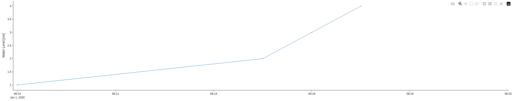

# hdhelpers
## What is hdhelpers?
hdhelpers is a package designed for and included in the standard installation of the [hetida designer](https://github.com/hetida/hetida-designer).

It contains functions that streamline plotting components, especially those that are used in the [hetida platform](https://hetida.io/), by
* accessing series metadata that complies with the hetida platform metadata scheme
* accessing metadata that the hetida platform writes into the hetida designer's `plot_target_settings` context variable 
* adjusting the timezone of timestamps, series, and dataframes
* providing toggleable standardized styling options and json serialization for plotly plots

## Getting Started with hdhelpers
Since the intended use of the hdhelpers package is as a part of the hetida designer, it is highly recommended to follow the [hetida designer setup guide](https://github.com/hetida/hetida-designer/blob/release/README.md#getting-started-with-hetida-designer).

For a specific example of how to use hdhelpers functionality in a hetida designer component, see [Example](#example).

## Developing for hdhelpers
In the development of this package, [uv](https://docs.astral.sh/uv/) was used for setting up a virtual environnment, managing dependencies, building and publishing the package. Though its use is not technically required, the following instructions assume that you use uv, too.

### Setting up a Development Environment
First, move to the `runtime/hdhelpers` subdirectory, which contains the hdhelpers package.

Create a virtual environment with `uv venv`, which you can then find in the `.venv` subdirectory. There, uv installs all dependencies defined in `pyproject.toml`.

All uv commands that need a python environment will use `.venv`, so you should use it for your development, too.

Finally, in case you need to add a new dependency, do so via `uv add <new_dependency>`. That way, uv finds versions of all dependencies that are compatible with each other.

Once you are done writing your code, including unit tests, use `./run check` to see if your code quality is sufficient.

To use your local hdhelpers code in a hetida designer development setup, use the nix-shell setup by executing the following commands:
```
nix-shell --pure
overmind s
```

### Deploying Your Code
Before you build the package, set an appropriate version number in `pyproject.toml` that matches the version number in the hedita designer `VERSION` file.

To build the package and delete any files that are currently in the `dist` subdirectory, execute `rm -r dist && uv build`. [Hatchling](https://pypi.org/project/hatchling/), the build backend specified in `pyproject.toml`, will build a new sdist and wheel in the `dist` subdirectory.

To publish the build from the `dist` subdirectory to PyPI, use `uv publish`. To do so, you need a PyPI account with a token to enter in the command line as password following the username "\_\_token__", and you need maintainer or owner access to the [hdhelpers PyPI project](https://pypi.org/project/hdhelpers/).

The hetida designer docker compose setup installs hdhelpers from [PyPI](https://pypi.org) as it does with any dependency listet in `runtime/requirements.in`.

Next time your hetida designer docker compose dev setup builds the runtime container, it will install the hdhelpers version that you just deployed.

## <a name="example"></a> Example
Let's say we want to plot the following timeseries in a style that looks good on a hetida platform dashboard.
```
{
    "__hd_wrapped_data_object__":"SERIES",
    "__metadata__": {
        "single_metric_dataset_metadata": {
            "ref_interval_end_timestamp":"2020-01-01T08:20:00.000Z",
            "ref_interval_start_timestamp": "2020-01-01T08:10:00.000Z"
        },
        "single_metric_metadata": {
            "structured_metadata": {
                "metric": {
                    "short_display_name": "Water Level",
                    "unit": "cm"
                }
            }
        }
    },    "__data__": {
        "2020-01-01T08:10:00+00:00": 1,
        "2020-01-01T08:15:00+00:00": 2,
        "2020-01-01T08:16:00+00:00": 3,
        "2020-01-01T08:17:00+00:00": 4
    }
}
```
Our component code might look like this:
```
from hdhelpers import get_and_pad_start_and_end_timestamp, get_y_axis_label, modify_timezone, plotly_fig_to_json_dict
import plotly.graph_objects as go
...
def main(*, series):
    # entrypoint function for this component
    # ***** DO NOT EDIT LINES ABOVE *****
    # write your function code here.
    series = modify_timezone(series)

    fig = go.Figure([go.Scatter(x=series.index, y=series.values)])

    start, end = get_and_pad_start_and_end_timestamp(series=series, start_padding='5s')
    fig.update_xaxes(range=(start, end))

    full_title = get_y_axis_label(series=series, default_title="Level")
    fig.update_layout(yaxis_title=full_title)

    return {"plot": plotly_fig_to_json_dict(fig=fig)}
```
First, we use `modify_timezone` to set the timezone. Since our goal is just to make sure that the timestamps are timezone aware, not to convert it to a specific timezone, we do not pass a value for the `timezone` parameter. That way, if there is a `plot_target_timezone` set in `plot_target_settings`, that timezone will be used. Otherwise, the timestamps keep their current timezone or are converted to UTC if they are timezone naive.

With the timezone-corrected data in place, we turn it into a plotly scatter plot called `fig`, that we can then style to our liking.

Now, we use `get_and_pad_start_and_end_timestamp` for precise control over the x-axis range. We do not set `start` and `end` explicitly because we want to parse them from the series metadata, which reflects the chosen interval for which plotting data was requested. This way, we can see that there is missing data from 8:18 to 8:20, where normally Plotly would not have included that time range in the plot. We do not pass a `timezone` for the same reasons as with `modify_timezone`. We also set a `start_padding`, so the markers of the first data point is not cut in half by the edge of the plot. With start and end parsed, we can update `fig`'s x-axis range.

Next, we use `get_y_axis_label` so our y-axis can be labeled with the series metadata. With the above input series, title and unit will be parsed from the series metadata, but in case the component is ever run without series metadata, we provide a `default_title`, but we leave the `default_unit` at its empty default value. Then, we update `fig` with our title.

Lastly, we use `plotly_fig_to_json_dict` to apply standardized stylings of our choice and serialize the plotly figure into a json dict. All the standardized styling options are active by default, as detailed in [Styling Flags](#flags), so we do not have to set any for this example.

As a result we get the following plot:



### <a name="flags"></a> Styling Flags
`use_platform_defaults=True` sets the following flags to `True`, which are by default `False`:
* `hide_legend` sets the plotly layout parameter `showlegend=False` to hide the plot's legend
* `hide_x_title` sets the plotly xaxes parameter `title_text=''` to hide the x-axis title
* `remove_plotly_bar` sets the plotly figure's `displayModeBar` setting to `False` to remove the plotly bar from the plot
* `update_x_axes_tickformat` sets the plotly xaxes parameter `tickformat` to the `datetime_tick_format` property the hetida platform writes into the hetida designer's `plot_target_settings` context variable (unless the property is `None`)
* `use_default_standoff` sets the plotly yaxes parameter `title_standoff=5`
* `use_muplot_axes_color` sets the plotly xaxes and yaxes parameter `color` to the `axes_label_color` property the hetida platform writes into the hetida designer's `plot_target_settings` context variable (unless the property is `None`)
* `use_muplot_grid` makes the plotly grid visible and colors it in according to the `grid_color` property the hetida platform writes into the hetida designer's `plot_target_settings` context variable (unless the property is `None`)
* `use_muplot_line_and_markers` sets the plotly traces to the following style, which matches the hetida platform's µplots:
```
{
    "marker": {"size": 3},
    "line": {"width": 1},
    "mode": "lines+markers",
    "marker_symbol": "circle",
}
```
* `use_platform_background` sets the plotly layout parameter `paper_bgcolor` to the `background_color` property the hetida platform writes into the hetida designer's `plot_target_settings` context variable (unless the property is `None`) and it sets `plot_bgcolor=rgba(0,0,0,0)` so the "paper background" is visible through the "plot background"

`plotly_fig_to_json_dict` has four more boolean parameters:
* `add_config_settings` sets the plotly figure's locale to the `plot_target_locale` property the hetida platform writes into the hetida designer's `plot_target_settings` context variable (unless the property is `None`)
* `remove_plotly_icon` sets the plotly figure's `displaylogo` setting to `False` to remove the plotly logo from the plot
* `use_minimum_margin` sets the plotly layout parameter `margin={"autoexpand": True, "l": 0, "r": 0, "b": 0, "t": 0, "pad": 0}` to minimize the plot's margins
* `use_platform_colorway` sets the plotly layout parameter `colorway` to the `line_colors` property the hetida platform writes into the hetida designer's `plot_target_settings` context variable (unless the property is `None`). Note that in Plotly, explicitly set line colors have higher priority than those in the colorway, so setting this parameter to `False` is rarely necessary.
* `use_simple_white_template` sets the plotly layout parameter `template=simple_white`
